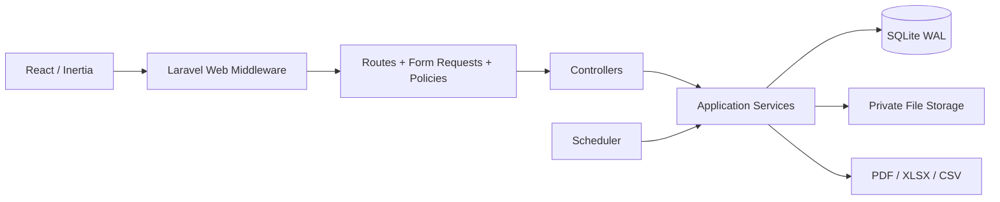
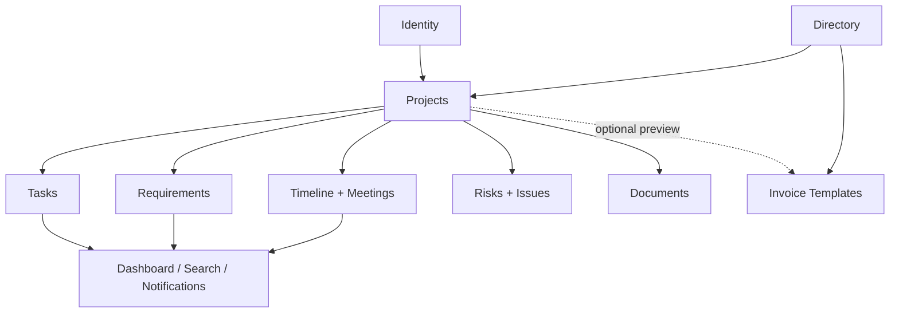
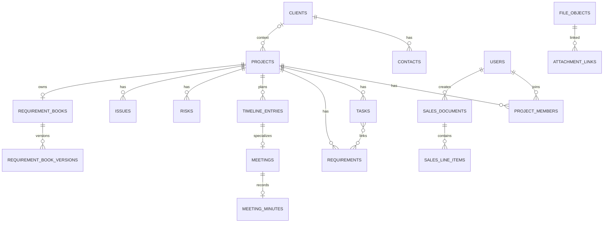

# Project Desk — التوثيق التقني الشامل لنسخة التطوير

> يشمل بنية النسخة الأولى كاملة ثم تكاملات المراحل، المشروع القائم، شجرة المتطلبات، والتحليل المحلي.

# مرجع النسخة الأولى: DOCUMENTATION INDEX

# فهرس التوثيق التقني — Project Desk

## 1. طريقة الاستخدام

هذه الحزمة توثق التنفيذ الذي تمت مراجعته من شيفرة Project Desk، وآخر مزامنة
لتوطين الواجهة بتاريخ 2026-08-14. لا تمثل وحدها رقم إصدار أو شهادة قبول. ابدأ
بـ[نظرة النظام](SYSTEM_OVERVIEW_AR.md)، ثم اختر الدليل حسب دورك. عند اختلاف
وثيقة مع التنفيذ تكون الأولوية: migrations وroutes/Requests/Policies/Services ثم
الاختبارات القابلة للتشغيل، ثم هذه الوثائق، ثم المستندات التاريخية.

رموز الحالة المستخدمة:

| الحالة | المعنى |
| --- | --- |
| منفذ `implemented` | يوجد مسار شيفرة حقيقي واختبارات/عقد مناسب بحسب الجرد؛ يلزم مع ذلك CI حديث للإصدار |
| جزئي `partial` | جزء عامل، لكن التكامل أو التغطية أو السلوك الموحد غير مكتمل |
| مخطط `planned` | نية/توصية فقط، ليست وعداً ولا يجوز عرضها كوظيفة حالية |
| غير مدعوم | خارج حدود الإصدار الحالي أو يحتاج إعادة تصميم |

## 2. الملفات العشرة

| الملف | الجمهور | المحتوى |
| --- | --- | --- |
| [SYSTEM_OVERVIEW_AR.md](SYSTEM_OVERVIEW_AR.md) | الجميع/المنتج | هدف النظام، الوحدات، الأدوار، الرحلات والحدود |
| [ARCHITECTURE_AR.md](ARCHITECTURE_AR.md) | المعماريون والمطورون | modular monolith، الطبقات، الطلب، الوقت، الحالة والتكاملات |
| [DATA_MODEL_AR.md](DATA_MODEL_AR.md) | المطورون/DBA | الجداول والنماذج والعلاقات والقيود والأرشفة والتزامن |
| [API_AND_ROUTES_AR.md](API_AND_ROUTES_AR.md) | Frontend/Backend/QA | routes الواجهة وHTTP، payloads، validation، الأخطاء والاستجابات |
| [SECURITY_AND_PERMISSIONS_AR.md](SECURITY_AND_PERMISSIONS_AR.md) | الأمن/المنتج/المطورون | المصادقة، matrix الصلاحيات، الملفات، الأسرار والتدقيق والمخاطر |
| [OPERATIONS_AND_RECOVERY_AR.md](OPERATIONS_AND_RECOVERY_AR.md) | التشغيل/الدعم | scheduler، النسخ `.pdesk` وlegacy، الاستعادة، الملفات، المراقبة وrunbooks |
| [TESTING_AND_QA_AR.md](TESTING_AND_QA_AR.md) | QA/المطورون/الإصدار | الجرد، الأوامر، CI، browser، gates، الفجوات والتشخيص |
| [DEVELOPER_GUIDE_AR.md](DEVELOPER_GUIDE_AR.md) | المطورون | الإعداد، بنية المستودع، إضافة ميزة، معاملات/وقت/ملفات/React |
| [DEPLOYMENT_AR.md](DEPLOYMENT_AR.md) | DevOps/التشغيل | build، env، Nginx، filesystem، النشر والترقية والرجوع وGo-Live |
| [DOCUMENTATION_INDEX_AR.md](DOCUMENTATION_INDEX_AR.md) | الجميع | الفهرس، أثر المتطلبات، الملكية وقواعد تحديث التوثيق |

## 3. مسارات قراءة مقترحة

| المهمة | اقرأ بالترتيب |
| --- | --- |
| فهم المنتج وحدوده | System Overview ثم Security ثم API |
| بدء تطوير | Developer Guide ثم Architecture ثم Data Model ثم Testing |
| بناء واجهة/تكامل داخلي | API and Routes ثم Security ثم Data Model |
| تدقيق أمني | Security ثم API ثم Operations ثم Deployment |
| نشر أول مرة | Deployment ثم Operations ثم Testing ثم Security |
| حادث أو استعادة | Operations and Recovery ثم Deployment ثم Data Model |
| قرار إضافة محاسبة | System Overview وحدود Sales ثم SRS؛ الوظيفة الحالية templates فقط |
| ترحيل لمساعد AI/فريق جديد | الملفات العشرة مع migrations/routes/config/tests وملف البيئة المثال دون أسرار |

## 4. خريطة التنفيذ والوثيقة الحاكمة

| المجال | الوضع المختصر | المرجع الأول |
| --- | --- | --- |
| مشاريع ومهام ممتدة بين بداية ونهاية | منفذ؛ جدول أسبوعي ببداية الأحد افتراضياً | API، Data Model، Architecture |
| عملاء وجهات اتصال وفريق | منفذ مع أدوار عامة وعضوية مشروع | API، Security |
| كراسة متطلبات وإصدارات | منفذ | Data Model، API، Operations للملفات |
| اجتماعات ومحاضر وجدولة | منفذ، وتنبيهات scheduler | API، Operations |
| مخاطر وقضايا ووثائق | منفذ | API، Data Model |
| ملفات خاصة وفحص malware | منفذ؛ production fail-closed مطلوب | Security، Operations |
| استيراد/تصدير CSV/XLSX | منفذ لموارد محددة ومعاملة ذرية | API، Operations |
| بحث داخلي | منفذ ومقيد بالصلاحيات | Architecture، Security، Developer Guide |
| قوالب فواتير وPDF | منفذ، غير محاسبي | System Overview، API، Developer Guide |
| proposal/receipt/letterhead legacy | مخزن تاريخياً لكنه مخفي/غير مسار منتج | Data Model، API |
| نسخة `.pdesk` كاملة مشفرة | منفذ لـSQLite/الملفات | Operations، Security |
| legacy DB backup | جزئي، database-only | Operations |
| إشعارات المهام والاجتماعات | منفذ عبر scheduler | Operations، Developer Guide |
| واجهة عربية/إنجليزية وRTL/LTR | منفذ؛ العربية افتراضية، والاختيار محفوظ في Cookie مشفرة، ولا يشمل ترجمة بيانات المستخدم أو PDF | System Overview، Architecture، SRS |
| queue/background Jobs مجال | غير منفذ؛ scaffold فقط | Architecture، Developer Guide |
| إعداد التقويم والمنطقة في كل النظام | جزئي؛ بعض المستهلكين يعتمدون config ثابتاً | Architecture، Testing |
| تعدد المضيفين/HA | غير مدعوم في v1 | Deployment، Architecture |

## 5. قرارات وحدود لا يجوز فقدها

1. **قوالب الفواتير ليست نظاماً محاسبياً.** لا توجد دفعات أو أرصدة أو دفتر أستاذ أو قيود أو ضرائب/تحصيل محاسبي.
2. v1 يستخدم SQLite وprivate local storage وأقفالاً محلية؛ النشر الأفقي غير آمن دون إعادة تصميم.
3. الواجهة عربية RTL افتراضياً وإنجليزية LTR اختيارياً؛ تحفظ اللغة سنة في Cookie
   مشفرة، وتستخدم الأسطح المربوطة تنسيق `ar-LY` أو `en-GB`. لا يترجم ذلك بيانات
   المستخدم أو مخرجات PDF العربية الحالية.
4. datetimes تخزن/تقارن UTC ويعرض الوقت التجاري افتراضياً `Africa/Tripoli`. الأسبوع يبدأ الأحد والعطلة الجمعة/السبت في builder الحالي.
5. إعداد calendar/timezone موجود لكنه لا يغذي كل الخدمات بالتساوي؛ الحالة `partial`.
6. لا توجد Jobs مخصصة أو outbox؛ العمليات الحالية متزامنة أو أوامر scheduler، وActivityLogger متزامن غالباً.
7. global `viewer` مع project pivot `manager` حالة غير موحدة: بعض تحديثات المشروع قد تسمح بها العضوية، بينما رفع الملفات يمنع viewer صراحة. هذه فجوة قرار/اختبار، لا قاعدة مستقرة.
8. التنزيل لا يسمح إلا لملف clean وبصلاحية صحيحة؛ production يجب أن يفشل مغلقاً إن لم يوجد ماسح.
9. restore خطير ومدير فقط مع recent password وعبارة ثابتة وchecksum وnonce وقفل وصيانة وrollback.

## 6. مصادر الشيفرة التي راجعتها الحزمة

| المصدر | ما تم استخراجه |
| --- | --- |
| `composer.json`, `package.json`, lockfiles | المنصة والإصدارات والأوامر |
| `bootstrap/app.php`, providers، `config/*`, `.env.example` | middleware، `/up`، adapters والحدود بلا قيم سرية |
| `database/migrations`, models/relations | المخطط والقيود والأرشفة/lock versions |
| `routes/*.php`, Controllers, Form Requests | routes وpayloads والاستجابات |
| Policies وServices | authorization والمعاملات والحسابات والنسخ/الملفات |
| Commands و`routes/console.php` | scheduler والعمليات الدورية |
| `resources/js/pages/components/hooks/layouts` و`resources/js/i18n` | صفحات Inertia والحالة، كتالوجا العربية/الإنجليزية، RTL/LTR، تنسيق اللغة وunsaved guard |
| Tests وCI | تغطية قابلة للتنفيذ وبوابات الجودة والفجوات |

الجرد في لحظة المراجعة: 25 model، 31 controller، 17 policy، 31 service، دون `app/Jobs`. أرقام الجرد أداة لاكتشاف الانجراف وليست contract دائم.

## 7. وثائق مرتبطة خارج الحزمة

توجد وثائق أخرى في `docs/` ويجب التعامل معها كمراجع داعمة والتحقق منها أمام الشيفرة:

- [دليل المستخدم العربي](../USER_MANUAL_AR.md)
- [حوكمة التوثيق](../DOCUMENTATION_GOVERNANCE_AR.md)
- [نطاق المنتج](../PRODUCT_SCOPE.md)
- [البيئة](../ENVIRONMENT.md)
- [المرفقات والاحتفاظ](../ATTACHMENTS_AND_RETENTION.md)
- [النسخ والاستعادة](../BACKUP_AND_RECOVERY.md)
- [جاهزية الإصدار](../RELEASE_READINESS.md)
- [تتبع المتطلبات](../REQUIREMENTS_TRACEABILITY.md)
- [خارطة الطريق](../ROADMAP.md)
- [Workflow Status API](../workflow-status-api.md)

تحذير: وثيقة architecture تاريخية قد تذكر `SaveTaskAction` أو outbox؛ التنفيذ الفعلي يستخدم `TaskService` ولا يملك outbox. لا تنقل الادعاء التاريخي إلى SRS أو تشغيل حالي.

## 8. قواعد تحديث الوثائق

حدث الوثائق في نفس pull request عند أي مما يلي:

| التغيير | الملفات الدنيا |
| --- | --- |
| route أو payload/error | API، Testing، وSRS/traceability |
| model/migration/relation | Data Model، Architecture، backup compatibility |
| Policy/role/membership | Security، API، اختبارات matrix ودليل المستخدم |
| ملف/MIME/scanner/reference | Security، Operations، Data Model، Testing |
| backup/restore/encryption | Operations، Security، Deployment واختبار drill |
| scheduler/Job/queue | Architecture، Operations، Deployment، Testing |
| timezone/week/calendar | Architecture، Developer، Testing ودليل المستخدم |
| لغة واجهة/كتالوج/اتجاه أو مبدل لغة | System Overview، Architecture، SRS/matrix، browser tests ودليل المستخدم |
| صفحة/رحلة UI | System Overview، API، browser tests ودليل المستخدم |
| نطاق invoice/sales | System Overview وAPI وSRS؛ حافظ على وسم غير محاسبي إلا بقرار منتج |
| متطلبات runtime/env | Developer، Deployment، Environment وCI |

كل تحديث يجب أن يسجل: السبب، الحالة قبل/بعد، migration/compatibility، الأثر الأمني/التشغيلي، الاختبارات، وقرار rollback. لا تضع secret example فعلياً.

## 9. فحص اتساق سريع

قبل نشر الحزمة أو تسليمها لمساعد AI آخر:

- [ ] الملفات العشرة موجودة وروابطها تعمل.
- [ ] route list وmigrations وPolicies تطابق جداول API/data/security.
- [ ] لا ادعاء عن outbox/Jobs/HA/CSP عامة غير موجودة.
- [ ] invoice موصوف كقالب غير محاسبي في كل موضع.
- [ ] `.pdesk` وlegacy database-only والفحص fail-closed موثقة بلا مفاتيح.
- [ ] UTC وTripoli والأحد والجمعة/السبت وحدود التكامل الجزئي ظاهرة.
- [ ] العربية الافتراضية والإنجليزية وCookie اللغة واتجاها RTL/LTR موثقة، مع
      استبعاد صريح لترجمة بيانات المستخدم وPDF.
- [ ] أوامر setup/test/deploy لا تحتوي credential ولا أمر مسح إنتاج.
- [ ] نتائج الاختبار مرتبطة بcommit وتشغيل حديث، لا برقم قديم فقط.
- [ ] diagrams إن وجدت يسبقها/يتبعها وصف نصي كامل ولا يعتمد الفهم عليها.
- [ ] الترميز UTF-8 والعربية وMarkdown tables/code fences سليمة.

## 10. سجل التغيير

| التاريخ | النطاق | الملاحظة |
| --- | --- | --- |
| 2026-08-14 | توطين الواجهة | مزامنة العربية الافتراضية والإنجليزية وCookie اللغة وRTL/LTR والتنسيق المحلي، مع توثيق حدود بيانات المستخدم وPDF |
| 2026-08-12 | إنشاء الحزمة التقنية العربية | توثيق code-first للتنفيذ الحالي مع تمييز المنفذ/الجزئي/المخطط والحدود |

# مرجع النسخة الأولى: SYSTEM OVERVIEW

# نظرة شاملة على نظام Project Desk

> مرجع تقني مستخرج من التنفيذ الفعلي — 14 أغسطس 2026  
> حالة الوثيقة: تصف الإصدار الموجود في المستودع، ولا تفترض خصائص غير منفذة.

## 1. الغرض والنطاق

Project Desk تطبيق ويب داخلي أحادي الشركة لإدارة العمل والمشاريع. العربية هي
الواجهة الافتراضية باتجاه RTL، وتتوفر واجهة إنجليزية باتجاه LTR. يجمع في نشر واحد:

- المشاريع، العملاء، جهات الاتصال، الفريق وعضويات المشاريع؛
- المتطلبات وكراسة المواصفات ذات الإصدارات؛
- المهام وجدولها وسجل الإسناد والجدول الأسبوعي؛
- الخط الزمني والاجتماعات والحضور والمحاضر؛
- المخاطر والمشكلات والمرفقات وسجل النشاط؛
- البحث والتنبيهات والإعدادات وحالات سير العمل؛
- استيراد/تصدير CSV وXLSX، ملخصات PDF، والنسخ والاستعادة؛
- **قوالب فواتير غير محاسبية** مع بنود وحساب معاينة وPDF.

لا توجد واجهة API عامة مستقلة؛ صفحات Inertia وبعض نقاط JSON الداخلية تخدم التطبيق نفسه بجلسة Laravel وسياساته.

## 2. تصنيف حالة الوظائف

| المجال | الحالة | الوصف والحدود |
| --- | --- | --- |
| الهوية والوصول | منفذ | دخول داخلي، تحقق البريد، استعادة كلمة المرور، 2FA، Passkeys، تعطيل/أرشفة الحساب، جلسات مشفرة اختيارياً |
| المشاريع والعملاء والفريق | منفذ | CRUD وأرشفة واستعادة وصلاحيات على مستوى السجل والمشروع |
| المهام والمتطلبات | منفذ | تواريخ إلزامية للمهمة، حالات قابلة للتهيئة، روابط مهمة/متطلب، قفل تفاؤلي |
| التخطيط والاجتماعات | منفذ | خط زمني، اجتماع كمصدر واحد مرتبط ببند زمني، حضور ومحضر ومرفق اختياري |
| كراسة المتطلبات | منفذ | ملف بإصدارات، حالة، إصدار حالي واحد، أرشفة واستعادة |
| المخاطر والمشكلات | منفذ | مخاطر 1–5، معالجة؛ مشكلات بشدة وحل مطلوب عند الإغلاق |
| الملفات | منفذ جزئياً تشغيلياً | تحقق بنيوي، تخزين خاص، عقد ماسح. يتطلب ماسح malware حقيقياً في الإنتاج |
| قوالب الفواتير | منفذ | إنشاء/تعديل/نسخ/أرشفة/استعادة/PDF؛ العميل والمشروع والتواريخ سياق معاينة اختياري |
| المحاسبة والتحصيل | خارج النطاق | لا أرصدة، قيود، مدفوعات، حالات تحصيل، أعمار ديون أو تقارير مالية |
| عروض/إيصالات/خطابات | بيانات تاريخية فقط | جداول/نماذج legacy محفوظة للتوافق؛ غير قابلة للعرض أو الربط عبر مسارات القوالب |
| مركز البيانات | منفذ | استيراد clients/tasks فقط؛ تصدير clients/projects/tasks؛ معاينة ثم commit ذري |
| النسخ والاستعادة | منفذ لملف v1 | SQLite وحزمة `.pdesk` مشفرة مع الملفات؛ legacy SQLite جسر ترحيل database-only |
| التنبيهات | منفذ | Inbox دائم للمهام والاجتماعات، مزامنة مجدولة، تفضيلات شخصية تقيد سياسة المدير |
| توطين الواجهة | منفذ بحدود معلنة | عربية افتراضية وEnglish UI، مبدل لغة عام ومحمي، Cookie مشفرة لمدة سنة، RTL/LTR وتنسيق أرقام/تواريخ بحسب اللغة؛ لا ترجمة آلية لبيانات المستخدم أو PDF |
| النشر متعدد العقد | مخطط/غير مدعوم | ملف v1 هو خادم Linux واحد وSQLite WAL وتخزين محلي خاص |
| Public API / Webhooks | غير منفذ | نقاط JSON داخلية فقط ولا يوجد عقد تكامل خارجي أو رموز API |

## 3. المستخدمون والأدوار

الأدوار العامة المخزنة في `users.global_role` هي:

| الدور | الاستخدام المتوقع |
| --- | --- |
| `admin` | إدارة كاملة للشركة، المستخدمين، الإعدادات، مركز البيانات، النسخ والاستعادة، وكل المشاريع والقوالب |
| `project_manager` | إنشاء مشاريع وعملاء؛ إدارة المشاريع التي يديرها؛ إدارة قوالب الفواتير التي أنشأها |
| `member` | قراءة المشاريع التي ينتمي إليها، ورفع الملفات حسب دور المشروع، وتغيير حالة المهمة المسندة إليه |
| `viewer` | المقصود قراءة فقط ولا يرفع ملفات؛ لكن عضوية مشروع بدور `manager` تستطيع حالياً عبور بعض Policies للتعديل، وهي فجوة اتساق يجب حسمها |

تضيف عضوية المشروع دوراً محلياً `manager | member | viewer` وحالة `active`. صلاحية سجل بعينه لا تُستنتج من الدور العام وحده؛ تطبق Policies وscopes للرؤية. العضوية لا تضيق الدور العام دائماً في التنفيذ الحالي: pivot `manager` قد يرفع global `viewer` في تحديث المشروع/موارده، بينما `uploadFile` يمنعه صراحة؛ لذلك لا تعتمد على وصف «قراءة فقط» قبل توحيد السياسات واختبارها.

## 4. رحلات العمل الأساسية

### 4.1 من العميل إلى التنفيذ

1. ينشئ المدير عميلاً وجهات اتصال.
2. ينشئ مشروعاً ويختار العميل والحالة والمدير والفريق.
3. يسجل المتطلبات أو يرفع إصداراً من كراسة المتطلبات.
4. ينشئ المهام ببداية ونهاية، ويمكن ربطها بالمتطلبات وإسنادها لعضو نشط.
5. تظهر المهام والاجتماعات في التخطيط والجدول الأسبوعي؛ تعرض لوحة المتابعة مؤشرات مأخوذة من البيانات نفسها.
6. تسجل المخاطر والمشكلات، ويربط الملف بالمشروع أو مهمة أو متطلب داخله.

### 4.2 اجتماع ومحضر

الاجتماع ليس نسخة منفصلة من الجدول: تنشئ الخدمة `timeline_entries.kind=meeting` ثم سجل `meetings` واحداً مرتبطاً به، وتحفظ الحضور. المحضر واحد لكل اجتماع، ويقبل ملخصاً وقرارات وإجراءات ومرفقاً آمناً اختيارياً.

### 4.3 قالب فاتورة

ينشئ Admin أو Project Manager قالباً مستقلاً كمسودة. رقم القالب يولده الخادم، ويحتوي بنداً واحداً على الأقل، وعملة من LYD/USD/EUR، وخصماً وضريبة ضمن 0–100. يمكن تحديد عميل/مشروع/تاريخ للمعاينة فقط. الإخراج PDF موسوم كمسودة/مؤرشف؛ لا ينشئ مستحقاً أو دفعة.

## 5. خريطة الواجهة

| المسار | صفحة React | الوظيفة |
| --- | --- | --- |
| `/dashboard` | `dashboard.tsx` | مؤشرات، قوائم تدخل، توزيع، عبء فريق وجدول أسبوعي |
| `/projects` | `projects/index.tsx` | قائمة/فلاتر وإنشاء مشروع |
| `/projects/{id}` | `projects/show.tsx` | تبويبات النظرة العامة والمتطلبات والمهام والخط الزمني والاجتماعات والمخاطر والمشكلات والفريق والوثائق والعميل والنشاط |
| `/tasks` | `tasks/index.tsx` | قائمة وكانبان، فلاتر، إنشاء وتعديل المهمة وسجل الإسناد |
| `/clients` وما تحته | `clients/*` | قائمة وإنشاء وتعديل وتفاصيل العميل وجهات اتصاله |
| `/team` | `team/index.tsx` | إدارة المستخدمين وعرض عبء العمل المرئي |
| `/sales` | `sales/index.tsx` | مكتبة ومحرر ومعاينة قوالب الفواتير فقط |
| `/data-center` | `data-center/index.tsx` | import/export والنسخ والاستعادة؛ Admin فقط |
| `/settings` | `settings/index.tsx` | إعدادات الشركة والتنبيهات والنسخ والتقويم وسير العمل؛ Admin فقط |
| `/settings/profile` | `settings/profile.tsx` | ملف المستخدم |
| `/settings/security` | `settings/security.tsx` | كلمة المرور و2FA وPasskeys |
| `/settings/notifications` | `settings/notifications.tsx` | تفضيلات التنبيه الشخصية |

الواجهة تستخدم Inertia forms و`fetch` لنقاط JSON، وتعرض flash عبر Sonner. الخطاف `use-unsaved-changes` يحمي التنقل وإغلاق الحوارات و`beforeunload` عند وجود مسودة غير محفوظة. يضبط `LocaleRuntime` لغة المستند واتجاهه، ويعرض `LanguageSwitcher` اللغة البديلة في الأسطح العامة والمحمية؛ يرسل المبدل `PUT /locale` ويحفظ الخادم الاختيار في Cookie مشفرة. تنسق المكونات المربوطة الأرقام والتواريخ بـ`ar-LY` أو `en-GB`. المظهر light/dark/system محفوظ في `localStorage` وCookie، وليس هناك store عالمي خارجي.

## 6. حدود مهمة

- الحذف الفيزيائي ليس مسار العمل المعتاد؛ الأرشفة تحفظ التاريخ. تنظيف الملفات اليتيمة استثناء مضبوط بعد مهلة.
- البحث قاعدة بيانات محلية بحد خمسة نتائج لكل نوع، وليس محرك بحث خارجي.
- PDF وXLSX/CSV تنفذ تزامنياً في الطلب الحالي؛ لا توجد Jobs تطبيقية في `app/Jobs` حالياً، رغم تهيئة queue database.
- تبديل اللغة يترجم نص واجهة النظام ولا يترجم الأسماء والأوصاف والملاحظات وغيرها
  من بيانات المستخدم. مخرجات PDF الحالية مستقلة عن لغة الواجهة وتظل عربية/RTL.
- إعداد التقويم قابل للتخزين، لكن builder الأسبوعي الحالي يستخدم الأحد كبداية والجمعة/السبت عطلة من `config/project-desk.php`؛ راجع قسم الزمن في دليل المعمارية.
- ملف الإنتاج المدعوم v1 هو خادم واحد؛ MySQL/PostgreSQL موجودان في إعداد Laravel العام لكن نسخ/استعادة Project Desk المباشرة ترفض غير SQLite.

## 7. مؤشرات الصحة

- `GET /up`: صحة Laravel الأساسية.
- نجاح scheduler كل دقيقة، وآخر `DataJob` للنسخ، ونتائج مزامنة التنبيهات مؤشرات تشغيلية لازمة.
- أحداث `activity_logs` تحمل `request_id` و`correlation_id` لتتبع الطلب.
- سجل `storage/logs/laravel.log` قناة التطوير الافتراضية؛ يجب ضبط التدوير والمراقبة في الإنتاج.

## 8. روابط الوثائق التقنية

ابدأ من [فهرس التوثيق](DOCUMENTATION_INDEX_AR.md)، ثم راجع [المعمارية](ARCHITECTURE_AR.md)، [نموذج البيانات](DATA_MODEL_AR.md)، [المسارات والعقود](API_AND_ROUTES_AR.md)، و[الأمن والصلاحيات](SECURITY_AND_PERMISSIONS_AR.md).

# مرجع النسخة الأولى: ARCHITECTURE

# معمارية Project Desk

> يصف هذا الملف البنية المنفذة، مع تمييز الحدود التشغيلية التي لم تُغلق بعد.

## 1. القرار المعماري

النظام **Modular Monolith** في مستودع ونشر واحد:

| طبقة | التقنية/المسؤولية |
| --- | --- |
| المتصفح | React 19 + TypeScript + Inertia 3 + Tailwind CSS 4 + Radix primitives، عربية RTL افتراضياً وإنجليزية LTR اختيارياً |
| النقل | مسارات Laravel web، جلسة وCSRF، Inertia responses وJSON داخلي وملفات تنزيل |
| HTTP | Form Requests، Controllers، Middleware، Policies/Gates |
| التطبيق | Services ومعاملات وتدقيق وقفل تفاؤلي وحسابات |
| المجال/البيانات | Eloquent Models، SQLite WAL، جداول علائقية وJSON محدود |
| المخرجات | تخزين محلي خاص، mPDF، PhpSpreadsheet، CSV streamed |
| التشغيل | Scheduler، database cache/session/queue، نسخ `.pdesk`، سجل Laravel |

المسار النصي للطلب هو: **المتصفح ← Web middleware ← Route binding ← Form Request/Policy ← Controller ← Service/transaction ← Eloquent/Storage ← Inertia أو JSON أو تنزيل**.



الرسم تلخيص فقط؛ الجدول السابق يحدد مسؤولية كل عقدة كاملة، ويظل التطبيق والخلفية في عملية نشر واحدة.

## 2. الحزم والإصدارات الأساسية

- PHP `^8.3` وLaravel `^13.17`؛
- `inertiajs/inertia-laravel ^3.0` و`@inertiajs/react ^3.0.0`؛
- React/React DOM `^19.2.0`، TypeScript `^5.7.2`، Vite `^8`؛
- Fortify، Laravel Passkeys، 2FA؛
- mPDF `^8.3` وPhpSpreadsheet `^5.9`؛
- PHPUnit 12، Larastan مستوى 7، Pint، ESLint وPrettier؛
- Node 22.12+ وpnpm 11.16.0.

## 3. Bootstrap والـmiddleware

`bootstrap/app.php` يسجل stack الويب بهذا الترتيب الإضافي:

1. `RequestContext`: يقبل معرفات منقحة أو يولد UUID، ويعيد `X-Request-Id` و`X-Correlation-Id`.
2. `HoldRestoreReadLock`: يأخذ قفل قراءة مشتركاً؛ أثناء restore يعيد 423.
3. `SetLocale`: يقرأ Cookie اللغة المشفرة، يقبل `ar|en` فقط، ويطبق العربية
   افتراضياً ثم يضبط `Content-Language`.
4. `HandleInertiaRequests`: يشارك المستخدم والقدرات والتنبيهات وحالة sidebar
   وعقد `localization` الذي يحوي اللغة والاتجاه واللغات المدعومة.
5. preload headers للأصول.
6. `SecurityHeaders`: nosniff، frame deny، referrer/permissions/COOP/CORP، وHSTS في production HTTPS.
7. `AuthenticateSession`: يربط الجلسة بتغير بيانات المصادقة.

مجموعة الأعمال محمية بـ`auth`, `verified`, `active`. `EnsureActiveUser` يسجل خروج الحساب المعطل/المؤرشف ويبطل الجلسة والـCSRF token.

## 4. حدود الوحدات المنفذة

| الوحدة | الجداول/النماذج الرئيسية | خدمات محورية |
| --- | --- | --- |
| Identity | users, passkeys, sessions | Fortify، `UserSessionSecurity` |
| Directory | clients, contacts | scopes `visibleTo/manageableBy`، Controllers |
| Projects/Work | projects, project_members, tasks, assignment_events | `TaskService`, `ProjectMetrics`, `WeeklyScheduleBuilder` |
| Requirements | requirements, requirement_task, books/versions | `RequirementService`, `RequirementBookService` |
| Planning | timeline_entries, meetings, attendees, minutes | `MeetingService` |
| Governance | risks, issues | Controllers + `OptimisticLock` |
| Documents | file_objects, attachment_links | `ProjectFileService`, scanner, retention |
| Invoice Templates | sales_documents, sales_line_items | `SalesDocumentService`, calculator, PDF |
| Data Operations | data_jobs, import_errors | CSV/XLSX services، backup services |
| Audit/Notifications | activity_logs, notifications | `ActivityLogger`, `NotificationCenterService` |
| Settings/Workflow | system_settings, workflow_statuses | corresponding services |

الاعتماد النصي: الهوية والدليل يغذيان المشاريع؛ المشاريع هي حد الصلاحية الذي تعتمد عليه المهام والمتطلبات والتخطيط والحوكمة والوثائق؛ لوحة المتابعة والبحث تقرآن من الجميع دون إنشاء مصدر حقيقة بديل؛ مركز البيانات يستدعي خدمات البيانات؛ التدقيق يكتب مع عملية المجال.



الأسهم المتقطعة تعني سياق معاينة اختياري فقط؛ ربط قالب الفاتورة بمشروع لا يمنح الوصول للقالب ولا يجعل القالب معاملة مشروع محاسبية.

## 5. معاملات واتساق وتزامن

- عمليات الإنشاء/التعديل المركبة تستخدم `DB::transaction` وتكتب `activity_logs` داخل المعاملة نفسها.
- `lockForUpdate` يحمي السجل أو التسلسل عند التعديل؛ SQLite مضبوط على `transaction_mode=IMMEDIATE` و`busy_timeout=5000`.
- `lock_version` يطبق على المشاريع، المهام، المتطلبات، إصدارات الكراسة، القوالب، المخاطر، المشكلات، البنود الزمنية، الاجتماعات والمحاضر.
- عدم تطابق الإصدار يعيد غالباً 422 بحقل `lock_version`، بينما المشروع والقالب يستخدمان 409 في مواضع محددة.
- استيراد المهام يقارن snapshot للإصدارات ثم يعيد قفل السجلات قبل commit؛ لا نجاح جزئياً.
- مولد رقم قالب الفاتورة يتطلب أن يكون داخل transaction ويقفل `document_sequences`.
- النسخ الكامل وتنظيف الملفات يتسلسلان بـ`FileInventoryLock`؛ الاستعادة تستخدم maintenance mode وقفل ملف حصرياً.

## 6. الزمن والتقويم

| القاعدة | التنفيذ |
| --- | --- |
| تخزين اللحظات | Form Requests تحول مدخلات business timezone إلى UTC؛ Eloquent يعيد datetime |
| التوقيت التجاري الافتراضي | `Africa/Tripoli` من `BUSINESS_TIMEZONE` |
| تواريخ بلا وقت | start/end للمشروع وissue/due للقالب من نوع `date` |
| أسبوع الجدول الحالي | الأحد (`week_starts_on=0`) حتى السبت |
| عطلة العرض الحالية | الجمعة والسبت (`[5,6]`) |
| إعدادات المدير | `calendar.week_start/weekend_days` مخزنة وتستخدم في جدولة النسخ الأسبوعية؛ builder الأسبوعي الحالي يعتمد config الثابت، لذا التكامل مع العرض **جزئي** |

`assigned_at` قرار الإسناد، ولا يغير `start_at/due_at`. `completed_at` مشتق من semantic حالة المهمة: يثبت عند `done` ويزال عند الخروج منه.

## 7. نمط الواجهة والحالة

- `resources/js/app.tsx` يحل الصفحات تلقائياً ويطبق layouts حسب الاسم.
- Inertia shared props: المستخدم، `canCreateTask`، قدرات مركز البيانات/الإعدادات، التنبيهات، حالة sidebar، و`localization` (`code`, `tag`, `dir`, `supported`).
- الصفحات تحفظ الحالة المحلية بـReact؛ إرسال النماذج عبر Inertia `useForm`، وJSON عبر `fetch` مع CSRF/session.
- Wayfinder يولد مسارات TypeScript؛ ملفات التوليد مستثناة من ESLint.
- `use-unsaved-changes` يحرس Inertia navigation وhistory وreload وإغلاق الحوارات.
- شاشات المشروع الكبيرة تحمل تبويباً واحداً فقط وتجزئه (عادة 50 صفاً) لتقليل payload.
- `LocaleRuntime` يزامن `html[lang][dir]` وحالة التنسيق، و`LanguageSwitcher`
  يرسل `PUT /locale` للزائر أو المستخدم؛ يحفظ الخادم الاختيار سنة في Cookie مشفرة.
- رسائل الواجهة الإنجليزية تحمل في كتالوجات TypeScript؛ تحمل الكتالوجات الإضافية
  كسولاً عند اختيار الإنجليزية، وتغطي طبقة توافق النصوص العربية الموروثة والخصائص
  الوصولية. تحمي الطبقة حقول محتوى المستخدم من الترجمة الآلية.
- `createLocaleNumberFormatter` و`createLocaleDateTimeFormatter` يستخدمان `ar-LY`
  للعربية و`en-GB` للإنجليزية في الأسطح المربوطة بهما.

## 8. البحث والقراءات

البحث يستخدم SQLite `LIKE` بعد escape لـ`%` و`_`، ويطلب حرفين على الأقل، ويحد كل نوع بخمس نتائج. الأنواع: project/task/client/requirement/invoice template/document/team. كل query يطبق visibility scope قبل البحث.

`ProjectMetrics` هو المصدر المشترك لتقدم المشروع وصحته والمرحلة التالية. `WeeklyScheduleBuilder` يبني أشرطة المهام والاجتماعات ويقصها عند حدود الأسبوع. لا تدخل إجماليات قوالب الفواتير في مؤشرات dashboard.

## 9. Adapter boundaries

- `MalwareScanner`: `none | command | callback`. في production يجب أن يكون configured وإلا يفشل الرفع مغلقاً.
- Laravel `Storage`: الملفات الخاصة تحت `storage/app/private` افتراضياً.
- PDF: mPDF متزامن إلى memory ثم response private/no-store؛ القوالب الحالية
  عربية/RTL ولا تتبدل تلقائياً مع لغة واجهة المستخدم.
- XLSX: PhpSpreadsheet مع حدود ZIP/حجم/ورقة/قالب؛ CSV stream وparser ثابت.
- Mail افتراضياً `log` محلياً؛ يجب تهيئة mailer إنتاجي للتحقق وإعادة كلمة المرور.

## 10. قرارات وحدود معلنة

- لا microservices ولا multi-tenancy ولا public API في v1.
- لا WebSocket/Echo realtime؛ الصفحات تعيد تحميل البيانات بعد الطفرات، والتنبيهات يزامنها scheduler.
- queue مهيأة database لكن الكود الحالي لا يعرّف `app/Jobs`; العمليات الثقيلة ما زالت متزامنة.
- PostgreSQL/MySQL connections عامة من Laravel وليست ملف نشر معتمداً؛ backup adapter الحالي SQLite-only.
- legacy commercial models والجداول موجودة للحفاظ على البيانات التاريخية فقط، ويمنع route binding الوصول لها.
- التدويل الحالي ثنائي اللغة للواجهة (`ar` و`en`)؛ لا ينشئ نسخاً مترجمة من
  بيانات المستخدم ولا يَعِد بترجمة PDF أو بإضافة لغة ثالثة دون كتالوج وعقد جديدين.

# مرجع النسخة الأولى: DATA MODEL

# نموذج بيانات Project Desk

> المصدر: migrations ونماذج Eloquent وعلاقاتها كما هي في 12 أغسطس 2026.

## 1. اصطلاحات

- المفتاح الأساسي الافتراضي `id` integer، مع timestamps ما لم يذكر خلاف ذلك.
- `*` في الجداول التالية يعني قيداً مهماً، وليس nullable/fillable notation.
- معظم كيانات الأعمال لا تستخدم `SoftDeletes`; الأرشفة حقل `archived_at` صريح.
- `lock_version` يبدأ 1 ويزيد عند كل طفرة محمية.

## 2. مخطط العلاقات العالي

العلاقات النصية الكاملة:

- العميل يملك جهات اتصال ومشاريع، ويمكن اختياره اختيارياً في قوالب الفواتير.
- المشروع يملك أعضاء ومهام ومتطلبات وخطاً زمنياً ومخاطر ومشكلات وكراسة متطلبات.
- المهمة والمتطلب علاقة many-to-many؛ المهمة لها سجل إسناد.
- الاجتماع يملك timeline entry واحداً، حضوراً ومحضراً واحداً اختيارياً.
- الملف له روابط attachment متعددة، وقد يكون ملف كراسة أو محضر أو مهمة بيانات.
- قالب الفاتورة له بنود، ومنشئ، وسياق عميل/مشروع اختياري.



الرسم لا يعرض كل FK؛ الجداول التالية هي المرجع التفصيلي.

## 3. الهوية والبنية الأساسية

### `users`

| الحقل | النوع/القيد | المعنى |
| --- | --- | --- |
| name, email | string؛ email unique | هوية المستخدم |
| email_verified_at | datetime nullable | بوابة `verified` |
| password | hash مخفي | كلمة مرور Fortify |
| phone, job_title | nullable | ملف وظيفي |
| global_role | string default member | admin/project_manager/member/viewer |
| status | string default active | active/inactive عملياً |
| archived_at | timestamp nullable | إبطال تاريخي للحساب |
| notification_preferences | JSON nullable | خيارات المستخدم |
| two_factor_* | text/datetime nullable | أسرار وحالة 2FA، مخفية عن serialization |

علاقات: projects عبر `project_members`، assignedTasks، notifications، passkeys.

الجداول القياسية المصاحبة: `password_reset_tokens`, `sessions`, `passkeys`, `cache`, `cache_locks`, `jobs`, `job_batches`, `failed_jobs`, `migrations`.

### `workflow_statuses`

`entity_type + code` فريد. الحقول `label`, `semantic(open/in_progress/done/cancelled)`, `color`, `position`, `is_active`. ترتبط بها projects/tasks/requirements. لا يوجد delete endpoint.

### `system_settings`

`group + key` فريد؛ `value` JSON حتى للقيم null؛ `is_secret` موجود في النموذج لكن مجموعات الإعداد الحالية تكتب قيماً غير سرية فقط. المجموعات المعروضة: general/company/notifications/automatic_backup/calendar.

## 4. الدليل والمشاريع

### `clients`

`code` فريد؛ الاسم مطلوب؛ email/phone/address اختيارية؛ `status`; `archived_at`; `created_by` nullable. العلاقات: contacts, projects, historical salesDocuments. نطاق الرؤية يسمح للمدير بمن أنشأه أو بمن يرتبط بمشروع مرئي.

### `contacts`

FK `client_id` cascade؛ name مطلوب؛ role/email/phone اختيارية؛ `is_primary`, `is_active`. تحقق التطبيق يمنع جهة أساسية غير نشطة، ويتأكد أن primary contact المختار للمشروع تابع للعميل.

### `projects`

| المجموعة | الحقول/القيود |
| --- | --- |
| الهوية | `code` unique، `name`, description nullable |
| الدليل | client nullable nullOnDelete، primary_contact nullable، manager nullable |
| التخطيط | status restrict، priority، start/end date nullable مع end ≥ start في validation |
| التزامن/التاريخ | `lock_version`, `archived_at` |

### `project_members`

`project_id + user_id` فريد؛ `project_role` default member؛ `status` default active. حذف المشروع cascade؛ حذف المستخدم restrict. مدير المشروع والمستخدم المنشئ يضافان كمديرين نشطين عند الإنشاء.

## 5. المتطلبات والعمل

### `requirements`

FK مشروع؛ `code` فريد داخل المشروع؛ title/description/acceptance_criteria؛ priority؛ status restrict؛ owner nullable؛ lock_version؛ archived_at. الكود الفارغ يولد `REQ-00001` بعد الإدراج.

### `tasks`

FK مشروع؛ code فريد داخله؛ title/description؛ status؛ priority؛ assignee nullable؛ `assigned_at` مستقل؛ `start_at` و`due_at` مطلوبان؛ completed_at؛ estimated_minutes؛ notes؛ lock_version؛ archived_at. الخدمة تولد `TSK-00001`، وتضمن due ≥ start وتزيل assigned_at عند إزالة المسؤول.

### `requirement_task`

مفتاح مركب requirement_id/task_id؛ كلاهما cascade. التطبيق لا يقبل الربط خارج المشروع نفسه أو إلى متطلب مؤرشف.

### `task_assignment_events`

task cascade؛ from/to user nullable؛ recorded_by restrict؛ assigned_at؛ recorded_at؛ note. يسجل حدثاً فقط عند تغير المسؤول، وليس كل حفظ.

## 6. التخطيط والاجتماعات

### `timeline_entries`

project؛ `kind`; title؛ starts_at؛ ends_at nullable؛ status؛ owner؛ note؛ metadata JSON؛ archived_at؛ lock_version. أنواع الإدخال العام: milestone/delivery/review/deadline/phase/event؛ `meeting` محجوز لخدمة الاجتماعات.

### `meetings` و`meeting_attendees`

meeting يملك `timeline_entry_id` unique cascade، organizer nullable، location، URL، agenda، archived_at وlock_version. attendees يربط meeting/user بصورة فريدة مع status: invited/accepted/declined/tentative/attended/absent.

### `meeting_minutes`

`meeting_id` unique؛ summary مطلوب؛ decisions/action_items؛ file_object_id nullable؛ recorded_by؛ recorded_at؛ lock_version. لا يوجد سجل محضر ثان للاجتماع؛ المسار upsert.

## 7. الحوكمة

### `risks`

project؛ title/description؛ probability وimpact (1–5 في validation)؛ status open/monitoring/mitigated/accepted/closed؛ owner؛ mitigation؛ due_at؛ archived_at؛ lock_version. درجة العرض = probability × impact.

### `issues`

project؛ title/description؛ severity low/medium/high/critical؛ status open/in_progress/resolved/closed؛ owner؛ due_at؛ resolution؛ archived_at؛ lock_version. يتطلب resolved/closed وجود resolution.

## 8. الملفات وكراسة المتطلبات

### `file_objects`

| الحقل | المعنى |
| --- | --- |
| disk, storage_key unique | مكان خاص يولده الخادم |
| original_name, mime_type, extension | metadata منقحة |
| size_bytes, checksum_sha256 | سلامة وحصص |
| scan_status | pending/safe/structurally_safe/quarantined حسب المسار |
| uploaded_by, uploaded_at | أصل الملف |

### `attachment_links`

يربط file_object بمشروع، ويمكن أن يحدد **واحداً** من task/requirement/requirement_book_version/meeting_minutes وفق مسار الخدمة. `archived_at` يؤرشف الرابط فقط. بعض حصرية الأهداف تفرضها الخدمة وليست CHECK constraint في migration.

### `requirement_books` و`requirement_book_versions`

Book واحد unique لكل مشروع. Version فريد بـ(book, version_number)، وله title/status/file/uploader/uploaded_at/is_current/lock_version/archived_at. الحالات: draft/under_review/approved/superseded. الخدمة تضمن إصداراً حالياً نشطاً واحداً منطقياً، لكن قاعدة البيانات لا تملك partial unique index لـ`is_current`.

## 9. قوالب الفواتير والبيانات التاريخية

### `sales_documents`

الجدول اسمه تاريخياً تجاري، لكن سطح المنتج الحالي يقبل فقط:

- `type=invoice`؛
- `status=draft|archived`؛
- number unique مولد من `document_sequences`؛
- title؛ client/project/issue_date/due_date اختيارية؛
- reference؛ currency LYD/USD/EUR؛ discount/tax؛ notes؛ snapshots؛ lock_version؛ created_by.

`SalesDocument::resolveRouteBindingQuery` وscopes يحجبان proposal/receipt/letterhead والحالات المحاسبية القديمة. لا تحذف بيانات legacy.

### `sales_line_items`

document cascade؛ name/description؛ quantity decimal(12,3) >0؛ unit؛ unit_price decimal(14,2) ≥0؛ position. الإجماليات لا تخزن؛ يعيد `SalesCalculator` subtotal/discount/tax_base/tax/total باستخدام BCMath.

### جداول legacy

`proposal_details`, `receipt_details`, `letter_details` و`source_document_id` ما زالت موجودة للتوافق التاريخي، لكنها غير مستخدمة في مسارات المنتج الحالية. `document_sequences` يحتفظ بـdocument_type/year/next_number unique.

## 10. العمليات والتدقيق

### `data_jobs` و`import_errors`

Job: type، resource_type، format، status، file_object، created_by، summary JSON، error_message، started/completed. Error: job، sheet/row/field/code/message. حالات الاستيراد تتدرج من processing إلى validated/succeeded/failed حسب المسار.

### `activity_logs`

actor nullable، project nullable، action، subject_type/id، before/after JSON، request_id، correlation_id، IP، user_agent، created_at فقط. لا يعرض التطبيق endpoint حذف أو تعديل؛ هو append-only على مستوى التطبيق.

### `notifications`

Laravel database notifications: UUID، type، notifiable morph، data، read_at. Project Desk يستخدم type ثابت `project-desk.deadline` ومعرفات مستقرة مشتقة من user/source.

## 11. سياسات الحذف وFK

- حذف project يسبب cascade لموارد المشروع، لكنه ليس endpoint عادياً؛ المنتج يؤرشف.
- المستخدم المشار إليه في عضوية/أحداث/ملفات غالباً restrict، بينما manager/owner nullable يستخدم nullOnDelete.
- client المرتبط بمشروع nullOnDelete، لكن sales historical FK restrict في migration.
- حذف file_object cascade لattachment_links؛ مراجع الكراسة/المحضر/data jobs تستخدم nullOnDelete أو restrict حسب الجدول.
- تنظيف اليتيم لا يعتبر رابطاً مؤرشفاً يتيماً؛ كل durable reference يحمي الملف.

## 12. فهارس مهمة

توجد فهارس على نطاقات الحالة/الأرشفة، تواريخ المهام، المسؤول والحالة، المشروع/التاريخ للخط الزمني، المخاطر والمشكلات، scan status، job type/status، activity subject/actor/project/correlation، ومخزون المرفقات. اختبار الحجم يغطي 10,000 مهمة واستقرار عدد queries لمقاييس الحافظة.

# مرجع النسخة الأولى: API AND ROUTES

# المسارات والعقود الداخلية في Project Desk

> لا يوجد Public REST API في الإصدار الحالي. هذه عقود Web/Inertia وJSON داخلية محمية بالجلسة وCSRF؛ أي عميل خارجي يحتاج عقداً وإصداراً ومصادقة منفصلة قبل الاعتماد.

## 1. العقد العام

### 1.1 Middleware والاستجابة

جميع مسارات الأعمال تقريباً تستخدم `web + auth + verified + active`. الاستثناءات: صفحة البداية؛ مسارات Fortify للضيف؛ profile/notification preferences تحتاج auth+active ولا تشترط verified؛ health `/up`.

| نوع الطلب | نجاح | فشل شائع |
| --- | --- | --- |
| Inertia page | HTML أولي أو Inertia JSON props | redirect/login، 403، 404 |
| Inertia mutation | 302/303 إلى صفحة مع flash toast | 422 validation bag، 403 |
| JSON مع `Accept: application/json` | `{data: ...}` أو payload موثق؛ create غالباً 201 + Location | `{message, errors}` عند 422؛ 401/403/404؛ 409 stale؛ 423 restore |
| تنزيل | PDF/XLSX/CSV/private file response | 403 أو 404 دون كشف storage key |

كل response ويب يضم `X-Request-Id` و`X-Correlation-Id`. الطلب يقبل معرفاً يطابق `[A-Za-z0-9][A-Za-z0-9._:-]{0,99}` وإلا يولد UUID.

### 1.2 رموز الأخطاء

| HTTP | الدلالة في النظام |
| --- | --- |
| 401 | لا يوجد مستخدم مصادق في نقطة تتوقعه |
| 403 | Policy/Gate أو حساب معطل؛ تنزيل scan غير safe |
| 404 | سجل خارج النطاق/parent mismatch/نوع legacy محجوب/مجموعة غير مدعومة |
| 409 | lock_version قديم في مشروع أو قالب فاتورة في مواضع محددة |
| 422 | Form Request، lock_version قديم في معظم الموارد، ملف/استيراد/حالة مجال غير صالحة |
| 423 | الاستعادة تمسك قفل الكتابة ولا تقبل طلبات متزامنة |
| 429 | login/2FA/passkey/upload/restore rate limit |
| 503 | maintenance mode أثناء restore |

لا تعتمد على نص الخطأ وحده؛ تعامل مع status و`errors.<field>`. تعاد الصفحة أو المعاينة عند conflict، ثم يرسل `lock_version` الجديد.

## 2. مسارات الواجهة العليا

| Method | URI | الاسم | النتيجة |
| --- | --- | --- | --- |
| GET | `/` | home | welcome |
| GET | `/dashboard` | dashboard | Dashboard Inertia |
| GET | `/search?q=` | search | JSON نتائج مرئية؛ 2–80 حرفاً، وإلا فارغ |
| POST | `/notifications/{uuid}/open` | notifications.open | mark read ثم redirect لوجهة يعاد التحقق منها |
| GET | `/up` | — | health baseline |

## 3. المشاريع والعملاء والفريق

### 3.1 المشاريع

| Method | URI | الغرض |
| --- | --- | --- |
| GET/POST | `/projects` | list/create |
| GET/PUT | `/projects/{project}` | show/update |
| POST | `/projects/{project}/archive` | archive |
| POST | `/projects/{project}/restore` | restore |
| GET | `/projects/{project}/summary.pdf` | PDF ملخص مصرح ومدقق |

فلاتر list: `q,status,priority,client,activity=active,risk=high,health=danger|attention|healthy,scope=active|archived,sort=end_date|start_date|name|priority|created_at,direction=asc|desc`. pagination ثابت 20.

عقد create/update الأساسي:

```json
{
  "code": "PRJ-042",
  "name": "اسم المشروع",
  "description": null,
  "client_id": 3,
  "primary_contact_id": 8,
  "manager_id": 5,
  "status_id": 2,
  "priority": "high",
  "start_date": "2026-08-12",
  "end_date": "2026-09-30",
  "members": [{"id": 5, "role": "manager"}, {"id": 7, "role": "member"}],
  "lock_version": 4
}
```

`lock_version` update فقط. code unique max40؛ end ≥ start؛ status مشروع فعال؛ priority low/medium/high/critical؛ client/manager/member نشطون؛ contact تابع للعميل؛ members بلا تكرار وبأدوار manager/member/viewer. لا يسمح نقل موارد المشروع عبر nested routes.

صفحة show تقبل `tab=overview|requirements|tasks|timeline|meetings|risks|issues|team|documents|client|activity`, و`archived=1`, و`tab_page`/`activity_page`. يحمل الخادم التبويب النشط فقط.

### 3.2 العملاء وجهات الاتصال

| Method | URI | الغرض |
| --- | --- | --- |
| GET | `/clients`, `/clients/create`, `/clients/{id}`, `/clients/{id}/edit` | صفحات |
| POST/PUT | `/clients`, `/clients/{id}` | create/update |
| POST | `/clients/{id}/archive` أو `/clients/{id}/restore` | تاريخ دون حذف |
| POST/PUT | `/clients/{id}/contacts[/{contact}]` | create/update contact |
| POST | `/clients/{id}/contacts/{contact}/archive` أو `.../restore` | تعطيل/إعادة تفعيل |

Client payload: `code` unique max40، name، nullable email/phone/address(max5000)، status active/inactive. فلاتر: q، status active/inactive/archived، archived active/only/all، per_page 1–100. Contact: name، role، email، phone، booleans `is_primary/is_active`; primary يجب أن يكون active.

### 3.3 الفريق

| Method | URI | الغرض |
| --- | --- | --- |
| GET/POST | `/team` | list/create user |
| PUT | `/team/{member}` | update |
| POST | `/team/{member}/archive` أو `/team/{member}/restore` | archive/restore |

Payload: name/email unique/phone/job_title/global_role/status؛ عند الإنشاء password + confirmation. عند التعديل password اختياري. تعديل المستخدم لنفسه في email/role/password يتطلب current_password وتأكيداً حديثاً؛ Admin فقط يدير الحسابات ولا يستطيع أرشفة نفسه.

## 4. المهام والمتطلبات

### 4.1 المهام

| Method | URI | الغرض |
| --- | --- | --- |
| GET | `/tasks`, `/tasks/create`, `/tasks/{task}/edit` | list/form |
| POST/PUT | `/tasks`, `/tasks/{task}` | create/update كامل |
| PATCH | `/tasks/{task}/status` | تغيير الحالة فقط |
| POST | `/tasks/{task}/archive` أو `/tasks/{task}/restore` | archive/restore |

Payload الكامل:

```json
{
  "project_id": 1,
  "title": "تنفيذ الواجهة",
  "description": null,
  "status_id": 6,
  "priority": "high",
  "assignee_id": 7,
  "assigned_at": "2026-08-12T09:00",
  "start_at": "2026-08-13T08:00",
  "due_at": "2026-08-18T17:00",
  "estimated_minutes": 1200,
  "notes": null,
  "requirement_ids": [4, 5],
  "assignment_note": "بدء المرحلة",
  "lock_version": 3
}
```

start/due مطلوبان وdue ≥ start؛ assignee اختياري لكن يجب أن يكون مدير المشروع أو عضواً نشطاً بدور manager/member؛ المتطلبات من المشروع نفسه؛ لا نقل مهمة بعد إنشائها؛ estimated 1–100000. طلب status هو `{status_id, lock_version}` ويمكن للمسند إليه تنفيذه وإن لم يملك التعديل الكامل.

### 4.2 المتطلبات

النمط لكل nested resource هو GET collection، POST collection، GET item، PUT item، POST item/archive، POST item/restore تحت `/projects/{project}/requirements`.

Payload: `code` اختياري max40 وفريد داخل المشروع، title، description max20000، acceptance_criteria max50000، priority، status_id لحالة requirement فعالة، owner_id عضو نشط، وlock_version للتعديل/الأرشفة/الاستعادة. الخادم يولد code عند غيابه.

### 4.3 كراسة المتطلبات

| Method | URI | Payload مختصر |
| --- | --- | --- |
| GET | `/projects/{p}/requirement-book` | `archived` اختياري |
| POST | `/projects/{p}/requirement-book/versions` | multipart: title، version_number؟، status؟، note؟، is_current؟، file |
| PUT | `.../versions/{v}` | lock_version + title/status/note/is_current fields |
| POST | `.../{v}/make-current` أو `.../archive` أو `.../restore` | `{lock_version}` |

File max من `UPLOAD_MAX_FILE_KB`; النوع يخضع لخدمة الملفات. status من draft/under_review/approved/superseded. لا يمكن إلغاء current مباشرة؛ عيّن غيره. لا يمكن أرشفة آخر إصدار حالي دون انتقال صالح.

## 5. التخطيط والحوكمة

### 5.1 خط الزمن

Nested تحت `/projects/{p}/timeline-entries`: GET/POST collection، GET/PUT item، POST archive/restore. Query: archived boolean، kind، from، to، per_page≤100.

Payload: kind milestone/delivery/review/deadline/phase/event؛ title؛ starts_at؛ ends_at nullable ≥ start؛ status planned/in_progress/completed/cancelled؛ owner active member؛ note؛ metadata object؛ lock_version للتعديل. `kind=meeting` ممنوع هنا.

### 5.2 الاجتماعات والمحاضر

Nested تحت `/projects/{p}/meetings`: GET/POST collection، GET/PUT item، POST archive/restore، وPUT `/{meeting}/minutes`.

Meeting payload:

```json
{
  "title": "اجتماع الاعتماد",
  "starts_at": "2026-08-15T10:00",
  "ends_at": "2026-08-15T11:00",
  "status": "planned",
  "organizer_id": 5,
  "location": "قاعة 1",
  "meeting_url": "https://meet.example/room",
  "agenda": "...",
  "note": null,
  "attendees": [{"user_id": 5, "attendance_status": "accepted"}],
  "lock_version": 2
}
```

ends > starts، URL http/https، organizer/attendees أعضاء نشطون. Minutes payload: summary مطلوب max100000؛ decisions/action_items؛ إما `file_object_id` آمن أو multipart `attachment` لا كلاهما؛ lock_version عند وجود محضر سابق.

### 5.3 المخاطر والمشكلات

كل منهما يوفر GET/POST collection، GET/PUT item، POST archive/restore تحت المشروع. List يقبل archived، status، per_page≤100.

- Risk: title، description، probability/impact 1–5، status open/monitoring/mitigated/accepted/closed، owner عضو، mitigation، due_at، lock_version.
- Issue: title، description، severity low/medium/high/critical، status open/in_progress/resolved/closed، owner، due_at، resolution، lock_version. resolution مطلوب للحالتين resolved/closed.

## 6. الوثائق

| Method | URI | العقد |
| --- | --- | --- |
| GET | `/projects/{p}/files` | JSON list؛ `archived`, `per_page≤100` |
| GET | `/projects/{p}/file-targets` | JSON targets؛ query type/q/per_page |
| POST | `/projects/{p}/files` | multipart file + target_type project/task/requirement + target_id حسب النوع |
| POST | `/projects/{p}/files/{f}/archive` أو `.../restore` | رابط project العام |
| POST | `/projects/{p}/files/{f}/links/{link}/archive` أو `.../restore` | رابط هدف بعينه |
| GET | `/files/{fileObject}/download` | تنزيل خاص؛ safe + رابط نشط + authorization |

الأنواع المسموحة PDF/DOCX/XLSX/CSV/JPEG/PNG/WebP؛ الحجم الافتراضي 25MB؛ extension/MIME/signature/ZIP active content تفحص. response تنزيل `private, no-store`, `nosniff`, وCSP sandbox.

## 7. قوالب الفواتير

| Method | URI | العقد |
| --- | --- | --- |
| GET/POST | `/sales` | list/create |
| GET/PUT | `/sales/{template}` | JSON detail/update |
| POST | `/sales/{template}/archive` أو `.../restore` أو `.../duplicate` | `{lock_version}` |
| GET | `/sales/{template}/pdf` | PDF خاص ومدقق |

List filters: q، project، status draft/archived؛ pagination 20. Legacy rows تعيد 404 حتى لو ID موجود.

Create/update payload:

```json
{
  "type": "invoice",
  "title": "قالب خدمات التطوير",
  "status": "draft",
  "client_id": null,
  "project_id": null,
  "issue_date": null,
  "due_date": null,
  "reference": null,
  "currency": "LYD",
  "discount_rate": "0",
  "tax_rate": "15",
  "notes": null,
  "line_items": [
    {"name": "تطوير", "description": null, "quantity": "1.000", "unit": "خدمة", "unit_price": "1000.00"}
  ],
  "lock_version": 1
}
```

`number`, `source_document_id`, `proposal`, `receipt`, `letter` prohibited. line_items min1؛ quantity >0 حتى 3 decimals؛ price ≥0؛ rates≤100؛ due لا تسبق issue؛ إذا وجد client وproject فيجب أن يتبعه. `lock_version` prohibited في create ومطلوب في update.

## 8. مركز البيانات

Admin فقط.

| Method | URI | ملاحظات |
| --- | --- | --- |
| GET | `/data-center` | صفحة Inertia |
| GET | `/data-center/jobs[/{id}]` | JSON pagination/detail |
| GET | `/data-center/csv/{resource}/template` و`.../export`؛ ونظيرهما تحت `/xlsx` | resource clients/projects/tasks للتصدير/القوالب |
| POST | `/data-center/csv/{resource}/preview` | clients/tasks فقط؛ multipart CSV ≤10MB default |
| POST | `/data-center/xlsx/{resource}/preview` | clients/tasks فقط؛ template v1، ورقة واحدة |
| POST | `/data-center/imports/{job}/commit` | `{checksum_sha256}` لنفس ملف المعاينة |
| GET | `/exports/xlsx/{resource}` | export scoped للرؤية؛ ليس صفحة Admin حصراً |

CSV headers:

- clients: `code,name,email,phone,address,status`؛
- projects export: `code,name,description,client_code,manager_email,status_code,priority,start_date,end_date`؛
- tasks: `project_code,code,title,description,status_code,priority,assignee_email,assigned_at,start_at,due_at,estimated_minutes,notes`.

المعاينة لا تكتب سجلات العمل. تعرض `DataJob` و`import_errors`; commit يتطلب status validated، checksum مطابق، snapshot إصدارات صالح، وينفذ transaction لجميع الصفوف.

## 9. النسخ والاستعادة

| Method | URI | الحماية/العقد |
| --- | --- | --- |
| POST | `/data-center/backups` | إنشاء `.pdesk`؛ Admin |
| POST | `/data-center/backups/upload` | multipart بامتداد `.pdesk` أو `.sqlite` أو `.sqlite3` أو `.db` |
| POST | `/data-center/backups/{f}/validate` | تأكيد كلمة مرور حديث 900ث؛ يعيد restore_nonce |
| POST | `/data-center/backups/{f}/restore` | password confirmation + throttle؛ confirmation/checksum/nonce |
| GET | `/data-center/backups/{f}/download` | safe private download + checksum header |

Restore payload:

```json
{
  "confirmation": "RESTORE PROJECT DESK",
  "checksum_sha256": "64-hex",
  "restore_nonce": "64-hex.64-hex"
}
```

nonce أحادي الاستخدام، مرتبط بالمستخدم والملف والبصمة، TTL افتراضي 600 ثانية. الاستعادة تسجل خروج الجلسة بعد النجاح.

## 10. الإعدادات والمصادقة

- `/system-settings`: GET all، PUT `/{group}` partial fields، DELETE `/{group}` reset. groups: general/company/notifications/automatic_backup/calendar. Admin فقط.
- `/settings/workflow-statuses/{project|task|requirement}`: GET وPUT/PATCH **مجموعة كاملة**؛ يجب إرسال كل status مرة واحدة؛ code/entity_type immutable؛ لا delete.
- `/settings/profile`: GET/PATCH؛ تغيير email يتطلب current password + recent confirmation ويعيد التحقق ويلغي الجلسات الأخرى.
- `/settings/security`: GET بعد password confirmation؛ `/settings/password` PUT throttled.
- `/settings/notifications`: GET/PATCH `{enabled, overdue_tasks, upcoming_tasks, meetings, lead_hours}`؛ lead لا يتجاوز سياسة النظام.
- Fortify: login/logout، forgot/reset password، email verification، confirm password، 2FA lifecycle/recovery codes وPasskeys. Self-registration غير مفعّل.

## 11. مثال عميل JSON داخلي

استخدم Cookie session وCSRF؛ المثال إيضاح عقد لا API token:

```http
GET /search?q=بوابة HTTP/1.1
Accept: application/json
X-Request-Id: ui-search-42
X-CSRF-TOKEN: ...
Cookie: project_desk_session=...
```

النتيجة:

```json
{
  "data": [{"id":"project-1","type":"project","type_label":"مشروع","title":"بوابة العملاء","subtitle":"PRJ-001","href":"/projects/1"}],
  "meta": {"query":"بوابة","total":1}
}
```

لا تخزن أو تسجل CSRF/session/password/2FA secrets في عميل أو log.

# مرجع النسخة الأولى: SECURITY AND PERMISSIONS

# الأمن والصلاحيات في Project Desk

## 1. نموذج الثقة

النظام تطبيق داخلي أحادي الشركة. المتصفح غير موثوق؛ جميع القرارات الحساسة في الخادم عبر authentication، Form Requests، Policies/Gates، scopes، nested parent checks، ومعاملات. إخفاء زر React ليس حد أمان.

الأصول الحساسة: credentials و2FA/passkey material، بيانات المشاريع والعملاء، الملفات الخاصة، قاعدة SQLite، APP_KEY، مفتاح `.pdesk`، session/cookies، وسجل النشاط. لا تضعها في Git أو وثائق عامة أو خدمات AI غير معتمدة.

## 2. المصادقة والجلسات

- Laravel Fortify guard `web` وusername=email lowercase.
- يقبل login فقط حساب `status=active` و`archived_at=null` مع password صحيح.
- login و2FA خمس محاولات/دقيقة؛ passkeys عشر/دقيقة بحسب credential/session+IP.
- Email verification إلزامي لمسارات الأعمال.
- 2FA يتطلب confirmation وكلمة مرور؛ Passkeys تعتمد RP host من `APP_URL` وallowed origin نفسه.
- `SESSION_DRIVER=database`, lifetime 120 دقيقة، encryption مفعّل في `.env.example`, serialization JSON، HttpOnly true، SameSite Lax. الإنتاج يجب أن يفعّل Secure cookie وHTTPS.
- تغيير كلمة المرور/email/الدور الحساس يلغي الجلسات الأخرى ويغير remember token. الاستعادة تمسح sessions وpassword reset tokens وتدور remember tokens.
- الحساب المعطل يطرد فوراً عبر `active` middleware.

في production، password default: 12+ مع mixed case/letters/numbers/symbols وuncompromised. في local/testing تتبع قاعدة Laravel الافتراضية الأخف.

## 3. مصفوفة الصلاحيات العامة

الجدول يصف المقصود العام، لكن عضوية المشروع قد تضيف قدرة محلية ولا تضيق النطاق دائماً في التنفيذ الحالي. خصوصاً، `ProjectPolicy::update` لا يمنع global `viewer` إذا كانت عضويته active بدور manager، بينما `uploadFile` يمنعه صراحة. الخلايا الموسومة «فجوة» أدناه تحتاج قراراً وتوحيداً قبل اعتبار Viewer قراءة فقط قطعياً.

| القدرة | Admin | Project Manager | Member | Viewer |
| --- | --- | --- | --- | --- |
| عرض المشاريع المرئية | كل المشاريع | managed/member | member | member |
| إنشاء مشروع/عميل | نعم | نعم | لا | لا |
| تعديل مشروع | نعم | manager_id أو project_role=manager | فقط إذا project_role=manager | ممكن إذا project_role=manager؛ فجوة |
| إدارة مهام المشروع | نعم | في مشروع يديره | فقط إن كان project_role=manager | ممكن عبر update project؛ فجوة |
| تغيير حالة مهمة مسندة | نعم | حسب المشروع/الإسناد | نعم للمهمة المسندة | لا |
| رفع ملف | نعم | manager أو active project member manager/member | project role member | لا |
| المتطلبات/الخط الزمني/الحوكمة/الاجتماعات | نعم | داخل مشروع يديره | فقط إن كان manager محلياً | قد يعدل كmanager محلي؛ فجوة |
| إدارة المستخدمين | نعم | لا | لا | لا |
| مركز البيانات والنسخ | نعم | لا | لا | لا |
| إعدادات الشركة وحالات workflow | نعم | لا | لا | لا |
| عرض/إنشاء قوالب الفواتير | كل القوالب/نعم | قوالبه فقط/نعم | لا | لا |
| تعديل قالب فاتورة | draft يملكه أي منشئ/كلها كAdmin | draft أنشأه فقط | لا | لا |

### صلاحية المشروع

الرؤية: Admin، `manager_id`، أو عضوية project active. التعديل: المشروع غير مؤرشف وAdmin أو manager_id أو عضوية active بدور manager. لا يفحص فرع العضوية الدور العام، وهذا مصدر فجوة Viewer المذكورة. الاستعادة لغير Admin تشترط عضوية active مناسبة حتى لو ظل manager_id.

### العملاء

Admin يرى الكل. غيره يرى من أنشأه أو عميل مشروع مرئي. Project Manager يدير من أنشأه أو عميل مشروع يديره. Contact يرث Policy العميل.

### قوالب الفواتير

صلاحيتها مستقلة عن المشروع: Project Manager لا يرى إلا `created_by=self`. اختيار مشروع مرئي كسياق لا يمنح الآخرين وصولاً. `member/viewer` ممنوعان. binding يقبل invoice draft/archived فقط.

## 4. Object-level authorization

- كل nested route يفحص أن child يخص project الموجود في المسار؛ المخالفة 404 لتقليل تسريب الوجود.
- queries تستخدم `Project::visibleTo`, `Client::visibleTo/manageableBy`, `SalesDocument::visibleTo`.
- البحث، dashboard، exports، التنبيهات والملفات تبدأ من project IDs المرئية.
- تنزيل الملف يتطلب scan=safe، رابطاً نشطاً، ورؤية مشروع واحد على الأقل.
- DataJob، SystemSetting وWorkflowStatus Admin-only.
- Policies ترفض تلقائياً المستخدم inactive/archived عبر `before` في معظم الموارد.

## 5. حماية الإدخال والملفات

### Form/data

- CSRF من Laravel web middleware؛ mass assignment عبر fillable/validated fields.
- فلاتر sort/enum allowlist؛ search العام يهرب wildcards `%` و`_`.
- URLs للاجتماع/الموقع http/https فقط بحسب الحقل.
- optimistic lock يمنع overwrite الصامت.
- CSV/XLSX يرفض formula injection (`=,+,-,@,tabs`) مع استثناء phone موجب صالح؛ export يحول القيم الخطرة إلى نص آمن.
- XLSX يرفض macros، external links، أكثر من ورقة، نسخة template خاطئة، ZIP bomb بالحجم/entries.

### مرفقات المشاريع

تدفق الحماية:

1. Policy وrate limit per user/project.
2. scanner availability في production؛ غياب تكامل حقيقي يرفض الرفع.
3. allowlist extension/MIME وحجم وتوقيع/بنية؛ مفاتيح التخزين عشوائية خاصة.
4. quota للمشروع والمستخدم وعدد الملفات تحت cache lock.
5. عقد `MalwareScanner`: command يمرر absolute path كوسيط دون shell interpolation، أو callback يطبق interface.
6. clean فقط ينتقل `safe`; infected=`quarantined`; scanner failure=`structurally_safe` وغير قابل للتنزيل.
7. التنزيل يعيد authorization ويستخدم `private,no-store`, `nosniff`, `CSP sandbox`.

الوضع الافتراضي local `MALWARE_SCANNER_DRIVER=none` يفيد التطوير فقط. الإنتاج غير جاهز حتى يثبت command/callback حقيقي وفحوص clean/infected/failure.

## 6. أمن النسخ والاستعادة

- `.pdesk` يحتوي ZIP payload لكنه يخزن مشفراً في chunks حجمها 1MiB بـAES-256-GCM authenticated.
- header versioned مع key ID غير سري؛ المفتاح 32-byte منفصل في `BACKUP_ENCRYPTION_KEY`; المفاتيح السابقة للدوران فقط.
- manifest يسجل checksums وقائمة الملفات وinventory؛ paths allowlisted، ويمنع duplicate/traversal/زيادة expanded size/entries.
- validate قبل restore يتحقق من schema، checksum، الملفات، ووجود المدير الحالي active.
- requires recent password، exact phrase، checksum، nonce موقّع أحادي الاستعمال، وthrottle 3/10 دقائق افتراضياً.
- restore يدخل maintenance، ينتظر requests، ينشئ `pre_restore`, يعزل WAL/SHM والملفات، ويعمل rollback عند الفشل.
- legacy SQLite uploads تحول إلى encrypted `.pdesk` مع `legacy_database_only=true`; لا تعيد bytes ملفات غير موجودة.

لا تخزن مفتاح النسخة مع الحزمة. انسخ الحزم إلى off-host/immutable storage، واختبر restore شهرياً في نسخة معزولة.

## 7. ترويسات المتصفح وTLS

كل response يضيف:

- `X-Content-Type-Options: nosniff`؛
- `X-Frame-Options: DENY`؛
- `Referrer-Policy: strict-origin-when-cross-origin`؛
- `Permissions-Policy: camera=(), microphone=(), geolocation=(), payment=()`؛
- `Cross-Origin-Opener-Policy: same-origin`؛
- `Cross-Origin-Resource-Policy: same-origin`؛
- HSTS سنة مع subdomains عند production+HTTPS.

لا توجد Content-Security-Policy عامة للصفحات في middleware الحالي؛ يوجد CSP sandbox للتنزيلات/PDF. إعداد CSP صفحة شامل **تحسين أمني مخطط** ويحتاج اختبار Inertia/Vite/fonts قبل التفعيل.

## 8. التدقيق والخصوصية

`ActivityLogger` يسجل actor، project، action، subject، before/after، request/correlation، IP وuser-agent. أحداث login/logout/failure و2FA وPasskey تسجل دون password/secret/recovery credential. فشل login لحساب غير معروف لا ينشئ subject اصطناعياً.

اعتبارات:

- before/after قد يحتوي بيانات عمل؛ امنح عرض activity فقط لمرئي المشروع، واضبط retention خارج التطبيق إذا لزم قانونياً.
- لا يوجد UI عام لحذف audit، وهو append-only تطبيقياً، لكن DB admin يستطيع التعديل؛ الحماية غير قابلة للعبث cryptographically غير منفذة.
- request/correlation يسمحان الربط مع reverse proxy logs؛ حافظ على نفس المعرف بعد تنقيحه.

## 9. قائمة hardening الإنتاج

- `APP_ENV=production`, `APP_DEBUG=false`, أسرار من secret manager.
- TLS وتحويل HTTP؛ Secure/HttpOnly/SameSite cookies؛ اختبر HSTS والنطاق.
- Mailer موثوق للتحقق/reset؛ لا تستخدم log mailer.
- ماسح malware حقيقي fail-closed وتحديث signatures ومراقبة الأعطال.
- مفتاح backup مخصص، off-host replication، restore drill.
- least-privilege OS user، صلاحيات `storage` وSQLite فقط، لا expose `storage/app/private`.
- PHP/Nginx upload limits متطابقة مع application limits.
- تدوير logs وحجب الأسرار، مراقبة 401/403/409/423/429/5xx وأحداث scanner/restore.
- scheduler وqueue تحت systemd/Supervisor؛ أوقف custom workers وقت restore.
- Composer/npm audit، CI من lockfiles، build artifacts موثقة.
- نسخ SQLite على local durable disk فقط، لا NFS/SMB.

## 10. تهديدات وحدود متبقية

| الخطر | الوضع الحالي | الإجراء |
| --- | --- | --- |
| XSS/asset injection | React escaping + validation؛ لا CSP صفحة شامل | أضف CSP tested ونظف أي HTML مستقبلي |
| رفع ضار | عقد وتنفيذ fail-closed production | تهيئة ماسح حقيقي وإثباته قبل Go |
| DB/file loss | `.pdesk` كامل ومشفر | off-host + drills + مراقبة RPO/RTO |
| سرقة جلسة | HttpOnly/SameSite/encryption available | TLS + Secure + rotation + incident runbook |
| إساءة Admin | audit فقط؛ لا فصل موافقات | least privilege ومراجعة دورية؛ dual-control للاستعادة إن تطلبت المخاطر |
| Horizontal race | ملف v1 single-host وflock | لا توسع قبل distributed locks/backup adapter |
| Audit tampering by DB operator | غير محمي cryptographically | export/WORM أو signing إذا أصبح مطلب امتثال |

# مرجع النسخة الأولى: DEPLOYMENT

# دليل النشر

## 1. نموذج النشر المدعوم

الإصدار الحالي مصمم لتطبيق ويب عربي داخلي على **مضيف واحد**:

`المستخدمون عبر HTTPS -> reverse proxy/Nginx -> PHP-FPM/Laravel -> SQLite محلية + storage خاص محلي`

وعلى نفس المضيف أو تحت نفس القرص/القفل يعمل scheduler. الأصول المبنية تخدم من `public/build`. البريد وماسح malware وخزن النسخ الخارجي تكاملات تشغيلية. لا توجد Jobs مجال مخصصة حالياً، لذلك queue worker ليس ضرورياً للسلوك الحالي، مع بقاء جداول/تهيئة queue scaffold.

| النمط | الحالة |
| --- | --- |
| Linux أو Windows مضيف واحد بقرص محلي دائم | مدعوم وفق التهيئة والاختبار |
| Container واحد مع volume دائم لـSQLite وstorage | ممكن، ويحتاج اختبار permissions/signals/backup |
| عدة PHP replicas على SQLite/storage محلي | غير مدعوم |
| SQLite على NFS/SMB | غير مدعوم/عالي المخاطر |
| نشر أفقي مع DB/objects/locks موزعة | مخطط مستقبلي، يحتاج إعادة تصميم adapters والأقفال والاستعادة |

## 2. متطلبات الخادم

- PHP 8.3+؛ استخدم نسخة مدعومة أمنياً. CI الحالي يتحقق على PHP 8.4.
- Extensions: `bcmath,curl,dom,fileinfo,gd,intl,mbstring,pdo_sqlite,sqlite3,xml,zip`.
- Composer 2 لبناء artifact أو تثبيت vendor من lockfile.
- Node 22.12+ وpnpm 11.16 للبناء فقط؛ لا يلزمان runtime إذا شحنت `public/build`.
- Nginx/Apache أو خادم مكافئ مع PHP-FPM وTLS.
- cron/systemd/Supervisor لتشغيل scheduler.
- ماسح malware production حقيقي عبر driver command أو callback.
- SMTP/مزود بريد موثوق إذا استعملت verification/reset.
- مساحة محلية دائمة للقاعدة وWAL وprivate files والنسخ والسجلات، مع مراقبة وهامش للاستعادة staging.

لا تنشر إذا كان PHP CLI مختلفاً عن PHP-FPM في extensions أو config دون اختبار الاثنين. البيئة المحلية التي ينقصها `intl` أو تعمل بـNode 18 ليست مطابقة للبناء المعتمد.

## 3. بناء artifact

نفذ في CI نظيفة من lockfiles:

```powershell
composer validate --strict --no-check-publish
composer install --prefer-dist --no-progress --optimize-autoloader
composer audit --locked --no-interaction
pnpm install --frozen-lockfile
pnpm run format:check
pnpm run lint:check
pnpm run types:check
pnpm run build
composer test
```

لا تضمّن `.env` أو SQLite أو `storage/app/private` أو logs أو browser auth state في artifact. ضمّن الشيفرة، `vendor` إن كان نموذج النشر artifact كامل، و`public/build` وملفات lock. سجّل commit SHA وchecksums ونتيجة CI.

تنبيه: script المتصفح يشير حالياً إلى `tests/Browser` بينما المجلد `tests/browser`. يجب توحيد حالة الأحرف والتحقق على Linux قبل اعتماد browser gate.

## 4. إعدادات البيئة

استخدم secret manager أو ملف بيئة مقيد القراءة. الجدول يذكر الأسماء لا القيم:

| المجموعة | المتغيرات الأساسية | قاعدة الإنتاج |
| --- | --- | --- |
| التطبيق | `APP_ENV`, `APP_KEY`, `APP_DEBUG`, `APP_URL`, `APP_TIMEZONE`, `BUSINESS_TIMEZONE`, locales | production، debug false، URL HTTPS، `APP_KEY` ثابت وسري، business timezone مقصودة |
| قاعدة البيانات | `DB_CONNECTION`, SQLite path عند الحاجة، `DB_BUSY_TIMEOUT`, `DB_JOURNAL_MODE`, `DB_SYNCHRONOUS`, `DB_TRANSACTION_MODE` | SQLite محلية؛ القيم الافتراضية للمشروع تختبر قبل تغييرها |
| الجلسة | `SESSION_DRIVER`, `SESSION_LIFETIME`, `SESSION_ENCRYPT`, `SESSION_DOMAIN`, `SESSION_SECURE_COOKIE`, `SESSION_HTTP_ONLY`, `SESSION_SAME_SITE` | database، Secure مع HTTPS، HttpOnly، SameSite lax افتراضياً، domain ضيق |
| التخزين/queue/cache | `FILESYSTEM_DISK`, `QUEUE_CONNECTION`, `CACHE_STORE` | private/local والدatabase حسب `.env.example`؛ لا تجعل private files public |
| البريد | `MAIL_MAILER`, host/port/user/password/from | مزود حقيقي، لا `log` لبيانات حساسة |
| malware | `MALWARE_SCANNER_DRIVER`, executable/arguments/timeout أو callback | command/callback حقيقي؛ `none` مرفوض عملياً في production |
| الرفع | `UPLOAD_MAX_FILE_KB`, rate/quota/file limit/orphan retention | متسقة مع Nginx وPHP ومساحة القرص |
| Data Center | `CSV_MAX_*`, `XLSX_MAX_*` | أبق الحدود الدفاعية واختبر الملفات القصوى |
| backup | `BACKUP_MAX_*`, `BACKUP_DISK`, `BACKUP_FILE_DISKS`, `BACKUP_ENCRYPTION_KEY`, `BACKUP_PREVIOUS_ENCRYPTION_KEYS`, restore TTL/attempts | مفتاح مستقل، previous للقراءة أثناء rotation، قرص خاص وoff-host copy |
| logs | `LOG_CHANNEL`, `LOG_LEVEL` | دوران وتنبيه وتنقيح أسرار؛ info أو أشد حسب السياسة |

لا تضع أسراراً في `VITE_*`؛ هذه القيم تدخل bundle عام. لا تغير `APP_KEY` أو `BACKUP_ENCRYPTION_KEY` في مكانها بلا اختبار فك البيانات/النسخ ومهلة تدوير.

## 5. نظام الملفات والصلاحيات

وثّق مسار الإصدار الفعلي، مثلاً `/var/www/project-desk/current`. القواعد:

- document root هو `public` فقط.
- مستخدم PHP يكتب إلى `storage` و`bootstrap/cache` وملف SQLite **ومجلده**.
- ملفات الشيفرة و`.env` لا يكتبها مستخدم الويب؛ `.env` يقرأه فقط مستخدم الخدمة/النشر المناسب.
- `storage/app/private` وbackup directory غير قابلين للوصول المباشر عبر Nginx.
- احتفظ بضعفي مساحة أكبر عملية restore تقريباً، لأن staging و`pre_restore` قد يتعايشان.

مثال أوامر Linux يجب تكييف المستخدم والمسار قبل التنفيذ:

```bash
chown -R deploy:www-data /var/www/project-desk
chown -R www-data:www-data /var/www/project-desk/storage /var/www/project-desk/bootstrap/cache /var/www/project-desk/database
chmod -R u=rwX,g=rwX,o= /var/www/project-desk/storage /var/www/project-desk/bootstrap/cache /var/www/project-desk/database
chmod u=rw,g=r,o= /var/www/project-desk/.env
```

لا تنسخ المثال حرفياً إن اختلف نموذج الملكية؛ اختبر القراءة/الكتابة كمستخدم PHP الفعلي.

## 6. إعداد خادم الويب

Nginx يجب أن يطبق TLS ويخدم الملفات الموجودة من `public` ويرسل غيرها إلى `public/index.php`. الحد الأدنى المنطقي:

```nginx
root /var/www/project-desk/current/public;
index index.php;

location / {
    try_files $uri $uri/ /index.php?$query_string;
}

location ~ \.php$ {
    include fastcgi_params;
    fastcgi_param SCRIPT_FILENAME $document_root$fastcgi_script_name;
    fastcgi_pass unix:/run/php/php8.4-fpm.sock;
}

location ~ /\. {
    deny all;
}
```

أضف TLS/HSTS بعد اختبار النطاق، وحدود body/timeouts المتسقة مع upload والـPDF/import. لا تضف alias إلى `storage/app/private`. رؤوس التطبيق موجودة، لكن لا توجد CSP عامة شاملة للصفحات حالياً؛ أي CSP في proxy يجب اختبارها مع Inertia/Vite/الخطوط وPasskeys.

اضبط trusted proxy/protocol في البنية حتى يرى Laravel HTTPS الحقيقي، وإلا قد تتأثر URLs وSecure cookies.

## 7. scheduler والخدمات

cron القياسي:

```cron
* * * * * cd /var/www/project-desk/current && php artisan schedule:run >> /dev/null 2>&1
```

يفضل توجيه stdout/stderr إلى logging مراقب بدلاً من فقده. بديل systemd هو `php artisan schedule:work` مع restart policy. المهام: automatic backup كل دقيقة، notification sync كل دقيقة، orphan pruning 03:30 بتوقيت العمل.

لا تشغل نسختين scheduler على نفس نشر v1 بلا فهم الأقفال. إن أضيف queue worker لاحقاً، شغله عبر systemd/Supervisor وحدد retries/timeouts و`queue:restart` في النشر، وأوقفه أثناء restore.

## 8. أول نشر

1. أنشئ مستخدم الخدمة والمجلدات والـTLS والـsecret file.
2. ضع artifact واضبط symlink `current` إن استعملت releases ذرية.
3. أنشئ SQLite الفارغة والمسارات الخاصة بالصلاحيات الصحيحة.
4. نفذ:

```powershell
php artisan project-desk:ensure-app-key
php artisan migrate --force
php artisan db:seed --class=WorkflowStatusSeeder --force
php artisan optimize
php artisan project-desk:provision-admin
```

5. شغّل PHP-FPM/scheduler، ثم افتح `/up` و`/login` عبر HTTPS.
6. سجل دخول المدير، غير/أكد بياناته، فعّل 2FA/Passkey حسب السياسة، واختبر البريد.
7. اضبط company/general/notifications/automatic backup/calendar، مع العلم أن calendar/timezone integration جزئي في بعض الخدمات.
8. اختبر upload نظيفاً وخبيثاً، PDF قالب فاتورة، بحثاً scoped، نسخة `.pdesk` واستعادة في بيئة معزولة.

`project-desk:ensure-app-key` لا يستبدل مفتاحاً موجوداً. provisioning لا يجوز أن ينتج credential مشتركاً أو محفوظاً في script.

## 9. ترقية إصدار قائم

نفذ نافذة تغيير معلنة؛ SQLite والمضيف الواحد يفضلان إيقاف الكتابة أثناء migration:

1. تحقق من CI/artifact/checksum ومتغيرات البيئة الجديدة ومساحة القرص.
2. أنشئ نسخة `.pdesk` كاملة مؤكدة وانقل نسخة off-host.
3. سجل baseline: `/up`، نسخة التطبيق/commit، counts/عينات، آخر scheduler/backup.
4. أدخل الصيانة: `php artisan down`، وأوقف scheduler وأي worker مخصص.
5. انشر artifact جديداً دون مسح shared `.env`, SQLite, `storage`.
6. نفذ `php artisan migrate --force` ثم `php artisan optimize`.
7. أعد تشغيل PHP-FPM لتفريغ OPcache، ثم scheduler/workers.
8. `php artisan up` ونفذ smoke tests.
9. راقب الأخطاء والقفل والقرص والمستخدمين أول فترة بعد النشر.

لا تشغل `migrate:fresh` ولا تستبدل قاعدة الإنتاج. لا تعتمد على `migrate:rollback` إذا كانت migration حذفت/حوّلت بيانات؛ استخدم خطة الإصدار ونسخة `.pdesk` المختبرة.

## 10. Smoke tests بعد النشر

- [ ] `GET /up` ناجح، و`/login` يحمل assets بلا mixed content.
- [ ] login/logout وCSRF والجلسة وemail flow حسب البيئة.
- [ ] dashboard ومشروع مسموح ومشروع غير مسموح لا يتسربان.
- [ ] إنشاء/تحديث مهمة مع start/end و409 عند نسخة قديمة.
- [ ] upload نظيف ينزل بعد scan؛ infected/failure لا ينزل.
- [ ] بحث لا يظهر بيانات مشروع غير مصرح.
- [ ] قالب فاتورة وPDF يعملان؛ لا تظهر وظائف محاسبة/دفع.
- [ ] scheduler يحدّث التنبيهات والنسخ، وpruner لا يحذف مرجعاً دائماً.
- [ ] إنشاء `.pdesk` والتحقق منها؛ لا تنفذ restore على الإنتاج للاختبار.
- [ ] logs/request IDs بلا أسرار ووقت UTC/business صحيح.

## 11. الرجوع

قرار الرجوع إذا فشل migration، تعذر login/authorization، ظهر فساد قاعدة/ملفات، scanner أصبح fail-open، أو تجاوز الخطأ/SLO حد التغيير.

التسلسل الآمن:

1. أدخل الصيانة وأوقف الكتاب/جدولة.
2. احتفظ بسجلات ونسخة الحالة الفاشلة للتحقيق؛ لا تكتب فوقها عشوائياً.
3. إن كانت الشيفرة فقط ولم تتغير schema، أعد symlink/artifact السابق وأعد PHP-FPM.
4. إن تغيرت البيانات/schema، استخدم تدفق الاستعادة الرسمي للنسخة pre-deploy/`pre_restore` مع العبارة/checksum/nonce، لا نسخ ملف SQLite وهو حي.
5. استعد الملفات مع القاعدة كحزمة واحدة؛ اعزل WAL/SHM وفق runbook.
6. نفذ smoke tests وأعد scheduler ثم اخرج من الصيانة.
7. وثق timeline، الأثر، RPO/RTO، السبب والإجراء التصحيحي.

## 12. المراقبة والسعة

راقب `/up` و`/login`، 5xx/latency، request/correlation IDs، scheduler heartbeat، scan/mail failures، SQLite lock time، WAL/DB size، مساحة/inodes، آخر backup وoff-host copy، وفشل restore/import. التطبيق لا يتضمن منصة observability كاملة.

حدود السعة:

- SQLite تسلسل الكتابة ويحتاج `busy_timeout` وtransactions قصيرة.
- توليد PDF/import/backup/scan متزامن قد يستهلك worker وزمناً؛ راقب timeouts والذاكرة.
- storage المحلي والـflock يمنعان التوسع الأفقي الساذج.
- قبل التوسع: انقل DB إلى خادم مناسب، files إلى object storage خاص، locks/cache/session إلى خدمة مشتركة، backup إلى adapter جديد، ثم أعد اختبارات consistency/restore/authorization.

## 13. hardening قبل Go-Live

- [ ] `APP_ENV=production`, `APP_DEBUG=false`, TLS وSecure/HttpOnly/SameSite cookies.
- [ ] أسرار فريدة في secret manager، rotation وbreak-glass موثقان.
- [ ] mailer حقيقي وscanner fail-closed مثبت باختبار.
- [ ] private/backup/database غير مكشوفة، least privilege ونسخ off-host.
- [ ] NTP/timezone وPHP/Nginx upload limits متسقة.
- [ ] Composer audit وOS/PHP/Nginx patching وSBOM/فحص artifact حسب السياسة.
- [ ] scheduler مراقب، logs مدوّرة ومنقحة، alerts فعالة.
- [ ] restore drill ناجح ومؤرخ، مع ربط owner وRPO/RTO.
- [ ] مراجعة الأدوار، خصوصاً تضارب global viewer مع project manager، قبل منح الحسابات.
- [ ] CSP عامة إما منفذة ومختبرة أو المخاطرة موثقة؛ لا تدّع وجودها.

## 14. قائمة إصدار نهائية

- [ ] commit/tag وartifact/checksums ونتائج CI/browser مثبتة.
- [ ] migration upgrade/fresh/restore compatibility اختبرت.
- [ ] release notes وenv delta وrunbook/rollback وملاك القرار جاهزون.
- [ ] `.pdesk` pre-deploy صالحة وoff-host ومتاحة بالمفتاح الصحيح.
- [ ] نافذة الصيانة والإبلاغ والدعم بعد النشر محددة.
- [ ] smoke/security/accessibility/RTL وinvoice PDF مكتملة.
- [ ] scheduler/scanner/mail/backup/monitoring مثبتة من بيئة النشر.
- [ ] لا أسرار أو debug أو test admin أو بيانات browser في artifact.
- [ ] القيود المعلنة واضحة: single-host، SQLite، templates غير محاسبية، calendar integration جزئي.

# مرجع النسخة الأولى: OPERATIONS AND RECOVERY

# التشغيل والاستعادة

## 1. الغرض والنطاق

هذا الدليل مخصص لمشغل Project Desk في الإصدار الحالي ذي المضيف الواحد وقاعدة SQLite. يشرح التشغيل الدوري، النسخ الاحتياطي، الاستعادة، معالجة الملفات، والمواقف الطارئة كما تنفذها الشيفرة. لا يحل محل سياسة استمرارية أعمال مؤسسية، ولا يجعل SQLite أو التخزين المحلي مناسبين تلقائياً لنشر أفقي متعدد العقد.

حالة القدرات:

| القدرة | الحالة | الملاحظة التشغيلية |
| --- | --- | --- |
| نسخ `.pdesk` كامل ومشفر | منفذ | قاعدة البيانات والملفات المشار إليها، مع manifest وchecksums |
| رفع نسخة والتحقق منها قبل الاستعادة | منفذ | فحص بنية وحجم ومسارات وتشفير ومخطط وصلاحيات |
| استعادة ذرية مع رجوع | منفذ | وضع صيانة، قفل حصري، نسخة ما قبل الاستعادة، staging للملفات |
| استيراد قاعدة legacy `.sqlite`/`.db` | منفذ جزئياً | تتحول إلى `.pdesk` موسومة database-only؛ الملفات القديمة غير الموجودة لا تستعاد |
| نسخ تلقائي حسب الإعدادات | منفذ | يحتاج scheduler دائم العمل |
| نقل النسخ إلى موقع خارجي | مخطط/مسؤولية البنية | التطبيق يخزن محلياً؛ يجب إضافة نسخ off-host خارج التطبيق |
| High availability متعدد المضيفين | غير مدعوم في v1 | الأقفال وSQLite والتخزين محلية |

## 2. مكونات التشغيل ومواقع البيانات

| العنصر | المصدر/الموقع الافتراضي | قاعدة التشغيل |
| --- | --- | --- |
| قاعدة البيانات | `database/database.sqlite` عند اختيار SQLite | ملف محلي دائم، ليس NFS/SMB |
| الملفات الخاصة | قرص `local` تحت `storage/app/private` | لا تعرضه خوادم الويب مباشرة |
| الملفات المؤقتة | `storage/app/private/tmp` وما ينشئه كل تدفق | يحذفها التطبيق بعد النجاح/الفشل؛ راقب البقايا |
| النسخ الاحتياطية | المسار المعرّف في إعدادات/تهيئة Project Desk | اقصر الوصول على مستخدم الخدمة |
| السجلات | قنوات Laravel في `storage/logs` افتراضياً | دوران واحتفاظ وتنبيه خارجي |
| cache/session/queue | قاعدة البيانات افتراضياً في `.env.example` | تعتمد على جداول Laravel ومتانة SQLite نفسها |
| أصول الواجهة | `public/build` بعد `pnpm build` | جزء من artifact الإصدار |

يجب أن يملك مستخدم PHP-FPM/الخدمة حق القراءة والكتابة على ملف SQLite ومجلده، و`storage` و`bootstrap/cache` فقط. لا تمنحه حق الكتابة على الشيفرة المنشورة.

## 3. العمليات المجدولة والأوامر

شغّل `php artisan schedule:run` كل دقيقة عبر cron أو شغّل `php artisan schedule:work` تحت مدير خدمات. الجدول الفعلي:

| المهمة | التوقيت | منع التداخل | الغرض |
| --- | --- | --- | --- |
| `project-desk:automatic-backup` | كل دقيقة | 60 دقيقة | يفحص موعد النسخ المضبوط ثم ينشئ النسخة المستحقة مرة واحدة |
| `project-desk:sync-notifications` | كل دقيقة | 10 دقائق | ينشئ/يحدّث تنبيهات المهام والاجتماعات الدائمة |
| `project-desk:prune-orphaned-files` | يومياً 03:30 بتوقيت العمل | 60 دقيقة | يزيل الكائنات اليتيمة بعد مهلة الاحتفاظ |

الأوامر المتاحة للمشغل:

```powershell
php artisan project-desk:automatic-backup
php artisan project-desk:sync-notifications
php artisan project-desk:prune-orphaned-files
php artisan project-desk:provision-admin
php artisan project-desk:ensure-app-key
```

`provision-admin` تفاعلي وآمن لإنشاء أول مدير؛ لا توثق أو تشحن بيانات دخول ثابتة. `ensure-app-key` لا يستبدل مفتاحاً قائماً. لا تدور `APP_KEY` أو مفتاح النسخ بلا خطة ترحيل واختبار استعادة.

لا توجد Jobs تطبيقية مخصصة حالياً؛ إعداد queue موجود للبنية والإطار، لكن أعمال المجال الحالية متزامنة أو تنفذها أوامر scheduler. إذا أضيفت Jobs لاحقاً يجب تشغيل `queue:work` ومراقبته وإيقافه أثناء الاستعادة.

## 4. روتين التشغيل

### 4.1 كل يوم

1. تحقق أن scheduler نفذ خلال آخر دقيقتين، وأن مزامنة التنبيهات لم تفشل.
2. راجع أخطاء 5xx وعمليات 401/403/409/423/429 غير المعتادة ومعرّفات الطلب/الارتباط.
3. راقب مساحة القرص: SQLite وWAL والملفات الخاصة والنسخ والسجلات.
4. تحقق من حالة ماسح البرمجيات الضارة؛ فشل الماسح في الإنتاج يمنع قبول التنزيل الآمن للملف.
5. تحقق من أحدث نسخة تلقائية وchecksum وحجمها، ثم من نجاح نقلها إلى موقع خارجي إن كان النقل منفذاً بالبنية.
6. راجع فشل البريد إن كانت تنبيهات التحقق/إعادة كلمة المرور مطلوبة.

### 4.2 أسبوعياً

1. نفّذ تحققاً قابلاً للقراءة على نسخة `.pdesk` مختارة من واجهة البيانات.
2. راجع الملفات في quarantine أو `structurally_safe` وأسباب فشل الفحص.
3. راجع الحسابات المعطلة/المؤرشفة، المديرين، ومديري المشاريع.
4. افحص نمو `activity_logs` و`security_events` و`notifications` وفق سياسة الاحتفاظ.
5. أكد أن الوقت والمنطقة `BUSINESS_TIMEZONE` وتوقيت المضيف/NTP صحيحان.

### 4.3 شهرياً أو قبل إصدار كبير

نفّذ تمرين استعادة في بيئة معزولة من نسخة إنتاج حقيقية منزوعة الوصول الخارجي. قس زمن الاكتشاف، فك الحزمة، التحقق، الاستعادة، smoke tests، وقرار العودة. سجّل RPO وRTO الفعليين؛ التطبيق لا يَعِد بقيم ثابتة.

## 5. دورة النسخة `.pdesk`

### 5.1 الإنشاء

الحزمة الكاملة تحتوي manifest، لقطة SQLite متسقة، والملفات الدائمة المشار إليها. التشفير AES-256-GCM موثق في الحزمة، ويُطبّق على chunks مصادق عليها بحجم 1 MiB. يتحقق المنشئ من checksums والحجوم والمسارات. في الإنتاج يلزم `BACKUP_ENCRYPTION_KEY` مخصص؛ يمكن تعريف مفاتيح سابقة للقراءة أثناء التدوير دون عرضها في الوثائق أو السجلات.

خط البيانات مكتوب نصياً:

`قفل/لقطة متسقة -> جمع المراجع الدائمة -> manifest وchecksums -> حزمة ZIP داخلية -> تشفير مصادق -> ملف .pdesk -> تحقق نهائي`

لا تعتمد على وجود الملف فقط؛ النسخة لا تعد صالحة حتى ينجح التحقق ويمكن فتحها بالمفتاح المتاح.

### 5.2 الرفع والتحقق

يدقق التطبيق في:

- الامتداد والبصمة والتشفير والإصدار وحدود الحزمة والملفات.
- منع absolute paths و`..` وsymlinks وتجاوز العدد/الحجم ونسب الضغط الخطرة.
- checksums للقاعدة والملفات وتوافق مخطط قاعدة البيانات.
- وجود مدير فعال حتى لا تنتج استعادة تقفل النظام.
- checksum النسخة مقارنة بما أكد المستخدم قبل التنفيذ.

التحقق لا يغير بيانات العمل. احتفظ بالملف المرفوع في نطاق خاص وطبّق مهلة احتفاظ محددة.

### 5.3 شروط الاستعادة

الاستعادة عملية مدير فقط، وتتطلب مجتمعة:

- تأكيد كلمة مرور حديث ضمن النافذة المضبوطة، افتراضياً 900 ثانية.
- العبارة الحرفية `RESTORE PROJECT DESK`.
- checksum مطابق للنسخة التي تم التحقق منها.
- nonce موقّع أحادي الاستخدام، افتراضياً 600 ثانية.
- اجتياز throttle الاستعادة، افتراضياً 3 محاولات في 10 دقائق.
- قاعدة SQLite ومضيف واحد وقابلية الحصول على القفل الحصري.

### 5.4 تسلسل الاستعادة والرجوع

الوصف الكامل للتدفق:

1. يعيد الخادم التحقق من النسخة والمدخلات، لا يثق بمعاينة قديمة.
2. يدخل وضع الصيانة ويأخذ قفل `flock` حصرياً؛ يجب إيقاف workers مخصصة إن وجدت.
3. ينشئ نسخة `pre_restore` من الحالة الحالية.
4. يفك القاعدة والملفات إلى staging ويتحقق منها، دون الكتابة المباشرة فوق الحالة الحية.
5. يعزل SQLite مع ملفات `-wal` و`-shm` ويبدّل القاعدة والملفات.
6. يشغّل اختبارات السلامة المطلوبة ويثبت الحالة الجديدة.
7. عند أي فشل يعيد قاعدة وملفات ما قبل الاستعادة ويبلغ بحالة واضحة؛ لا تحذف أدلة الفشل قبل التحقيق.
8. عند النجاح يبطل الجلسات/بيانات المصادقة ذات الصلة، يخرج من الصيانة، ثم يلزم تسجيل الدخول مجدداً.

بعد النجاح نفّذ smoke tests على تسجيل الدخول، dashboard، مشروع وملف آمن، بحث، وقالب فاتورة PDF. راجع أحدث activity/security event ومعرف العملية.

### 5.5 النسخ القديمة

ملفا `.sqlite` و`.db` المقبولان legacy يمثلان قاعدة فقط. يحولهما التطبيق إلى `.pdesk` مشفرة تحمل `legacy_database_only=true`. لا يمكن اختراع مرفقات لم تكن داخل الملف؛ لذلك:

- احتفظ بنسخة منفصلة من شجرة الملفات القديمة قبل الترحيل.
- افحص سجلات الملفات/المرفقات المفقودة بعد الاستعادة.
- لا تسوق استعادة legacy على أنها استعادة كاملة.

## 6. الملفات والفحص والتنظيف

حالة الملف التشغيلية تمر تقريباً بالتسلسل التالي:

`رفع مؤقت -> تحقق امتداد/MIME/signature/quota/rate -> فحص malware -> clean أو infected أو scanner failure -> ربط دائم أو orphan -> حذف بعد المهلة`

| الحالة | السلوك | إجراء المشغل |
| --- | --- | --- |
| `clean`/آمن | قابل للربط والتنزيل المصرح | لا إجراء إلا المراقبة |
| `infected` | quarantine وغير قابل للتنزيل | اعزل المصدر وراجع الحادث، لا تتجاوز النتيجة يدوياً بلا سياسة |
| `structurally_safe` بعد فشل scanner | ليس آمناً للتنزيل | أصلح الماسح وأعد الفحص وفق مسار التطبيق |
| orphan داخل المهلة | محفوظ مؤقتاً | طبيعي أثناء تدفق/فشل حديث |
| orphan بعد المهلة | مرشح pruning | راجع dry-run/السجل عند التحقيق |

المراجع الدائمة التي تمنع الحذف تشمل روابط المرفقات حتى المؤرشفة، إصدارات كراسة المتطلبات، محاضر الاجتماعات، ومخرجات/مدخلات data jobs. الأمر يستخدم قفلاً ويعزل rollback/quarantine لتجنب سباق الإنشاء أو الاستعادة.

في الإنتاج لا تستخدم scanner driver `none`. يمكن استخدام command أو callback حسب التهيئة؛ اختبر timeout، exit codes، content contract، وفشل الاتصال على أنه fail-closed.

## 7. الاستيراد والتصدير كعملية تشغيلية

- Preview CSV/XLSX لا يغير البيانات؛ Commit يعيد التحقق من checksum ونسخ السجلات وينفذ معاملة all-or-nothing.
- الاستيراد الحالي للعملاء والمهام فقط. التصدير/القالب يدعم العملاء والمشاريع والمهام حسب نوع العملية.
- XLSX نسخة قالب 1 وورقة واحدة؛ ترفض الصيغ والماكرو والمراجع الخارجية وحزم ZIP الخطرة.
- إذا ظهر `409` فقد تغير الملف/المعاينة أو `lock_version` لسجل؛ أعد preview ولا تجبر الدمج.
- لا تعدل ملف job في التخزين ولا قاعدة البيانات يدوياً لتجاوز حالة مقفلة؛ احتفظ بالأدلة وشخّص السبب.

## 8. سيناريوهات التعافي

| العارض | التشخيص الآمن | التعافي |
| --- | --- | --- |
| التطبيق يعرض 503 | افحص maintenance mode وlogs والقفل والاستعادة الجارية | إن لم توجد عملية حية، أكمل/ارجع runbook ثم `artisan up` بعد سلامة DB فقط |
| `database is locked` | افحص عمليات PHP/scheduler/backup والاستعادة ومساحة القرص | أوقف الكاتب غير الشرعي، لا تحذف WAL/SHM يدوياً أثناء عمله، أعد المحاولة بعد القفل |
| نسخة تلقائية لا تظهر | افحص scheduler، الإعدادات، timezone، المسار والمفتاح والمساحة | أصلح السبب وشغل الأمر مرة، ثم تحقق من النسخة |
| الملفات لا تنزل | افحص authorization وحالة scan ووجود object وchecksum | أصلح الماسح/استعد الملف من `.pdesk`؛ لا تجعل private disk عاماً |
| تنبيهات غائبة | افحص scheduler والتفضيلات والسياسة والمواعيد UTC | شغّل sync، ثم أصلح الجدولة لا إشعاراً يدوياً فقط |
| استيراد عالق/فاشل | افحص job/errors/checksum/record versions | صحح الملف وأعد preview؛ المعاملة تمنع أنصاف الاستيراد |
| login يفشل بعد restore | تأكد أن الاستعادة اكتملت والجلسات أبطلت والمدير فعال | استخدم حساباً صالحاً؛ عند فقد الجميع استخدم إجراء recovery موثق/`provision-admin` من console الموثوق |
| مساحة القرص منخفضة | جزّئ SQLite/WAL، private files، backups، logs، tmp | أوقف عمليات كبيرة، انقل نسخاً قديمة وفق الاحتفاظ، prune عبر الأمر؛ لا تحذف كائنات حية يدوياً |

## 9. المراقبة والتنبيه

الحد الأدنى خارج التطبيق:

- HTTP health على `/login` أو نقطة تحقق مناسبة دون تسجيل أسرار، وزمن الاستجابة ونسبة 5xx.
- نبض scheduler وآخر نجاح لكل أمر ومدة التنفيذ.
- مساحة/inodes وصحة SQLite ووقت آخر نسخة ناجحة وحجمها ونجاح off-host copy.
- فشل scanner ونسبة الملفات غير `clean`، وفشل البريد والqueue إن استعملت.
- security events الحساسة: محاولات login المتكررة، تغيير 2FA/Passkeys، استعادة، صلاحيات، وتعطيل حسابات.
- تنبيه على انجراف الساعة، انتهاء TLS، وأخطاء البناء/الإصدار.

لا تسجل كلمات المرور أو session/CSRF tokens أو مفاتيح backup أو بيانات 2FA/Passkey. استخدم request/correlation IDs للربط بين proxy وLaravel.

## 10. اختبار التعافي وقائمة الإغلاق

قبل اعتبار تمرين الاستعادة ناجحاً:

- [ ] checksum والحزمة والمفتاح تم التحقق منها في بيئة معزولة.
- [ ] تم توثيق وقت البداية والنهاية وRPO/RTO الفعليين.
- [ ] migration/schema والحساب الإداري والجلسات بعد الاستعادة سليمة.
- [ ] عدد/عينات المشاريع والمهام والعملاء والقوالب متسقة.
- [ ] عينات الملفات نظيفة وقابلة للتنزيل بصلاحية صحيحة.
- [ ] PDF قالب فاتورة ينتج؛ لم يضف الاختبار أي سلوك محاسبي غير موجود.
- [ ] scheduler والتنبيهات والبحث يعملون بعد الخروج من الصيانة.
- [ ] تم اختبار مسار فشل واحد على الأقل وإثبات rollback.
- [ ] النسخة `pre_restore` وأدلة التمرين خضعتا لسياسة الاحتفاظ.
- [ ] تم تدوين الملاحظات والإجراءات التصحيحية والمالك والموعد.

# مرجع النسخة الأولى: TESTING AND QA

# الاختبارات وضمان الجودة

## 1. سياسة الدليل

المصدر الحاكم هو الاختبار القابل لإعادة التنفيذ في نفس commit وبيئة CI، لا رقم نجاح قديم. جرد الشيفرة الحالي يحتوي 239 طريقة اختبار Feature و17 طريقة Unit، أي 256 طريقة مكتشفة نصياً، إضافة إلى 10 تدفقات متصفح يشغلها `run-all.mjs`. هذه أرقام جرد وليست شهادة أن آخر تشغيل نجح؛ يجب إرفاق رابط CI أو سجل مؤرخ بكل إصدار.

حالة منظومة الجودة:

| الطبقة | الحالة | الأداة/النطاق |
| --- | --- | --- |
| Unit | منفذ | PHPUnit 12؛ حسابات ومقاييس وجدولة أسبوعية ونسخ وفحص malware |
| Feature/Integration | منفذ على نطاق واسع | Laravel HTTP/DB/policies/files/backups/imports/settings |
| Browser workflows | منفذ | Playwright Chromium عبر 10 scripts متسلسلة |
| تحليل PHP الساكن | منفذ | Larastan/PHPStan level 7 |
| أنواع TypeScript | منفذ | `tsc --noEmit` مع إعداد صارم |
| lint/format | منفذ | Pint، ESLint، Prettier |
| فحص dependencies | منفذ في CI لـ Composer | `composer audit --locked`؛ يلزم أيضاً سياسة دورية للنظام وnpm/pnpm |
| تغطية سطرية بحد أدنى | غير منفذ | CI يعطل coverage؛ لا توجد عتبة تمنع الدمج |
| اختبار حمل/أداء مستمر | جزئي | يوجد `PerformanceVolumeTest`، وليس benchmark إنتاجياً أو SLO |
| DAST/اختبار اختراق | غير منفذ في المستودع | مطلوب قبل نشر حساس |

## 2. بيئة الاختبار

`phpunit.xml` يضبط بيئة معزولة تقريباً: `APP_ENV=testing`، SQLite في الذاكرة، cache/session من نوع array، queue متزامنة، mail array، وhashing منخفض الكلفة. لذلك:

- لا تستنتج أداء SQLite على القرص أو سلوك WAL/أقفال المضيف من اختبارات in-memory وحدها.
- اختبارات backup/restore التكاملية التي تنشئ ملفات مؤقتة هي الدليل الأهم لمسار القرص، ويجب إبقاؤها معزولة.
- queue sync لا يختبر worker/retry/failure transport؛ حالياً لا توجد Jobs مجال مخصصة أصلاً.
- اختبارات المتصفح تستخدم قاعدة seeded بعد `migrate:fresh --seed`، لذلك ممنوع تشغيلها على قاعدة عمل.

متطلبات CI المعلنة: Ubuntu، PHP 8.4 مع `bcmath,curl,dom,fileinfo,gd,intl,mbstring,pdo_sqlite,sqlite3,xml,zip`، Node 22.12.0، pnpm 11.16.0، Chromium. يدعم Composer PHP `^8.3`، لكن build الحالي Vite 8 يحتاج toolchain Node حديثاً؛ لا تعتمد على Node 18 في التطوير أو الإصدار.

## 3. أوامر الجودة

من جذر `project-desk`:

```powershell
# Backend: format check + PHPStan + PHPUnit
composer test

# كل بوابات الشيفرة باستثناء build/browser
composer run ci:check

# اختبارات Laravel فقط أثناء التشخيص
php artisan test
php artisan test --filter=SqliteBackupRestoreIntegrationTest

# Frontend
pnpm run format:check
pnpm run lint:check
pnpm run types:check
pnpm run build

# Browser؛ يتطلب تطبيقاً محلياً وقاعدة اختبار seeded
pnpm run browser:check
```

`composer test` يبدأ بـ`config:clear` ثم Pint check وPHPStan والاختبارات. لا تشغل أوامر الإصلاح مثل `pint` أو `eslint --fix` كجزء من التحقق الصامت إن أردت كشف diff غير مقصود.

تنبيه حالة الأحرف: مجلد المصدر الموجود هو `tests/browser` بينما script في `package.json` يشير حالياً إلى `tests/Browser/run-all.mjs`. يعمل ذلك عادة على Windows غير الحساس للحالة، وقد يفشل على Linux الحساس لها. هذه فجوة يجب حسمها قبل الاعتماد على CI Linux؛ التوثيق لا يعتبر browser gate ناجحاً دون تشغيل فعلي.

## 4. خريطة تغطية Backend

| المجال | الاختبارات الممثلة | ما يجب أن تثبته |
| --- | --- | --- |
| المصادقة والحساب | مجلدات `Feature/Auth` و`Feature/Settings`، `ProvisionAdminCommandTest` | login، verification، password، 2FA/passkeys، session invalidation، provisioning |
| المشاريع/المهام | `ProjectWorkflowTest`, `TaskWorkflowTest`, `Dashboard*`, `ProjectMetrics*` | CRUD، archive/restore، صلاحيات، status، dates، metrics، lock/version conflicts |
| الفريق | `TeamWorkflowTest`, `SharedNavigationAbilitiesTest` | الأدوار والحالة والعضوية وقدرات navigation |
| العملاء | `ClientContactCrudTest` | العميل وجهات الاتصال والتحقق والأرشفة |
| الحوكمة | `GovernanceResourcesTest`, `TimelineMeetingWorkflowTest` | متطلبات ومخاطر وقضايا واجتماعات ومحاضر |
| المستندات والملفات | `ProjectDocumentWorkflowTest`, `ProjectFileSecurityTest`, `ProjectFileTargetLinkTest`, `OrphanedFileRetentionTest` | authorization، ربط الأهداف، scanning، download، orphan pruning |
| قوالب الفاتورة | `SalesDocumentWorkflowTest`, `SalesDocumentAuthorizationTest`, `SalesCalculatorTest`, `PdfExportAuthorizationTest` | draft/archive/restore/duplicate، الإجماليات، PDF، عدم التسريب |
| Data Center | `DataCenterCsvTest`, `DataCenterXlsxTest` | preview/commit، الصيغ الخبيثة، checksum، all-or-nothing |
| النسخ والاستعادة | `SqliteBackupControllerTest`, `SqliteBackupRestoreIntegrationTest`, `SqliteBackupManagerTest`, `RestoreWriteFenceTest`, `AutomaticBackupCommandTest` | تشفير/manifest، صلاحيات، nonce/phrase/checksum، قفل وrollback وautomatic schedule |
| الأمن والتدقيق | `SecurityHeadersTest`, `SecurityActivityAuditTest`, `ActivityLogContextTest` | headers، request/correlation context، activity/security events |
| التنبيهات والبحث | `NotificationCenterTest`, `GlobalSearchTest` | permission-scoped results، stable notifications، preferences |
| إعدادات النظام/workflow | `SystemSettingsTest`, `WorkflowStatusSettingsTest`, `WeeklyScheduleBuilderTest` | validation، immutable codes، week rules والحدود المعروفة |
| malware | `CommandMalwareScannerTest` | command result/timeout/failure contract |
| حجم | `PerformanceVolumeTest` | عدم الانهيار على fixture أكبر؛ لا يمثل capacity proof |

عند إضافة حالة عمل جديدة، أضف اختبار Policy/Request/Service وليس اختبار صفحة سعيد فقط. اختبر 401، 403، 404 لمنع enumeration، 409 للنسخة المتعارضة، 422 للتحقق، و423/429 حيث ينطبق.

## 5. تدفقات المتصفح

يشغّل `tests/browser/run-all.mjs` هذه التدفقات بالترتيب:

| الملف | الهدف العام |
| --- | --- |
| `smoke.mjs` | login والتنقل الأساسي |
| `critical-journey.mjs` | رحلة مشروع/مهمة حرجة |
| `sales-smoke.mjs` | قوالب الفاتورة وPDF دون محاسبة |
| `documents-data-settings-smoke.mjs` | المستندات وData Center والإعدادات |
| `governance-smoke.mjs` | المتطلبات والمخاطر والقضايا/الحوكمة |
| `notifications-smoke.mjs` | مركز التنبيهات |
| `notification-preferences-smoke.mjs` | تفضيلات التنبيه وحدودها |
| `accessibility-responsive-smoke.mjs` | مؤشرات وصول واستجابة أساسية |
| `ui-task-regressions.mjs` | انحدارات واجهة المهام والجدول |
| `unsaved-dialogs-smoke.mjs` | حوار التغييرات غير المحفوظة والتنقل |

الـrunner ينشئ حالة مصادقة مؤقتة بصلاحية ملف `0600` ويحذفها في `finally`. عند الفشل تحفظ CI مجلد `storage/app/browser-tests` وسجل الخادم 14 يوماً. يجب التأكد أن evidence لا يتضمن session/cookies أو بيانات شخصية قبل مشاركته.

اختبارات الوصول هنا smoke وليست تدقيق WCAG كامل. الفحص اليدوي المطلوب يشمل: keyboard-only، ترتيب focus، dialog focus trap/return، قارئ شاشة عربي، RTL/LTR mixed content، contrast، zoom 200%، ورسائل الأخطاء المرتبطة بالحقول.

## 6. خط CI الفعلي

تسلسل `.github/workflows/ci.yml`:

1. checkout بمرجع action مثبت وبدون credentials باقية.
2. إعداد PHP 8.4 وNode 22.12 وpnpm 11.16.
3. إنشاء `.env` وSQLite للاختبار فقط.
4. `composer validate` ثم install و`composer audit --locked`.
5. توليد مفتاح مؤقت وmigrate.
6. `pnpm install --frozen-lockfile` ثم format/lint/types/build.
7. `composer test`.
8. تثبيت Playwright Chromium.
9. `migrate:fresh --seed` لfixtures المتصفح، تشغيل خادم محلي ثم browser workflows.
10. رفع evidence عند الفشل.

يوجد timeout 20 دقيقة وconcurrency تلغي التشغيل الأقدم لنفس المرجع. قبل اعتماد الخط كحاجز إصدار، أصلح/اختبر اختلاف `Browser`/`browser` على Ubuntu.

## 7. استراتيجية بيانات الاختبار

- استخدم factories/seeders وحسابات وهمية؛ لا تنسخ production PII إلى CI.
- احتفظ بحالات boundary: بداية/نهاية اليوم UTC/Tripoli، أسبوع يبدأ الأحد، عطلة الجمعة/السبت، DST لمناطق بديلة إن سمحت الإعدادات بها لاحقاً.
- أنشئ ملفات fixtures صغيرة صالحة وخبيثة: MIME مضلل، signature خاطئ، ZIP bomb محدود، XLSX formula/macro/external ref، path traversal، checksum خاطئ.
- اختبر `lock_version` بعميلين وpreview/commit بعد تغيير سجل.
- اختبر أدواراً متقاطعة، خصوصاً global `viewer` مع project membership `manager`: بعض Policies تسمح تحديث المشروع عبر العضوية بينما upload يمنع viewer صراحة. هذا تضارب فعلي يجب تحويله إلى قرار متطلب واختبار موحد.
- اختبر archived resources وعلاقاتها الدائمة حتى لا يحذف orphan pruner ملفاً ما زال مرجعاً.

## 8. بوابات القبول قبل الدمج

- [ ] `composer validate --strict --no-check-publish` وaudit بلا ثغرات غير مقبولة.
- [ ] Pint check وPHPStan level 7 ناجحان.
- [ ] Prettier وESLint وTypeScript ناجحة.
- [ ] build production ناجح من lockfiles على Node المدعوم.
- [ ] كل Unit/Feature ناجحة ولا توجد skip جديدة بلا تبرير/issue.
- [ ] browser workflows ناجحة على نظام حساس لحالة الأحرف.
- [ ] migration جديدة تختبر fresh install وupgrade وbackup/restore compatibility.
- [ ] تغيير صلاحيات يملك positive وnegative وcross-project tests.
- [ ] تغيير ملف يملك MIME/signature/scanner/quota/orphan tests.
- [ ] تغيير تاريخ يختبر UTC والمنطقة وحدود الأسبوع.
- [ ] تغيير UI يراجع RTL، responsive، keyboard، empty/error/loading states وunsaved guard.
- [ ] لا توجد أسرار أو fixtures حقيقية أو browser auth state في artifact.

## 9. قبول الإصدار

بالإضافة إلى بوابات الدمج:

1. شغّل CI كاملاً على commit المرشح وسجّل SHA والرابط والوقت والنتائج.
2. نفذ `migrate:fresh --seed` وsmoke في staging مشابه للإنتاج.
3. اختبر upgrade من نسخة مدعومة، لا fresh install فقط.
4. أنشئ `.pdesk` في staging واستعدها في نسخة بيئة أخرى واختبر rollback متعمداً.
5. اختبر scanner الحقيقي وmailer وscheduler وdisk permissions وTLS/cookies.
6. تحقق من invoice template PDF بالعربية والعملات المدعومة، ومن عدم ظهور ledger/payment/accounting workflows.
7. راجع release notes، تغييرات البيئة، runbook والرجوع، وموافقة مالك المنتج/الأمن/التشغيل.

## 10. فجوات وخطة تحسين QA

| الأولوية | الفجوة | الإجراء المقترح |
| --- | --- | --- |
| P0 | case mismatch في مسار browser script | توحيد الاسم وتشغيل CI Ubuntu قبل الإصدار |
| P0 | لا evidence حديث مضمّن تلقائياً في الوثائق | حفظ ملخص JUnit/CI وSHA مع كل release |
| P1 | تضارب global viewer/project manager | قرار صلاحية مركزي، تعديل Policies واختبارات matrix |
| P1 | إعدادات calendar/timezone غير موصولة بكل الخدمات | contract tests من setting إلى weekly schedule/backup/UI |
| P1 | لا حد coverage | جمع coverage أولاً ثم عتبة تدريجية للمجالات الحرجة |
| P1 | backup/scanner يعتمد على قرص/command فعليين | integration suite على filesystem وscanner sandbox في CI آمنة |
| P2 | وصول وأداء جزئيان | axe/قارئ شاشة يدوي، budgets، وload profile على staging |
| P2 | لا DAST/SBOM gate موثق | إضافة SBOM، dependency policy، وDAST مصادق محدود |

## 11. تشخيص فشل الاختبار

| الفشل | افحص أولاً | لا تفعل |
| --- | --- | --- |
| Vite/Node syntax أو engine | `node --version` وpnpm lock؛ استخدم Node 22.12 كما CI | لا تغير lockfile بمدير حزم آخر |
| PHP extension missing | `php -m` وقائمة CI، خصوصاً `intl/bcmath/sqlite/zip` | لا تتجاوز الاختبار من production image ناقصة |
| test يعمل منفرداً لا ضمن suite | state/leak/time/factory/order | لا تثبت ترتيب الاختبارات كحل |
| SQLite locked | عمليات متوازية وملفات مؤقتة وWAL | لا تحذف WAL أثناء كاتب نشط |
| browser لا يجد الملف على Linux | حالة `Browser` مقابل `browser` | لا تعتبر نجاح Windows دليلاً على Linux |
| browser selector متقلب | semantics/accessibility locator وانتظار الحالة | لا تضف sleep ثابتاً طويلاً |
| timezone assertion | UTC normalization و`BUSINESS_TIMEZONE` وCarbon clock | لا تعتمد على ساعة الجهاز بلا تثبيت |
| snapshot/fixture يحتوي سراً | evidence وstorage state وlogs | لا ترفعه قبل التنقيح |

# مرجع النسخة الأولى: DEVELOPER GUIDE

# دليل المطور

## 1. نقطة البداية

Project Desk تطبيق Laravel 13 / PHP 8.3+ مع Inertia 3 وReact 19 وTypeScript وVite 8 وTailwind 4. المعمارية modular monolith: طلب الويب يمر عبر Route ثم Form Request/Policy ثم Controller وخدمة مجال ثم Eloquent/SQLite، ويعيد صفحة Inertia أو redirect/JSON. لا توجد microservices أو outbox أو domain event bus، ولا توجد `app/Jobs` مخصصة حالياً؛ `TaskService` وخدمات المجال هي التنفيذ الحقيقي، وليس أي تصميم قديم يذكر `SaveTaskAction`.

الحد الوظيفي المهم: المبيعات الحالية هي **قوالب فواتير غير محاسبية**. لا تضف ledger أو دفعات أو أرصدة أو ترحيل قيود تحت اسم صيانة عادية؛ ذلك منتج/نطاق جديد يحتاج SRS وقراراً صريحاً.

## 2. المتطلبات المحلية

| الأداة | المتطلب |
| --- | --- |
| PHP | `^8.3`؛ CI يستخدم 8.4 |
| Extensions | bcmath, curl, dom, fileinfo, gd, intl, mbstring, pdo_sqlite, sqlite3, xml, zip |
| Composer | v2 ومن lockfile |
| Node | استخدم 22.12 أو أحدث مدعوم من المشروع؛ Node 18 غير مناسب لـVite 8 |
| pnpm | 11.16.0 عبر Corepack |
| قاعدة التطوير | SQLite محلية، ملف واحد ومضيف واحد |

تحقق قبل البدء:

```powershell
php -v
php -m
composer --version
node --version
corepack enable
corepack prepare pnpm@11.16.0 --activate
pnpm --version
```

إذا غاب `intl` أو امتداد آخر، أصلح PHP CLI نفسه؛ نجاح PHP-FPM منفصل لا يعني أن أوامر Artisan/CI المحلية سليمة.

## 3. إعداد نسخة تطوير جديدة

المسار المختصر:

```powershell
Copy-Item .env.example .env
New-Item -ItemType File -Path database/database.sqlite -Force
composer install
php artisan project-desk:ensure-app-key
php artisan migrate
php artisan db:seed --class=WorkflowStatusSeeder
php artisan project-desk:provision-admin
pnpm install --frozen-lockfile
pnpm run build
```

أو `composer setup` ينفذ التسلسل تقريباً، ويتوقف تفاعلياً عند provisioning أول مدير. لا تضع بيانات مدير افتراضية في commit أو توثيق.

للتطوير:

```powershell
composer run dev
```

أو شغّل Laravel وVite كل واحد في terminal مستقل. شغل scheduler في terminal ثالث عند تطوير التنبيهات/النسخ:

```powershell
php artisan schedule:work
```

لا تستخدم `migrate:fresh --seed` على قاعدة عمل؛ هو مخصص للاختبار/fixtures.

## 4. خريطة المستودع

| المسار | المسؤولية |
| --- | --- |
| `app/Models` | 25 نموذج Eloquent في جرد النسخة الحالية |
| `app/Http/Controllers` | 31 Controller؛ تحويل HTTP وتنسيق الاستجابة |
| `app/Http/Requests` | validation وauthorization الأولي وعقود payload |
| `app/Policies` | 17 Policy؛ صلاحيات الكائنات والمشروع |
| `app/Services` | 31 خدمة؛ معاملات وتدفقات المجال والحساب/النسخ/الملفات |
| `app/Console/Commands` | backup، notifications، orphan pruning، app key، admin provisioning |
| `app/Support` | أدوات مشتركة للسياق والتواريخ والأمان/التنسيق بحسب الاستخدام |
| `database/migrations` | مصدر حقيقة المخطط والقيود والفهارس |
| `database/seeders` | حالات workflow وfixtures التطوير/الاختبار |
| `routes/web.php` | routes الأساسية |
| `routes/settings.php` | الملف الشخصي والأمن والتنبيهات |
| `routes/workflow.php` | إعداد حالات workflow |
| `routes/console.php` | scheduler |
| `resources/js/pages` | صفحات Inertia |
| `resources/js/components` | عناصر مشتركة وواجهات المجال |
| `resources/js/hooks` | سلوك مشترك مثل unsaved changes |
| `resources/js/actions`, `routes`, `wayfinder` | مخرجات/تكامل Wayfinder لعقود routes typed |
| `tests/Feature`, `tests/Unit`, `tests/browser` | اختبارات الخادم والمتصفح |
| `config/project-desk.php` | حدود الملفات والنسخ والوقت والسياسات التطبيقية |

الأعداد أعلاه snapshot تساعد على اكتشاف ملف منسي، وليست contract؛ حدثها أو احذفها عند تغير الجرد.

## 5. دورة الطلب

الوصف النصي الكامل:

`المتصفح -> middleware المصادقة/التحقق/الرؤوس/السياق -> route model binding -> Form Request -> Policy -> Controller -> Service داخل transaction عند الكتابة -> Model/SQLite والملف الخاص -> Activity/Security log -> Inertia redirect أو JSON`

القواعد:

1. لا تعتمد على إخفاء زر في React؛ كل عملية تملك authorization خادمياً.
2. استخدم Form Request للأنواع والحدود والرسائل، وPolicy لحق الفاعل في الكائن.
3. اجعل Controller رفيعاً؛ الحسابات والتغييرات المركبة في Service.
4. اجمع الكتابات المرتبطة في `DB::transaction` واستخدم row/operation lock حيث يوجد سباق.
5. سجّل before/after والسياق عبر آلية ActivityLogger الحالية دون أسرار.
6. عد بخطأ محدد: 403 منع، 404 إخفاء/غير موجود، 409 تعارض نسخة، 422 validation، 423 قفل، 429 throttle.

## 6. إضافة ميزة مجال جديدة

اتبع هذا الترتيب العملي:

1. اكتب contract وحالة `implemented/partial/planned` والحدود، خاصة الأدوار والأرشفة والوقت.
2. أضف migration forward آمنة مع foreign keys/unique/indexes و`lock_version` إن كان السجل قابلاً للتحرير المتزامن.
3. أضف Model بعلاقات وcasts وfillable محددة؛ تجنب mass assignment لحقول الملكية/الدور غير المصرحة.
4. أضف Policy واختبارات matrix تشمل cross-project وarchived وinactive/global role + project role.
5. أضف Form Request، ثم Service transaction، ثم Controller وroutes مسماة.
6. مرر props الدنيا إلى Inertia؛ لا ترسل صفوفاً غير مصرح بها ثم تخفيها في الواجهة.
7. استخدم Wayfinder بدلاً من كتابة URLs متفرقة، وشغّل build/types لإعادة التوليد والتحقق.
8. أضف Unit للحساب الخالص، Feature للعقود/DB/Policy، ومتصفحاً للرحلة الحرجة فقط.
9. حدث docs التقنية وSRS ودليل المستخدم في نفس التغيير.

لا تنشئ status codes حرة؛ workflow statuses بيانات مضبوطة، وcode/entity type غير قابلين للتغيير عبر الإعدادات الحالية.

## 7. البيانات والمعاملات

- Migration هي الحقيقة؛ لا تعدل SQLite يدوياً لتطوير ميزة.
- archive منطقي مقصود في المشاريع والموارد ذات الصلة؛ راجع scopes وroute binding حتى لا تعيد legacy/archived بلا قصد.
- حقول `lock_version` تتطلب إرسال النسخة التي قرأها العميل؛ عند mismatch أرجع 409 ودع المستخدم يعيد التحميل/الدمج.
- Data Center preview/commit يعتمد checksum وrecord versions وall-or-nothing؛ لا تحول commit إلى upsert جزئي صامت.
- Activity log متزامن غالباً ضمن تدفق الطلب، ولا يوجد outbox. إذا نقل إلى queue مستقبلاً، صمم ضمان التسليم/الترتيب/الفشل صراحة.
- queue tables scaffold من Laravel وليست دليلاً على asynchronous domain processing.

عند إضافة migration:

```powershell
php artisan make:migration add_example_to_projects_table
php artisan migrate
php artisan migrate:status
```

اختبر fresh install وupgrade من نسخة مدعومة وbackup/restore. لا تجعل rollback blind هو خطة استرجاع إنتاج؛ بعض migrations غير قابلة للعكس دون فقد.

## 8. الوقت والتقويم

- datetimes التجارية تدخل بتوقيت العمل وتخزن/تقارن UTC، ثم تعرض في المنطقة المحددة.
- الافتراضي `BUSINESS_TIMEZONE=Africa/Tripoli`.
- builder الأسبوعي الحالي يعتمد `config/project-desk.php`: بداية الأسبوع الأحد (`0`) وعطلة الجمعة/السبت (`[5,6]`).
- توجد إعدادات system calendar/timezone، لكنها ليست موصولة بالكامل بكل builders وUI/automatic backup. عامل ذلك كـ`partial` ولا تدّع أن تغيير الإعداد يغير كل السلوك.
- اختبر midnight، حدود الأسبوع، قيم date-only، والاجتماعات/التنبيهات عند التحويل إلى UTC.

لا تستخدم `now()` الموزع عشوائياً في منطق قابل للاختبار؛ مرر clock/ثبّت Carbon حيث يلزم.

## 9. الملفات

لا تكتب upload مباشرة في `public` أو تثق بالامتداد. المسار الحالي يفرض allowlist للامتداد/MIME/signature، حدود الحجم والعدد والمساحة/rate، تخزيناً خاصاً بمفتاح عشوائي، ثم malware scan. في الإنتاج فشل/غياب الماسح fail-closed.

لإضافة نوع ملف:

1. حدّث allowlists المتسقة في config/validator/signature inspector.
2. أضف fixtures صحيحة ومضللة واختبارات scanner/quota/download.
3. أثبت أن التنزيل لا يتم إلا لحالة clean وبPolicy صحيحة.
4. أضف المرجع الجديد إلى orphan retention وbackup manifest، بما فيه archived resource.
5. اختبر restore وchecksum ومسارات Unicode دون path traversal.

## 10. قوالب الفاتورة

العقد الحالي:

- نوع document المقبول `invoice` فقط؛ الحالة `draft` أو `archived`.
- عميل/مشروع/issue/due date اختياري، مع صف واحد على الأقل.
- العملات LYD/USD/EUR والنسب 0..100، والحساب في الخادم باستخدام BCMath.
- create/update/duplicate/archive/restore وPDF منفذة.
- جداول proposal/receipt/letterhead legacy محفوظة للتوافق، لكن routes/scopes الحالية تخفيها؛ لا تعيدها تلقائياً.

أي طلب دفع أو balance أو chart of accounts أو tax filing أو reconciliation خارج هذا المجال. سمِّ UI «قوالب فواتير» لا «المحاسبة».

## 11. React وInertia

- التطبيق RTL عربي، و`app.tsx` يهيئ صفحات Inertia وtheme.
- الحالة محلية عبر React وInertia `useForm`/fetch؛ لا يوجد global state store أو WebSocket حالياً.
- shared props يجب أن تكون صغيرة ومصرحاً بها.
- hook التغييرات غير المحفوظة يحرس Inertia navigation و`popstate` و`beforeunload` ويعرض dialog؛ استخدمه في النماذج الجديدة.
- theme محفوظ في localStorage وcookie؛ راع SSR/flash عند تغييره.
- استخدم semantic HTML وRadix primitives، focus management ورسائل field errors، واختبر keyboard وRTL والهواتف.
- فرّق loading/empty/error/permission/archived/conflict states؛ لا تعرض failure عام عندما يملك الخادم 409 أو 422 مفيداً.

## 12. البحث والتنبيهات

البحث الداخلي permission-scoped؛ query بين 2 و80 حرفاً، مع escaping لـLIKE wildcards وحد 5 نتائج لكل نوع. عند إضافة نوع نتيجة، طبق scope في query نفسه واختبر cross-project، ولا تجمع كل البيانات ثم ترشحها في PHP.

التنبيهات الدائمة ينتجها scheduler بمعرف ثابت لتجنب التكرار للمهام المتأخرة/القادمة والاجتماعات. تفضيلات المستخدم يمكنها تضييق سياسة النظام ولا تتجاوز نافذة lead العليا. لا تنشئ المنتج نفسه من UI وscheduler في آن واحد.

## 13. الأمن والأسرار

- احتفظ بـ`.env` خارج Git، ولا تعرض `APP_KEY` أو backup keys أو credentials في exception/screenshot/log.
- لا تبدل `APP_KEY` في بيئة قائمة دون خطة للجلسات والحقول المشفرة.
- استخدم `BACKUP_ENCRYPTION_KEY` مخصصاً في الإنتاج ومفاتيح previous للقراءة أثناء rotation المنضبط.
- لا تستخدم mail `log` أو scanner `none` كإعداد إنتاج.
- Global `viewer` ليس مطبقاً بصورة متسقة مع project membership: `ProjectPolicy::update` قد يسمح لعضو pivot manager حتى لو global viewer، بينما `uploadFile` يمنعه صراحة. لا توسع هذا السلوك بالنسخ؛ احسم المتطلب ووحّد Policies واختباراتها.

## 14. أوامر يومية

```powershell
# فحص routes والمخطط
php artisan route:list
php artisan migrate:status

# الجودة
composer test
pnpm run format:check
pnpm run lint:check
pnpm run types:check
pnpm run build

# تشغيل مهام المجال يدوياً للتشخيص
php artisan project-desk:sync-notifications
php artisan project-desk:automatic-backup
php artisan project-desk:prune-orphaned-files
```

مسارات الإصلاح تكتب ملفات (`pint`, `prettier --write`, `eslint --fix`)؛ راجع diff ولا تستخدمها لتغطية تغيير غير مقصود.

## 15. تشخيص التطوير

| المشكلة | الفحص |
| --- | --- |
| صفحة 419 | CSRF/cookie/domain/proxy وsession driver؛ لا تعطل CSRF |
| 403 غير متوقع | global role، user status/archive، project pivot status/role وPolicy |
| 409 | `lock_version` أو checksum/record version؛ أعد القراءة ولا تجبر الكتابة |
| route/types قديمة | شغل Vite/Wayfinder build وتحقق من imports وحالة الأحرف |
| build يفشل | Node 22.12+ وpnpm 11.16 وfrozen lockfile |
| Artisan يفشل | PHP CLI extensions و`.env` وSQLite write permissions |
| ملف غير قابل للتنزيل | scan status وPolicy وobject/checksum؛ لا تجعل القرص عاماً |
| إشعار لا يظهر | scheduler/timezone/policy/preferences وUTC value |
| تغير إعداد التقويم بلا أثر | التكامل partial؛ تتبع consumer الفعلي في `config/project-desk.php` والخدمة |

## 16. تعريف الإنجاز للتغيير

- [ ] Request وPolicy وService تفصل المسؤوليات وتمنع cross-project access.
- [ ] المعاملة/القفل/audit/timezone والأرشفة معالجة صراحة.
- [ ] migration وindexes والعلاقات واختبار upgrade صحيحة.
- [ ] Unit/Feature/browser بقدر الخطر، وكل quality gates ناجحة.
- [ ] RTL والوصول والاستجابة والتغييرات غير المحفوظة مجربة.
- [ ] الملفات/backup/search/notifications محدثة إن أصبح للميزة أثر فيها.
- [ ] لا أسرار، لا legacy route غير مقصود، ولا توسع محاسبي ضمن قالب الفاتورة.
- [ ] توثيق API/data/security/operations وSRS محدث ووضع القدرة صحيح.

# دليل التحليل المحلي للمتطلبات

# التحليل المحلي للمتطلبات والمراحل الموزونة

## النطاق

تغطي هذه الوثيقة تشغيل المراحل والـMilestones، إدخال مشروع بدأ قبل استعمال Project Desk، تصنيف المتطلبات، والتحليل المحلي لكراسات PDF وDOCX. لا تُرسل أي كراسة أو مقتطف أو Prompt إلى خدمة سحابية.

## المكونات المحلية

| المكون | الغرض | الإعداد الافتراضي |
|---|---|---|
| Ollama | تشغيل نموذج اللغة محليًا | `127.0.0.1:11434` فقط |
| Qwen3 | استخراج المتطلبات المنظمة | `qwen3:8b-q4_K_M` |
| Poppler | معلومات PDF واستخراج النص وتحويل الصفحات إلى صور | `pdfinfo`, `pdftotext`, `pdftoppm` |
| Tesseract | OCR للصفحات والصور | اللغتان `ara+eng` |
| Database Queue | إبقاء التحليل خارج طلبات الويب | طابور `local-ai`، عامل واحد |

عنوان Ollama ثابت في الكود على loopback ولا يمكن للمستخدم تغييره. لا يحصل النموذج على أدوات، أو اتصال بقاعدة البيانات، أو وصول إلى ملفات غير الإصدار الذي اختاره المستخدم.

## تثبيت Windows

1. ثبّت Ollama وشغّله كتطبيق خلفية.
2. افتح PowerShell مرة واحدة ونزّل النموذج:

   ```powershell
   ollama pull qwen3:8b-q4_K_M
   ```

3. ثبّت Poppler وTesseract، وتأكد من وجود بيانات اللغتين العربية والإنجليزية في Tesseract.
4. تحقق من الأدوات:

   ```powershell
   ollama list
   pdfinfo -v
   pdftotext -v
   pdftoppm -v
   tesseract --list-langs
   ```

5. إذا لم تكن الأدوات على `PATH`، ضع المسارات المطلقة في `.env` باستخدام `PDFINFO_BINARY` و`PDFTOTEXT_BINARY` و`PDFTOPPM_BINARY` و`TESSERACT_BINARY`.
6. نفّذ `php artisan migrate` ثم افتح «الإعدادات ← الذكاء الاصطناعي المحلي»، واضغط «اختبار محلي»، ثم فعّل الميزة.

المشغّل الموجود في `tools/windows/Start-ProjectDesk.ps1` يشغّل الويب والمجدول وعامل الطابور تلقائيًا. عامل الطابور يستمع إلى `local-ai,default` بمهلة ساعتين، بينما `DB_QUEUE_RETRY_AFTER=7500` يمنع حجز العملية نفسها مرتين.

## إعدادات البيئة

```dotenv
QUEUE_CONNECTION=database
DB_QUEUE_RETRY_AFTER=7500
LOCAL_AI_MODEL=qwen3:8b-q4_K_M
LOCAL_AI_FALLBACK_MODEL=qwen3:4b-instruct-2507-q4_K_M
LOCAL_AI_CONTEXT_SIZE=8192
LOCAL_AI_MAX_PAGES=300
```

الحد الصلب للملف 25MB، والحد الافتراضي 300 صفحة. يُقسم النص حسب الصفحة أو القسم إلى مقاطع تقارب 12–18 ألف حرف، مع تداخل يحفظ السياق. لا تُحمّل الكراسة كاملة داخل سياق النموذج.

## سير التحليل

```text
رفع وفحص الملف
  → استخراج النص أو OCR
  → فحص Prompt Injection
  → تقسيم إلى مقاطع
  → تحليل Qwen3 محليًا مع JSON Schema
  → تحقق Laravel من الصفحات والمقتطفات والأنواع والثقة
  → دمج وإزالة التكرار ومقارنة الإصدار
  → Candidates
  → مراجعة بشرية
  → اعتماد ذري داخل النظام
```

الحالات التشغيلية هي: `queued`, `waiting_for_engine`, `extracting`, `security_review_required`, `analyzing`, `merging`, `review_ready`, `approved`, `failed`, `cancelled`. إذا كان Ollama متوقفًا أو النموذج غير موجود، تبقى العملية في `waiting_for_engine` وتُعاد لاحقًا بدل فقدانها.

لا تُسجل النصوص الكاملة أو Prompts في جدول العمليات. يسجل النظام بصمة الملف، إصدار تعليمات الاستخراج، النموذج، المستخدم، التوقيت، الحالة، والإحصاءات. يمنع القيد الفريد تحليل البصمة والإصدار والتعليمات والنموذج نفسها مرتين.

## المراجعة والأمان

- كل نتيجة اقتراح فقط، ولا تنشئ متطلبًا أو مخاطرة أو سؤالًا قبل قرار بشري.
- تُرفض الثقة خارج `0..1`، والأنواع والعلاقات غير المعروفة، والمقتطفات أو الصفحات غير الموجودة في المقطع الأصلي.
- التحذير الحرج من Prompt Injection يوقف العملية عند `security_review_required`. مدير النظام وحده يستطيع تجاوز التحذير، ويُسجل التجاوز في Metadata العملية.
- اعتماد مجموعة قرارات يتم داخل معاملة قاعدة بيانات واحدة، وينشئ التصنيف والمتطلبات والمصادر والعلاقات وسجل القرار معًا.
- الإصدار الجديد لا يعدل أو يحذف متطلبات معتمدة تلقائيًا؛ يعرض `new`, `modified`, `unchanged`, `deleted` والمهام والمراحل المتأثرة.

## المراحل والمعالم

يستخدم النظام `timeline_entries`: المرحلة لها فترة ووزن، والـMilestone نقطة زمنية مرتبطة بمرحلة. مجموع أوزان المراحل غير الملغاة يجب أن يكون 100%.

```text
تقدم المرحلة = المهام المكتملة ÷ المهام غير الملغاة
مرحلة مكتملة = 100%
اكتمال المهام مع Milestone إلزامي مفتوح = 99% «بانتظار الاعتماد»
تقدم المشروع = مجموع (وزن المرحلة × تقدمها)
```

تظهر صحة المرحلة والمشروع: `on_track`, `attention`, `overdue`, `completed`. تظهر المرحلة الحالية والمعلم القادم في قائمة المشاريع واللوحة وملخص PDF، وتصدر تنبيهات المعالم قبل 14 و7 و3 أيام وعند التأخر.

## إدخال مشروع قائم

Wizard الإدخال يتكون من سبع خطوات: المشروع والفريق، تواريخ الانتقال، المراحل، المعالم، المهام المفتوحة، المخاطر والمشكلات، ثم المراجعة. تُنشأ كل السجلات في معاملة واحدة. تُسمح مرحلة تاريخية مكتملة دون إعادة مهامها القديمة، وتُحفظ لقطة انتقال موقعة ببصمة وغير قابلة للتعديل.

بعد الإدخال استخدم Checklist المشروع لرفع الكراسة، العقود، محاضر الاجتماعات السابقة، وخطة المشروع المرجعية.

## التصنيف والعلاقات

الهيكل هو «فئة ← مجموعة ← متطلب». المتطلبات القديمة ذات `group_id=null` تبقى تحت «غير مصنف». الأنواع المدعومة: وظيفي، تقني، غير وظيفي، أمني، بيانات، تكامل، أعمال.

العلاقات المدعومة: يعتمد على، يكمل، يفصل، يتعارض مع، مكرر، يستبدل، مرتبط بـ. يتحقق الخادم من عدم الربط الذاتي، ومن بقاء الطرفين داخل المشروع نفسه، ومن عدم إنشاء دورة في علاقات `depends_on`.

## الواجهات البرمجية الرئيسية

- `GET|PUT /projects/{project}/phase-plan`
- `POST /projects/existing`
- `GET /projects/{project}/requirement-taxonomy`
- `POST /projects/{project}/requirement-categories`
- `POST /projects/{project}/requirement-categories/{category}/groups`
- `POST /projects/{project}/requirements/{requirement}/relations`
- `POST /projects/{project}/requirement-book/versions/{version}/analyses`
- `GET|POST /projects/{project}/requirement-analyses/...`
- `GET /system-settings/local-ai/status`

كل المسارات محمية بالمصادقة وسياسات المشروع، وتستخدم Route Model Binding محدود النطاق عند التعامل مع سجلات تابعة للمشروع.

## استكشاف الأعطال

- `waiting_for_engine / ollama_unavailable`: شغّل تطبيق Ollama ثم اضغط إعادة.
- `model_missing`: نفّذ `ollama pull` للاسم المحدد في الإعدادات.
- Poppler غير جاهز: تحقق من أوامر `pdfinfo`, `pdftotext`, `pdftoppm` أو عيّن مساراتها.
- OCR ناقص: يجب أن يعرض `tesseract --list-langs` اللغتين `ara` و`eng`.
- لا تتقدم العملية: تحقق أن عامل `queue:work` يستمع إلى `local-ai`; المشغل المحلي يفعل ذلك تلقائيًا.
- ملف مشفر أو تالف: ارفع نسخة سليمة غير محمية بكلمة مرور. لا يحاول النظام كسر التشفير.

## التحقق قبل الإصدار

```powershell
composer run types:check
php artisan test
pnpm run types:check
pnpm run lint:check
pnpm run format:check
pnpm run i18n:check
pnpm run build
```

تشمل الاختبارات الحرجة أوزان المراحل، البوابات الإلزامية، ذرية Wizard، ثبات Snapshot، دورات الاعتماد، توقف Ollama، JSON غير الصالح، Prompt Injection، والصلاحيات.

# ملحق البنية والتنفيذ لنسخة التطوير 2.0

# التوثيق التقني لإضافات Development v2

## 1. ملخص معماري

يظل النظام Modular Monolith. أضيفت حدود مجال جديدة داخل التطبيق، مع عملية خارجية محلية واحدة هي Ollama. لا يوجد مزود سحابي أو Public API جديد.

```text
React / Inertia
    -> Laravel Controllers + Form Requests + Policies
        -> Domain Services + DB Transactions
            -> SQLite / private storage / Database Queue
                -> Local worker
                    -> Poppler / Tesseract / Ollama loopback
```

### 1.1 قرارات حاكمة

- يعاد استخدام `timeline_entries` للمراحل والمعالم.
- تحديث الخطة جماعي وذري؛ لا توجد عملية تعديل وزن منفردة تتجاوز قاعدة 100%.
- نتائج النموذج Suggestions في جداول Candidates منفصلة عن المتطلبات المعتمدة.
- يثبت endpoint Ollama في `OllamaClient::BASE_URL` ولا يقرأ من request أو DB.
- عمليات الاستخراج والتحليل الطويلة تعمل عبر Queue `local-ai`.
- لا تسجل prompts أو النص الكامل في logs أو activity metadata.

## 2. مكونات Backend الجديدة

### 2.1 التخطيط

| المكون | المسؤولية |
|---|---|
| `PhasePlanController` | قراءة الخطة وحفظ payload جماعي. |
| `SavePhasePlanRequest` | صلاحية الإدارة، الأنواع، التواريخ، المجموع 100، العلاقات الأبوة. |
| `PhasePlanService` | المعاملة، التقدم، البوابات، الصحة، المرحلة الحالية والمعلم القادم. |
| `ProjectMetrics` | اختيار تقدم tasks أو phases وإسقاط الصحة إلى dashboard legacy semantics. |

### 2.2 إدخال المشروع القائم

| المكون | المسؤولية |
|---|---|
| `ExistingProjectController` | endpoint مستقل للإنشاء القائم. |
| `StoreExistingProjectRequest` | التحقق من الخطوات ومراجع العميل/الفريق والخطة. |
| `ExistingProjectOnboardingService` | إنشاء المشروع وكل موارده داخل `DB::transaction`. |
| `ProjectOnboardingSnapshot` | لقطة الانتقال، المعتمد، التوقيت، JSON والبصمة. |

### 2.3 التصنيف

| المكون | المسؤولية |
|---|---|
| `RequirementTaxonomyController` | الشجرة وCRUD الفئات والمجموعات والنقل والدمج والعلاقات. |
| `RequirementTaxonomyService` | الأنواع، منع الدورة، النقل والدمج، مؤشرات التغطية. |
| `RequirementCategory/Group` | حدود الشجرة الخاصة بالمشروع وترتيبها. |
| `RequirementRelation` | علاقة موجهة بين متطلبين في المشروع نفسه. |
| `RequirementSource` | provenance دقيق للمتطلب المعتمد. |

### 2.4 التحليل المحلي

| المكون | المسؤولية |
|---|---|
| `LocalEngineStatus` | تجميع Ollama/GPU/Poppler/Tesseract والخصوصية. |
| `LocalAiSettings` | قراءة الإعدادات المسموحة وحدودها. |
| `OllamaClient` | health وstructured chat على loopback. |
| `LocalDocumentExtractor` | PDF text/OCR وDOCX XML/tables/images. |
| `DocumentChunker` | مقاطع 12-18 ألف حرف مع overlap وحفظ metadata. |
| `PromptInjectionScanner` | تصنيف إشارات التلاعب وإيقاف الحالات الحرجة. |
| `RequirementAnalysisService` | بدء/إلغاء/إعادة ومفاتيح idempotency. |
| `AnalyzeRequirementBook` | Job طويل، حالة الانتظار، retries والفشل المنقح. |
| `RequirementAnalysisPipeline` | استخراج، تحليل مقاطع، دمج، مقارنة وأثر. |
| `RequirementCandidateApprovalService` | الاعتماد الفردي والجماعي الذري. |

## 3. نموذج البيانات التفصيلي

### 3.1 امتدادات التخطيط

`projects`:

- `progress_mode`: `tasks|phases`.
- `onboarding_type`: `new|existing`.
- `actual_started_at`, `transitioned_at` للمشروع القائم.

`timeline_entries`:

- `parent_phase_id`: self FK للمعلم.
- `weight_percent`: وزن المرحلة.
- `completion_criteria`: شروط الاعتماد.
- `is_gate`: المعلم الإلزامي.
- `completed_at`, `completed_by`: أثر الإكمال.

`tasks.phase_id`: FK اختيارية إلى مرحلة المشروع.

`requirement_timeline_entry`: pivot تربط المتطلبات بالمراحل والمعالم.

### 3.2 شجرة المتطلبات

```text
projects 1---* requirement_categories
requirement_categories 1---* requirement_groups
requirement_groups 1---* requirements
requirements *---* requirements عبر requirement_relations
requirements 1---* requirement_sources
```

الكيانات:

- `requirement_categories`: project، name، position، metadata.
- `requirement_groups`: project، category، name، position، metadata.
- `requirements`: group_id nullable وtype.
- `requirement_relations`: source_requirement_id، target_requirement_id، type.
- `requirement_sources`: requirement، book_version، analysis_run، locator_type/value، excerpt، confidence.
- `taxonomy_templates`: name، payload، active.

### 3.3 المشروع القائم

`project_onboarding_snapshots`:

- project_id unique.
- snapshot JSON.
- checksum.
- approved_by/approved_at.
- لا يوجد update/delete endpoint.

### 3.4 تشغيل التحليل

`requirement_analysis_runs`:

- project_id وrequirement_book_version_id.
- status، file_fingerprint، instruction_version، model، context_size.
- attempt_count، started/finished/cancelled timestamps.
- security_flags وerror_code/error_message المنقحة.
- unique/idempotency key للبصمة + التعليمات + النموذج.

`requirement_candidates`:

- analysis_run_id وordinal.
- payload JSON المنظم.
- category/group/type/title/description/acceptance criteria/priority.
- page/section/paragraph/excerpt/confidence.
- review_status، reviewed_by/at، resulting_requirement_id.
- affected_entities والأسئلة والعلاقات المقترحة.

## 4. العقود والمسارات

### 4.1 خطة المراحل

| Method | Route | الغرض |
|---|---|---|
| GET | `/projects/{project}/phase-plan` | ملخص الخطة والتقدم والصحة. |
| PUT | `/projects/{project}/phase-plan` | استبدال الخطة الموزونة دفعة واحدة. |

Payload الأساسي:

```json
{
  "phases": [
    {
      "id": 10,
      "title": "التحليل",
      "starts_at": "2026-08-01T09:00",
      "ends_at": "2026-08-15T17:00",
      "status": "in_progress",
      "weight_percent": 25,
      "completion_criteria": "اعتماد المتطلبات",
      "milestones": [
        {"title": "اعتماد الكراسة", "date": "2026-08-15T12:00", "is_gate": true}
      ]
    }
  ]
}
```

### 4.2 المشروع القائم

`POST /projects/existing` يستقبل المشروع، العميل، الفريق، تواريخ الانتقال، المراحل والمعالم والمهام والمخاطر والمشكلات. الاستجابة تعيد المشروع وSnapshot وChecklist. لا تنشأ سجلات جزئية عند 422 أو exception.

### 4.3 التصنيف والعلاقات

- `GET /projects/{project}/requirement-taxonomy`
- CRUD للفئات والمجموعات داخل project scoped binding.
- `POST .../groups/{group}/merge`
- `POST .../requirements/{requirement}/relations`
- `DELETE .../requirement-relations/{relation}`
- نسخ taxonomy template إلى المشروع بإذن الإدارة.

### 4.4 التحليل والمراجعة

- بدء run لإصدار كراسة.
- إلغاء، إعادة، وإرجاع status/progress.
- جلب Candidates مع pagination/filter.
- إجراءات Candidate: approve، update-and-approve، reject، merge، question، risk.
- اعتماد مجموعة كاملة في معاملة واحدة.
- endpoint حالة المحرك في settings، لا يستقبل document content.

## 5. خوارزميات المجال

### 5.1 تقدم المرحلة

```text
إذا status=completed -> 100
وإلا task_progress = completed non-cancelled tasks / all non-cancelled tasks
إذا task_progress=100 وmandatory gate مفتوحة -> 99 + awaiting_approval
وإلا progress = task_progress
```

تقدم المشروع في وضع phases هو مجموع `phase.progress * phase.weight / 100`. المراحل الملغاة تستبعد، ويجب أن يبقى مجموع النشطة 100 عند الحفظ.

### 5.2 منع دورة depends_on

قبل إضافة `A depends_on B` يبحث النظام من B عبر حواف depends_on. إذا وصل إلى A ترفض العلاقة. العلاقات الأخرى لا تدخل في فحص الدورة.

### 5.3 Idempotency التحليل

المفتاح المنطقي:

```text
SHA-256(file) + instruction_version + model
```

لا يبدأ run مطابق نشط/مكتمل مرة ثانية. تغيير الملف أو النموذج أو التعليمات ينشئ run جديداً قابلاً للمقارنة.

### 5.4 chunking

الأولوية للعنوان والصفحة، ثم حد الأحرف. يحافظ overlap صغير على استمرارية التعريفات، ولا يتكرر النص الكامل أو يحمل المستند كله في prompt واحد.

## 6. أمن الذكاء الاصطناعي المحلي

### 6.1 حدود الثقة

```text
ملف مرفوع (غير موثوق)
  -> فحص بنيوي/أمني
  -> نص مستخرج (غير موثوق)
  -> Prompt Injection scanner
  -> Ollama بلا أدوات
  -> JSON غير موثوق
  -> Laravel schema/domain validation
  -> Candidate
  -> قرار بشري
  -> transaction معتمدة
```

### 6.2 الضوابط

- loopback ثابت، cloud_enabled=false.
- structured output مع `additionalProperties=false` حيث يلزم.
- temperature منخفضة وseed ثابت لتحسين الاتساق.
- رفض confidence خارج المجال ومصادر غير موجودة وأنواع مجهولة.
- لا cross-project relation أو timeline link.
- لا raw content في exception/log/activity.
- Admin فقط يتجاوز `security_review_required` الحرج.

## 7. التشغيل على Windows

المكونات المثبتة في بيئة التطوير المرجعية:

- Ollama 0.32.15.
- `qwen3:8b-q4_K_M` بحجم 5.2GB.
- Poppler 25.07.
- Tesseract 5.5.3 مع `ara` و`eng`.

تشغيل التطبيق يجب أن يشمل:

```powershell
php artisan serve --host=127.0.0.1 --port=8010
php artisan queue:work database --queue=local-ai,default --sleep=2 --tries=3 --timeout=7200 --memory=512
php artisan schedule:work
```

تستخدم أداة Windows المرفقة القيم نفسها. لا تشغل أكثر من عامل `local-ai` على جهاز RTX 4060 8GB.

## 8. النسخ والاستعادة

تشمل `.pdesk` الجداول والحقول الجديدة لأنها ضمن قاعدة البيانات. لا تشمل:

- ملفات نماذج Ollama.
- cache أو ملفات OCR المؤقتة.
- برامج Poppler/Tesseract/Ollama المثبتة.

بعد الاستعادة على جهاز جديد يجب تثبيت التبعيات، سحب النموذج، اختبار الحالة، ثم تشغيل العامل.

## 9. المراقبة واستكشاف الأعطال

| العرض | التشخيص | الإجراء |
|---|---|---|
| waiting_for_engine | Ollama متوقف أو model missing | تشغيل Ollama أو `ollama pull`؛ المهمة تعود تلقائياً. |
| extracting failed | PDF تالف/مشفر أو dependency ناقصة | فحص حالة Poppler/Tesseract وإعادة رفع نسخة صالحة. |
| security_review_required | حقن حرج محتمل | Admin يراجع المقتطف ولا يتجاوز آلياً. |
| analyzing timeout | مقطع كبير أو ضغط GPU | إبقاء عامل واحد، خفض السياق، إعادة run. |
| invalid structured JSON | إخراج لا يطابق schema | retries ثم failed منقح؛ لا اعتماد جزئي. |
| OCR ضعيف | مسح منخفض الدقة/لغة غير متاحة | تحسين المصدر والتحقق من `ara+eng`. |

## 10. جودة الإصدار

بوابات Development v2 المنفذة:

- PHPUnit: 278، نجح 276، skipped 2، assertions 3059.
- PHPStan: صفر أخطاء.
- Pint، TypeScript، ESLint، Prettier، Vite: ناجحة.
- i18n catalog: 100% عربي/إنجليزي بلا collisions.
- Browser: 12 workflows، 360/768/1440، RTL/LTR.
- Accessibility responsive audit: 50 تدقيقاً على 10 routes.
- Ollama structured JSON: اختبار تكامل فعلي ناجح باللغة العربية.
- GPU/Poppler/Tesseract/OCR languages: مكتشفة ومختبرة محلياً.

## 11. ملفات التنفيذ المرجعية

- migrations: `2026_08_23_000450...000470`.
- controllers: ExistingProject، PhasePlan، RequirementTaxonomy، RequirementAnalysis، LocalAiStatus.
- services: PhasePlan، Onboarding، Taxonomy، Extraction، Chunking، Ollama، Analysis، Approval.
- UI: existing-project-dialog، phase-plan-workspace، requirement-taxonomy-panel، requirement-analysis-panel، settings.
- docs: `LOCAL_REQUIREMENTS_ANALYSIS_AR.md` وهذا الملحق.

---

**نهاية التوثيق التقني لإضافات Development v2.**
