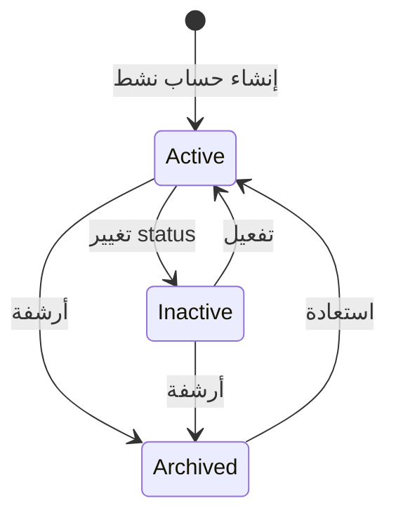
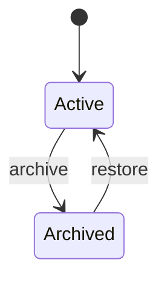
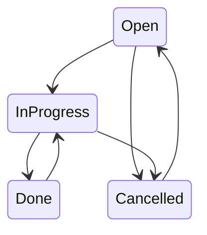
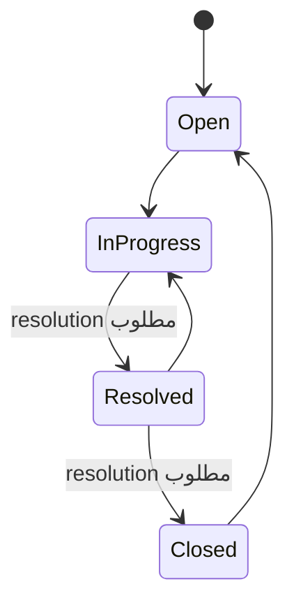
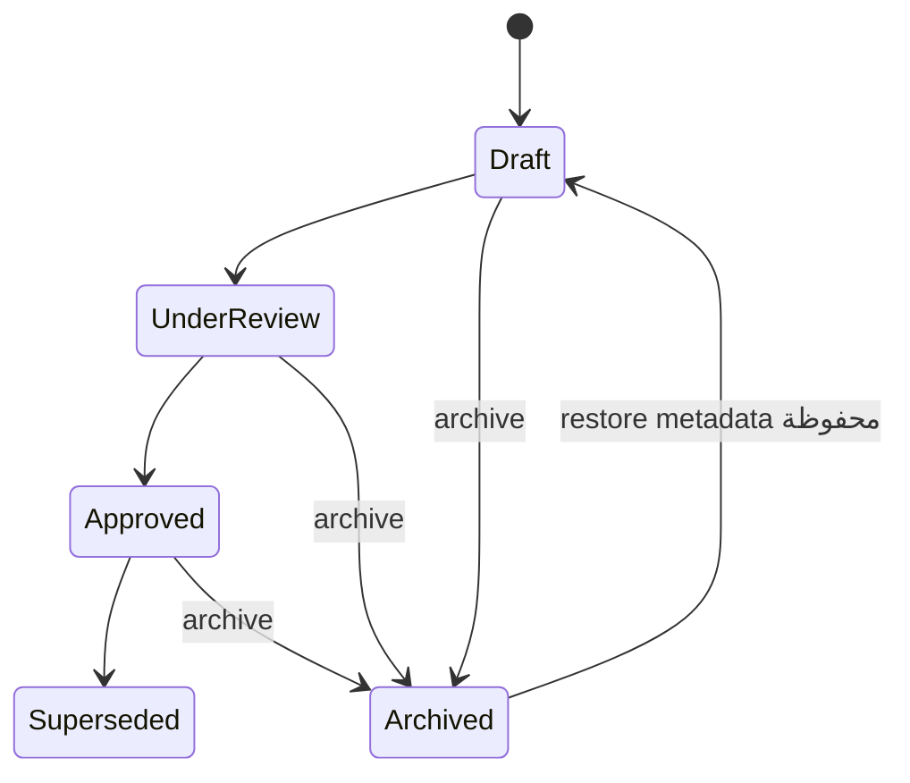
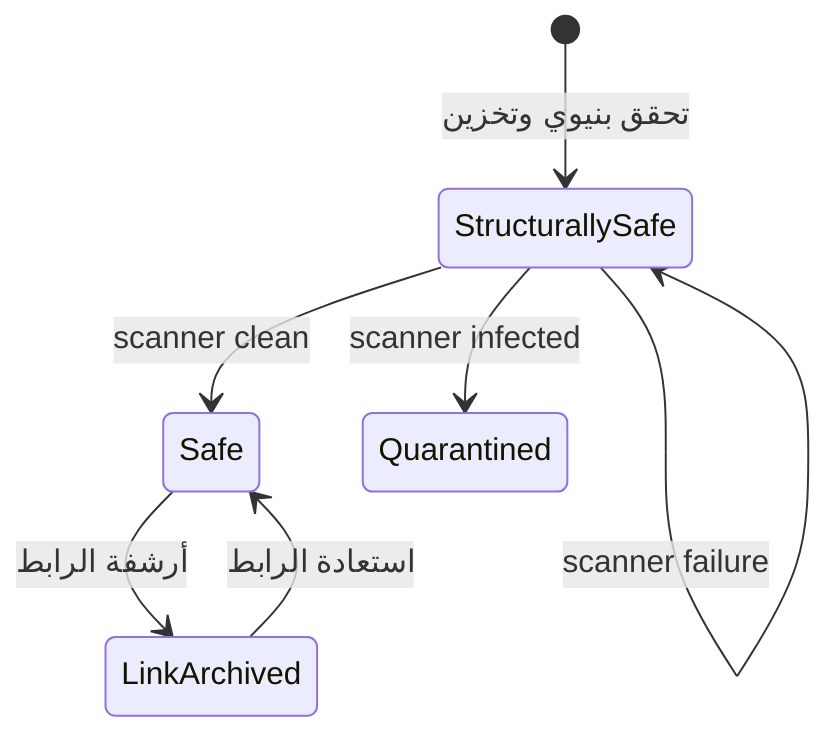
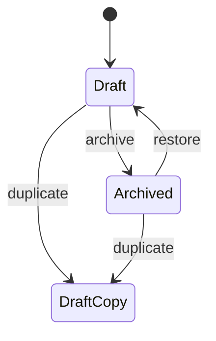
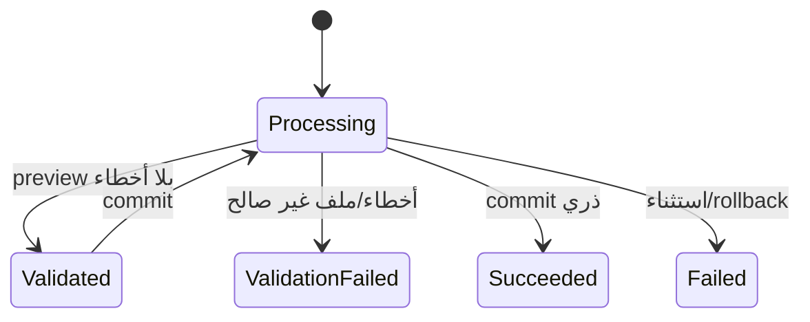
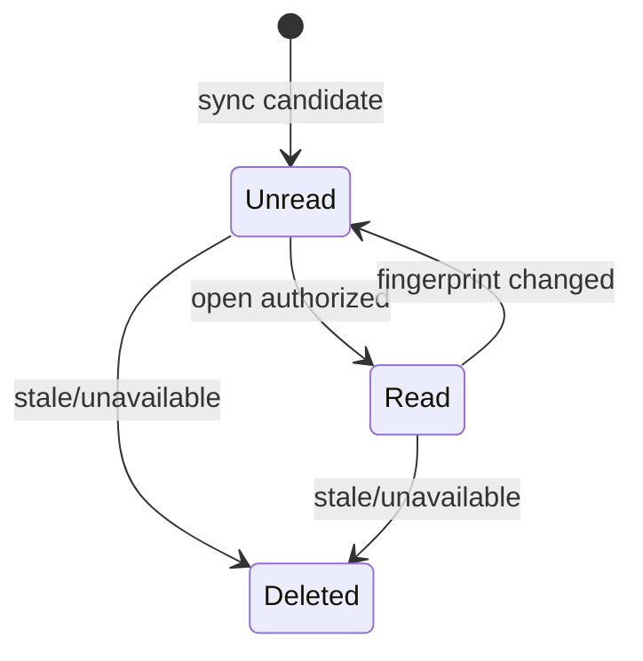

# كراسة مواصفات متطلبات البرمجيات لنظام Project Desk

## وفق بنية IEEE 830-1998 مع تحسينات التتبع الحديثة

> **تصنيف الوثيقة:** داخلي — CloudTech  
> **حالة الوثيقة:** مسودة مراجعة مستخرجة من التنفيذ الفعلي  
> **الإصدار:** 1.1  
> **تاريخ خط الأساس التحليلي:** 12 أغسطس 2026  
> **لغة المواصفات:** العربية  
> **النظام:** Project Desk  
> **نطاق الإصدار:** v1 داخلي، شركة واحدة، تطبيق ويب  

---

## ضبط الوثيقة

### سجل المراجعات

| الإصدار | التاريخ | المؤلف/الجهة | وصف التغيير | الحالة |
|---|---|---|---|---|
| 0.1 | 2026-08-12 | Codex / تحليل المستودع | مسودة أولية مشتقة من الشيفرة، قاعدة البيانات، الاختبارات والوثائق | مسودة |
| 1.0 | 2026-08-12 | Codex / تحليل المستودع | كراسة SRS كاملة ببنية IEEE 830، حالات استخدام، قواعد عمل، متطلبات بيانات وغير وظيفية وتتبّع | بانتظار المراجعة والاعتماد |
| 1.1 | 2026-08-14 | Codex / مزامنة التنفيذ | تحديث عقد التوطين إلى عربية افتراضية وواجهة إنجليزية، مع Cookie اللغة وRTL/LTR والتنسيق المحلي وحدود بيانات المستخدم وPDF | بانتظار المراجعة والاعتماد |

### المراجعة والموافقات

| الدور | الاسم | القرار | التاريخ | التوقيع/مرجع الدليل |
|---|---|---|---|---|
| مالك المنتج |  | موافق / تعديلات مطلوبة / مرفوض |  |  |
| المسؤول التقني |  | موافق / تعديلات مطلوبة / مرفوض |  |  |
| مسؤول الأمن والتشغيل |  | موافق / تعديلات مطلوبة / مرفوض |  |  |
| ممثل المستخدمين الداخليين |  | موافق / تعديلات مطلوبة / مرفوض |  |  |

### خط الأساس ومصدر الحقيقة

- أُعدت هذه الوثيقة من لقطة مساحة العمل الحالية، ولا يوجد في المستودع خط أساس `Git commit SHA` مثبت يمكن الاستناد إليه كمرشح إصدار.
- مصدر الحقيقة الأول هو التنفيذ الفعلي في `app/` و`routes/` و`database/migrations/` و`resources/` و`config/`، ثم الاختبارات في `tests/`، ثم الوثائق الموجودة في `docs/`.
- عند تعارض وثيقة سابقة مع الشيفرة الحالية، تصف هذه الكراسة السلوك المنفذ وتضع التعارض ضمن فجوات المتابعة.
- وجود اختبار أو تكامل تجريبي لا يساوي تصريح إنتاج؛ بوابات الإنتاج الخارجية موضحة في قسم الفجوات والاعتماد.

### اصطلاح حالة المتطلب

| الرمز | الحالة | المعنى |
|---|---|---|
| **Implemented** | منفذ | موجود في الشيفرة الحالية وله مسار تحقق أو اختبار مناسب. |
| **Partial** | منفذ جزئياً | جزء جوهري موجود، لكن السلوك أو التكامل أو الإثبات غير مكتمل. |
| **Planned** | مخطط/بوابة لازمة | مطلوب قبل الإنتاج أو مستهدف قياسياً، لكنه غير مثبت في اللقطة الحالية. |
| **Out of scope** | خارج النطاق | مستبعد عمداً من v1، ولا يجوز اعتباره وظيفة حالية. |

---

# 1. المقدمة

## 1.1 الغرض

تحدد هذه الوثيقة المتطلبات البرمجية القابلة للتحقق لنظام **Project Desk** كما هو منفذ حالياً. وهي موجهة إلى مالك المنتج، فريق التطوير، الاختبار، الأمن، التشغيل، المراجعين، وأي فريق أو نظام ذكاء اصطناعي يتولى صيانة المشروع لاحقاً.

تؤدي الوثيقة الأغراض التالية:

1. تثبيت حدود النظام ونطاقه الفعلي دون اختراع خصائص غير موجودة.
2. تحويل السلوك البرمجي إلى متطلبات معيارية تستخدم صياغة «يجب» ومعرّفات ثابتة.
3. توثيق المستخدمين والصلاحيات والبيانات والحالات والواجهات والقيود.
4. ربط المتطلبات بمصادر تنفيذها واختباراتها.
5. فصل اكتمال المستودع عن جاهزية النشر والإثبات التشغيلي.
6. إظهار الفجوات والخصائص الجزئية أو المخططة بصورة صريحة.

## 1.2 اصطلاحات الوثيقة

- المعرّفات `FR-*` للمتطلبات الوظيفية، و`BR-*` لقواعد العمل، و`DR-*` لمتطلبات البيانات، و`NFR-*` للمتطلبات غير الوظيفية.
- كلمة **يجب** تعني متطلباً إلزامياً قابلاً للتحقق.
- كلمة **قد** تستخدم لوصف اختيار متاح أو نتيجة فرعية غير إلزامية.
- التواريخ والأوقات التشغيلية تخزن كلحظات UTC حيث ينطبق، وتعرض وفق توقيت العمل؛ الوضع الافتراضي `Africa/Tripoli`.
- أسماء المسارات والجداول والملفات البرمجية تكتب كما هي لتسهيل التتبع.
- تشير عبارة «مدير المشروع» إلى الدور العام `project_manager` أو إلى مستخدم يملك صلاحية إدارة مشروع محدد وفق `ProjectPolicy`؛ ويحدد السياق أيهما المقصود.

## 1.3 الجمهور المقصود وتسلسل القراءة

| الجمهور | الأقسام المقترحة |
|---|---|
| مالك المنتج والمراجع الإداري | 1، 2، 3.2، 4، 7، 9 |
| المطورون والمعماريون | كامل الوثيقة، وبخاصة 3 و5 و8 |
| فريق الاختبار | 3.2، 4، 6، 7، 8 |
| الأمن والتشغيل | 2.4–2.7، 3.1، 3.5، 5.4، 9 |
| المستخدمون الداخليون والمدربون | 2.2، 2.3، 3.1.1، 4 |
| فريق نقل المشروع أو AI آخر | ضبط الوثيقة، 2، 3، 5، 8، 9 |

## 1.4 نطاق المنتج

Project Desk تطبيق ويب ثنائي الواجهة لإدارة مشاريع CloudTech الداخلية: العربية هي
اللغة الافتراضية باتجاه RTL، والإنجليزية لغة واجهة اختيارية باتجاه LTR. يجمع في نظام واحد:

- المستخدمين والأدوار والعضويات؛
- العملاء وجهات الاتصال؛
- المشاريع والمهام والمتطلبات وحالات سير العمل؛
- التخطيط الأسبوعي والمراحل والاجتماعات والمحاضر؛
- المخاطر والمشكلات؛
- الملفات وكراسة المتطلبات وإصداراتها؛
- لوحة المتابعة والبحث والتنبيهات؛
- **قوالب فواتير فقط** مع بنود وحساب داخل القالب ومعاينة/PDF؛
- مركز بيانات للاستيراد والتصدير والنسخ والاستعادة؛
- إعدادات النظام وسجل النشاط.

لا يمثل قسم قوالب الفواتير نظاماً محاسبياً، ولا ينشئ أرصدة أو تحصيلاً أو قيوداً أو حالات دفع أو استحقاقات.

## 1.5 التعاريف والاختصارات

| المصطلح | التعريف |
|---|---|
| SRS | كراسة مواصفات متطلبات البرمجيات. |
| Admin | مدير النظام ذو الدور العام `admin`. |
| PM | مدير مشروع؛ قد يكون الدور العام `project_manager` أو دور المشروع `manager`. |
| Member | عضو فريق يقرأ المشروع المصرح به، ويمكنه رفع الملفات وتحديث حالة المهمة المسندة إليه وفق السياسة. |
| Viewer | الدور المقصود منتجياً للقراءة فقط؛ التنفيذ يمنع رفعه وقوالبه، لكنه لا يفرض القراءة فقط في كل Project Policy إذا مُنح دور مدير مشروع؛ راجع GAP-010. |
| Workflow semantic | دلالة ثابتة للحالة: `open` أو `in_progress` أو `done` أو `cancelled`. |
| Archive | إخفاء منطقي قابل للاستعادة، لا حذف فيزيائي افتراضي. |
| Optimistic lock | منع الكتابة فوق تعديل أحدث باستخدام `lock_version`. |
| Requirement Book | كراسة متطلبات واحدة منطقياً لكل مشروع، ولها إصدارات ملفات متعددة. |
| FileObject | سجل ملف خاص يتضمن metadata والبصمة وحالة الفحص ومفتاح التخزين المخفي. |
| AttachmentLink | رابط ملف بسياق مشروع أو مهمة أو متطلب أو كراسة أو محضر. |
| Invoice template | قالب فاتورة مستقل، وقد يستخدم عميلاً أو مشروعاً وتواريخ كبيانات معاينة اختيارية. |
| DataJob | سجل عملية استيراد/نسخ أو عملية بيانات وحالتها ونتيجتها وأخطائها. |
| `.pdesk` | حزمة استعادة مشفرة ومصادق عليها تشمل SQLite والملفات المشار إليها. |
| Locale | اختيار لغة واجهة من `ar` أو `en` يحدد `lang` و`dir` وتنسيق العرض، ولا يغير لغة بيانات المستخدم المخزنة أو PDF الحالي. |
| RPO | أقصى فقد بيانات زمني مقبول عند التعافي. |
| RTO | أقصى زمن مستهدف لاستعادة الخدمة. |

## 1.6 المراجع

### مراجع معيارية

1. IEEE Std 830-1998, *IEEE Recommended Practice for Software Requirements Specifications*. صفحة IEEE SA تصنف المعيار بأنه **Superseded**؛ حلت محله ISO/IEC/IEEE 29148:2011. استُخدمت هنا بنية IEEE 830 بطلب صاحب النظام، مع إضافة تتبع حديث، ولا تدعي الوثيقة اعتماداً أو شهادة رسمية: <https://standards.ieee.org/ieee/830/1222/>.
2. ISO/IEC/IEEE 29148:2011، هندسة المتطلبات — مرجع منهجي للخلفية والتتبع الحديث، دون ادعاء إجراء تقييم امتثال كامل.

### مراجع داخلية حاكمة

- `README.md`
- `docs/PRODUCT_SCOPE.md`
- `docs/ARCHITECTURE.md`
- `docs/REQUIREMENTS_TRACEABILITY.md`
- `docs/ENVIRONMENT.md`
- `docs/BACKUP_AND_RECOVERY.md`
- `docs/ATTACHMENTS_AND_RETENTION.md`
- `docs/PROJECT_METRICS.md`
- `docs/RELEASE_READINESS.md`
- `docs/workflow-status-api.md`
- `routes/web.php` و`routes/settings.php` و`routes/workflow-statuses.php`

---

# 2. الوصف العام

## 2.1 منظور المنتج

Project Desk تطبيق أحادي متماسك **modular monolith** مبني على Laravel وReact، وليس مجموعة microservices. يستخدم:

- Laravel 13 وPHP 8.3+ في الخادم؛
- Inertia.js 3 لربط صفحات Laravel وReact؛
- React 19 وTypeScript وTailwind CSS 4 وRadix UI؛
- SQLite بوضع WAL في ملف v1 المدعوم؛
- تخزين ملفات خاص من خلال Laravel Storage؛
- mPDF لتوليد ملفات PDF العربية/RTL الحالية؛
- PhpSpreadsheet لملفات XLSX؛
- Laravel Fortify للمصادقة والتحقق من البريد و2FA وPasskeys؛
- Playwright وPHPUnit/PHPStan/Pint/ESLint/TypeScript لبوبات الجودة.

لا يوفر النظام Public REST API مستقلاً؛ صفحات Inertia ونقاط JSON الداخلية تستخدم جلسة الويب والسياسات نفسها.

## 2.2 ملخص وظائف المنتج

| المجال | الوظائف الحالية |
|---|---|
| الهوية والأمن | تسجيل الدخول والخروج، استعادة كلمة المرور، تحقق البريد، تأكيد كلمة المرور، 2FA، Passkeys، تعطيل الحساب، تدقيق أحداث الأمن. |
| الفريق | دليل أعضاء، إضافة وتعديل وأرشفة واستعادة، أدوار عامة، إبطال الجلسات عند تغييرات حساسة. |
| العملاء | قائمة وبحث وتفاصيل وإنشاء وتعديل وأرشفة واستعادة، وجهات اتصال أساسية/نشطة. |
| المشاريع | قائمة وفلاتر وصحة وتقدم، إنشاء وتعديل وأرشفة واستعادة، فريق المشروع، مساحة مشروع متعددة التبويبات، ملخص PDF. |
| المتطلبات والمهام | CRUD منطقي، أكواد تلقائية، حالات قابلة للتخصيص، ربط M:N، إسناد وسجل إسناد، قائمة وكانبان، أرشفة واستعادة. |
| التخطيط | أسبوع من الأحد إلى السبت، صف لكل مشروع، أشرطة تمتد من البداية إلى النهاية، اجتماعات ومراحل وبنود زمنية. |
| الحوكمة | مخاطر ومشكلات، درجة مخاطرة، ملاك، مواعيد، معالجة وحلول، أرشفة واستعادة. |
| الوثائق | رفع خاص، تحقق بنيوي وفحص malware، روابط للمشروع/المهمة/المتطلب، كراسة بإصدارات، مرفق محضر، تنزيل مصرح. |
| المتابعة | KPIs، صحة وتقدم، حمل الفريق، المتأخر والقريب، بحث عام، تنبيهات مستمرة. |
| قوالب الفواتير | إنشاء وتعديل ونسخ وأرشفة واستعادة، بنود وخصم وضريبة وعملة، معاينة A4 وPDF بعلامة نموذج. |
| البيانات والتعافي | قوالب/تصدير CSV وXLSX، معاينة واستيراد ذري للعملاء والمهام، DataJobs، نسخ `.pdesk` واستعادة محمية. |
| الإدارة | إعدادات الشركة والتنبيهات والنسخ والتقويم، حالات workflow، تفضيلات تنبيه شخصية، ملف وأمن المستخدم. |
| توطين الواجهة | عربية افتراضية وواجهة إنجليزية، مبدل لغة للزائر والمستخدم، Cookie مشفرة، RTL/LTR وتنسيق أرقام وتواريخ بحسب اللغة. |

## 2.3 فئات المستخدمين وخصائصهم

### 2.3.1 مدير النظام — Admin

- مستخدم داخلي موثوق مسؤول عن النظام والبيانات والتشغيل.
- يرى جميع المشاريع والعملاء وقوالب الفواتير.
- يدير المستخدمين، الإعدادات، حالات سير العمل ومركز البيانات والنسخ.
- يخضع لتأكيد كلمة المرور في العمليات الحساسة، ومنها الاستعادة وإدارة الأمن.

### 2.3.2 مدير المشروع — Project Manager

- ينشئ مشاريع وعملاء ضمن نطاقه ويدير المشاريع التي يديرها أو يحمل فيها دور `manager` نشطاً.
- يدير المهام والمتطلبات والاجتماعات والحوكمة والملفات داخل مشاريعه.
- يرى أعضاء الفرق المشتركة معه.
- ينشئ ويدير قوالب الفواتير التي أنشأها فقط؛ لا تمنحه علاقة القالب بالعميل/المشروع صلاحية إضافية.

### 2.3.3 العضو — Member

- يرى المشاريع التي يديرها أو ينتمي إليها بعضوية نشطة.
- يقرأ سجلات المشروع، ويمكنه رفع وتنزيل الملفات المصرح بها إذا كان دور المشروع `member` أو `manager`.
- يستطيع تحديث **حالة** المهمة المسندة إليه، لكنه لا يغير بقية بياناتها ما لم يكن مديراً للمشروع.
- لا يدخل مركز البيانات ولا الإعدادات الإدارية ولا قوالب الفواتير.

### 2.3.4 المشاهد — Viewer

- يرى الموارد التي تسمح بها عضوية المشروع.
- **النية المنتجية** أن يكون للقراءة فقط، لكن التنفيذ الحالي لا يفرض ذلك بصورة مطلقة: إذا عُيّن global Viewer كـ`manager_id` أو بعضوية مشروع `manager` فقد تمنحه `ProjectPolicy` صلاحيات إدارة، وقد تسمح عضوية manager/member بإسناد مهمة؛ يسجل ذلك كفجوة صلاحيات GAP-010.
- يمنعه `ProjectPolicy::uploadFile` صراحة من رفع الملفات، ولا يدير قوالب الفواتير.
- يمكنه تنزيل ملف آمن فقط إذا سمحت صلاحية العرض ورابط الملف النشط.

### 2.3.5 مسؤول التشغيل

- ليس دوراً برمجياً مستقلاً في قاعدة البيانات؛ تنفذ مسؤولياته بحساب Admin وبصلاحيات بيئة التشغيل.
- يدير المفاتيح والأسرار والجدولة والنسخ الخارجية والماسح والمراقبة وتمارين الاستعادة.

### 2.3.6 فئات غير موجودة

- لا يوجد حساب عميل خارجي أو بوابة عميل في v1.
- لا يوجد tenant آخر أو مدير مؤسسة مستقل.
- لا يوجد محاسب أو محصل كدور وظيفي؛ النظام ليس محاسبياً.

## 2.4 بيئة التشغيل

| المكون | خط الأساس المدعوم/المشاهد |
|---|---|
| الخادم | Linux LTS مُصان للإنتاج؛ بيئة التطوير الحالية قد تعمل على Windows. |
| PHP | 8.3 أو أحدث؛ CI الموثق يستهدف PHP 8.4. |
| Node | 22.12 أو أحدث في خط البناء؛ pnpm 11.16.0 مثبت في `package.json`. |
| قاعدة البيانات | SQLite محلية على تخزين دائم، وضع WAL، خادم تطبيق واحد. |
| الويب | Nginx أو بديل reverse proxy مع PHP-FPM وTLS في الإنتاج. |
| المتصفح | واجهة ويب متجاوبة؛ اختبارات المستودع الآلية تستخدم Chromium عبر Playwright. اعتماد مصفوفة متصفحات إنتاجية أوسع ما يزال بوابة تشغيل. |
| التخزين | Laravel private disk؛ لا تُعرض مفاتيح التخزين للمستخدم. |
| التوقيت | افتراض العمل `Africa/Tripoli`؛ تخزين لحظات المجال UTC وعرض محلي حيث ينطبق. |

## 2.5 قيود التصميم والتنفيذ

1. النظام شركة واحدة ولا يحتوي `tenant_id`.
2. ملف v1 المدعوم أحادي المضيف؛ التوسع الأفقي أو PostgreSQL/MySQL مشروع ترحيل مستقل.
3. قاعدة SQLite لا توضع على NFS/SMB أو تخزين شبكي مشترك.
4. التسجيل الذاتي العام معطل؛ الحسابات داخلية وينشئها Admin أو أمر التهيئة الأولية.
5. الأرشفة هي الافتراض للسجلات الجوهرية، ولا توجد واجهات حذف فيزيائي لها.
6. الصلاحيات تنفذ في الخادم عبر Policies/Scopes، وليس بإخفاء الواجهة فقط.
7. رفع الملفات مقيد بالامتداد وMIME والبنية والحصة ومعدل الطلب والفحص.
8. PDF وXLSX والاستيراد الحاليون متزامنون ضمن حدود الحجم؛ الأحجام الأكبر تحتاج queue مصممة ومختبرة.
9. قوالب الفواتير محصورة في النوع `invoice` والحالتين `draft` و`archived`.
10. القيم التجارية القديمة في مخطط قاعدة البيانات محفوظة للتوافق، لكنها لا تظهر ولا تحل عبر مسارات القوالب.

## 2.6 وثائق المستخدم والتشغيل

يوجد دليل مستخدم عربي وملفات تشغيل ونسخ واستعادة وبيئة. يجب اعتبار هذه الكراسة مرجع المتطلبات، بينما يشرح دليل المستخدم كيفية التنفيذ اليومي، وتشرح ملفات البيئة والتعافي إجراءات التشغيل.

## 2.7 الافتراضات والاعتمادات

- لدى المستخدم الداخلي بريد صالح ويمكن لخدمة البريد المهيأة إرسال التحقق وإعادة التعيين.
- يضبط المسؤول `APP_KEY` مرة واحدة ولا يدوره دون خطة ترحيل.
- يهيأ ماسح malware فعلي قبل استقبال ملفات غير موثوقة في الإنتاج.
- تحفظ مفاتيح النسخ في مدير أسرار منفصل عن الحزم.
- يستدعي cron/timer Laravel scheduler كل دقيقة.
- بيانات الفريق والعملاء والمشاريع المدخلة صحيحة ومصرح بها تنظيمياً.
- يتولى مسؤول التشغيل نسخ حزم الاستعادة خارج المضيف وإجراء تمارين دورية؛ التطبيق لا يثبت وحده حدوث ذلك.

---

# 3. المتطلبات المحددة

## 3.1 متطلبات الواجهات الخارجية

### 3.1.1 واجهات المستخدم

| الواجهة | المسار/السياق | الوظيفة | المستخدمون |
|---|---|---|---|
| الصفحة العامة | `/` | تعريف موجز بالنظام وروابط الدخول | زائر |
| المصادقة | `/login` ومسارات Fortify | دخول، نسيان/إعادة كلمة المرور، تحقق البريد، 2FA، تأكيد كلمة المرور | زائر/مستخدم |
| لوحة المتابعة | `/dashboard` | KPIs، مشاريع، مهام اهتمام، حوكمة، حمل، أسبوع مختار، تنبيهات | كل مستخدم نشط موثق |
| المشاريع | `/projects` | قائمة وفلاتر وإنشاء وأرشيف واستعادة | كل مستخدم نشط؛ الإنشاء Admin/PM |
| مساحة المشروع | `/projects/{project}` | overview، requirements، tasks، timeline، meetings، risks، issues، team، documents، client، activity | مستخدم يملك `view` |
| المهام | `/tasks` | قائمة/كانبان، فلاتر، إنشاء، تعديل، حالة، أرشيف | مستخدمون مصرحون |
| العملاء | `/clients` وما يتبعها | قائمة وتفاصيل ونماذج العميل وجهات الاتصال | مستخدمون مصرحون |
| الفريق | `/team` | الدليل والمشاريع والمهام؛ الإدارة لـAdmin | كل مستخدم نشط ضمن نطاقه |
| قوالب الفواتير | `/sales` | مكتبة القوالب والمحرر والمعاينة والنسخ والأرشيف وPDF | Admin وPM |
| مركز البيانات | `/data-center` | الاستيراد والتصدير والوظائف والنسخ | Admin فقط |
| الإعدادات | `/settings` | إعدادات النظام والحالات | Admin فقط |
| ملف المستخدم | `/settings/profile` | الاسم والبريد وبيانات الملف | المستخدم نفسه |
| الأمن | `/settings/security` | كلمة المرور، 2FA، Passkeys | المستخدم نفسه بعد تأكيد كلمة المرور |
| التنبيهات | `/settings/notifications` | تفضيلات المستخدم ضمن سياسة النظام | المستخدم نفسه |

متطلبات العرض المشتركة:

- يجب أن تبدأ الواجهة بالعربية واتجاه RTL عند غياب اختيار صالح، وأن تتيح الإنجليزية باتجاه LTR.
- يجب أن يتاح مبدل اللغة في الأسطح العامة والمحمية، وأن يبقى الاختيار بعد إعادة التحميل.
- يجب أن تتبع خصائص `html.lang` و`html.dir` ورأس `Content-Language` اللغة الفعالة.
- يجب أن تنسق الأسطح المربوطة الأرقام والتواريخ وفق `ar-LY` للعربية و`en-GB` للإنجليزية.
- يجب ألا يترجم تبديل الواجهة تلقائياً أسماء المستخدمين أو العملاء أو المشاريع أو
  الأوصاف والملاحظات وغيرها من المحتوى المخزن. كما لا يغير لغة PDF الحالية.
- يجب أن يوجد رابط تخطي إلى المحتوى الرئيسي كأول هدف Tab في الصفحات المحمية.
- يجب أن تحمل عناصر التحكم أسماء وصولية والجداول أسماءً أو تسميات واضحة.
- يجب أن تعيد الحوارات التركيز إلى عنصر الاستدعاء بعد الإغلاق.
- يجب أن تحذر الحوارات والمحررات المدعومة قبل فقد تغييرات غير محفوظة.
- يجب ألا يكون للصفحة تمرير أفقي غير مقصود في عروض الاختبار؛ يستثنى scroller الجدول الأسبوعي المقصود.

### 3.1.2 واجهات الأجهزة

لا توجد واجهة أجهزة خاصة. يعتمد النظام على جهاز خادم قياسي، شبكة HTTPS، تخزين دائم محلي، وجهاز مستخدم قادر على تشغيل متصفح ويب حديث. المصادقة بمفتاح مرور قد تعتمد على Authenticator يدعمه WebAuthn والمتصفح/نظام التشغيل.

### 3.1.3 واجهات البرمجيات

| الواجهة | الاتجاه | العقد الحالي |
|---|---|---|
| SQLite عبر PDO | داخلي | قاعدة v1 الأساسية، WAL، معاملات، مفاتيح خارجية وفهارس. |
| Laravel Storage | داخلي/خارجي | أقراص خاصة للملفات وحزم النسخ؛ القرص العام غير مسموح لحزمة الاستعادة الكاملة. |
| MalwareScanner | خارجي | driver من نوع `command` أو `callback`؛ نجاح الفحص وحده ينقل الملف إلى `safe`. |
| البريد | خارجي | Laravel Mail لإعادة كلمة المرور والتحقق من البريد؛ مزود الإنتاج يحدد بالبيئة. |
| mPDF | داخلي | توليد PDF باتجاه RTL وخط DejaVu Sans وA4. |
| PhpSpreadsheet | داخلي | قراءة/كتابة XLSX بقالب ثابت ودون formulas/macros/external relationships. |
| نظام الملفات/الأسرار | تشغيلي | `APP_KEY` ومفتاح نسخ 32 بايت ومفاتيح سابقة عند التدوير. |
| Scheduler | تشغيلي | أوامر التنبيهات والنسخ كل دقيقة، وتنظيف الملفات يومياً 03:30 بتوقيت العمل. |

### 3.1.4 واجهات الاتصالات

- يجب أن يستخدم الإنتاج HTTPS فقط.
- تستخدم واجهات الويب جلسة Laravel وCSRF ولا توفر API عاماً دون جلسة.
- ترسل الاستجابات `X-Request-Id` و`X-Correlation-Id` وتقبل قيماً منقحة بطول أقصى 100 حرف.
- ترسل الاستجابات الأمنية رؤوس `nosniff` و`DENY` للإطارات وسياسة referrer وpermissions وCOOP/CORP؛ يضاف HSTS في الإنتاج الآمن.
- يجب أن تكون تنزيلات PDF والنسخ والملفات خاصة، ومقيدة بالصلاحيات وبسياسة `no-store` حيث يطبقها التنفيذ.

### 3.1.5 واجهات الملفات

| الاستخدام | الصيغ الحالية | القيود الأساسية |
|---|---|---|
| مرفقات المشروع | PDF، DOCX، XLSX، CSV، JPG/JPEG، PNG، WEBP | 25 MiB افتراضياً؛ تحقق امتداد/MIME/توقيع/محتوى، لا تنزيل قبل `safe`. |
| استيراد البيانات | CSV أو XLSX | العملاء والمهام فقط؛ حد 10 MiB افتراضياً و5000 صف؛ preview قبل commit. |
| تصدير البيانات | CSV أو XLSX | العملاء والمشاريع والمهام ضمن صلاحية المستخدم أو من مركز Admin. |
| مخرجات PDF | PDF | ملخص مشروع وقالب فاتورة؛ تنزيل خاص مصرح. |
| النسخ | `.pdesk`؛ وSQLite قديم للترحيل | حزمة مشفرة كاملة؛ القديم database-only يحول ولا يعيد ملفات غير موجودة. |

## 3.2 المتطلبات الوظيفية

> عمود «الدليل» يحدد أهم ملف تنفيذ، وعمود «التحقق» يحدد اختباراً أو مجموعة اختبار. لا تعني الإشارة إلى الاختبار أنه شُغّل على SHA معتمد؛ يجب إعادة البوابة عند اعتماد مرشح الإصدار.

### 3.2.1 المصادقة وأمن الحساب

| المعرّف | الحالة | المتطلب | الدليل | التحقق |
|---|---|---|---|---|
| FR-AUTH-001 | Implemented | يجب أن يسمح النظام بتسجيل الدخول بالبريد وكلمة المرور للحساب النشط غير المؤرشف فقط. | `FortifyServiceProvider.php` | `AuthenticationTest.php`, `DisabledAccountTest.php` |
| FR-AUTH-002 | Implemented | يجب أن يطبق النظام حداً قدره خمس محاولات دخول في الدقيقة لكل بريد/IP. | `FortifyServiceProvider.php` | `AuthenticationTest.php`, `SecurityActivityAuditTest.php` |
| FR-AUTH-003 | Implemented | يجب أن ينشئ تسجيل الدخول الناجح جلسة ويوجه المستخدم إلى `/dashboard`. | `config/fortify.php` | `AuthenticationTest.php` |
| FR-AUTH-004 | Implemented | يجب أن يسجل الخروج ويلغي الجلسة الحالية. | Fortify / `SecurityActivitySubscriber.php` | `AuthenticationTest.php` |
| FR-AUTH-005 | Implemented | يجب أن يرفض middleware أي حساب صار غير نشط أو مؤرشف، ويسجل خروجه ويلغي جلسته. | `EnsureActiveUser.php` | `DisabledAccountTest.php` |
| FR-AUTH-006 | Implemented | يجب أن يدعم النظام طلب رابط إعادة كلمة المرور وإعادة تعيينها عبر البريد المهيأ. | `config/fortify.php`, `ResetUserPassword.php` | `PasswordResetTest.php` |
| FR-AUTH-007 | Implemented | يجب أن يتطلب النظام تحقق البريد قبل صفحات المجال الموسومة `verified`. | `routes/web.php` | `EmailVerificationTest.php`, `VerificationNotificationTest.php` |
| FR-AUTH-008 | Implemented | يجب ألا يتيح النظام التسجيل الذاتي العام. | `config/fortify.php` | `RegistrationTest.php`, `InternalAccountsTest.php` |
| FR-AUTH-009 | Implemented | يجب أن يدعم النظام تفعيل وتأكيد وتعطيل المصادقة الثنائية واستعمال رموز الاستعادة. | Fortify، `SecurityController.php` | `TwoFactorChallengeTest.php`, `Settings/SecurityTest.php` |
| FR-AUTH-010 | Implemented | يجب أن يطبق حد خمس محاولات 2FA في الدقيقة للجلسة. | `FortifyServiceProvider.php` | `TwoFactorChallengeTest.php` |
| FR-AUTH-011 | Implemented | يجب أن يدعم النظام تسجيل وإدارة والتحقق من Passkeys بعد تأكيد كلمة المرور. | Fortify Passkeys، `routes/settings.php` | `Settings/SecurityTest.php` |
| FR-AUTH-012 | Implemented | يجب أن يتطلب النظام تأكيد كلمة المرور لتغيير البريد أو لتغييرات الحساب الحساسة. | `RequireSensitiveProfilePassword.php`, `RequireSensitiveTeamPassword.php` | `PasswordConfirmationTest.php`, `Settings/ProfileUpdateTest.php` |
| FR-AUTH-013 | Implemented | يجب أن يبطل النظام الجلسات الأخرى وRemember Token عند تغيير البريد أو كلمة المرور أو الدور. | `UserSessionSecurity.php`, `TeamController.php` | `TeamWorkflowTest.php`, `Settings/SecurityTest.php` |
| FR-AUTH-014 | Implemented | يجب أن يسجل النظام أحداث الدخول والخروج والفشل و2FA وPasskeys دون تخزين كلمات المرور أو الأسرار. | `SecurityActivitySubscriber.php` | `SecurityActivityAuditTest.php` |

### 3.2.2 المستخدمون والفريق والصلاحيات

| المعرّف | الحالة | المتطلب | الدليل | التحقق |
|---|---|---|---|---|
| FR-USR-001 | Implemented | يجب أن يعرض النظام دليل الفريق للمستخدم النشط، مقيداً بأعضاء المشاريع المشتركة لغير Admin. | `TeamController@index` | `TeamWorkflowTest.php` |
| FR-USR-002 | Implemented | يجب أن يعرض لكل عضو بياناته الأساسية وعدد المشاريع النشطة والمهام المفتوحة ضمن نطاق المشاهد. | `TeamController@index` | `TeamWorkflowTest.php` |
| FR-USR-003 | Implemented | يجب أن يسمح لـAdmin فقط بإنشاء عضو باسم وبريد ودور وحالة وكلمة مرور مؤكدة. | `UserPolicy.php`, `StoreTeamMemberRequest.php` | `TeamWorkflowTest.php` |
| FR-USR-004 | Implemented | يجب أن يحصر الأدوار العامة في `admin`, `project_manager`, `member`, `viewer`. | `StoreTeamMemberRequest.php` | `TeamWorkflowTest.php` |
| FR-USR-005 | Implemented | يجب أن يسمح لـAdmin فقط بتعديل عضو غير مؤرشف. | `UserPolicy.php` | `TeamWorkflowTest.php` |
| FR-USR-006 | Implemented | يجب ألا يسمح لـAdmin بأرشفة حسابه بنفسه. | `UserPolicy.php` | `TeamWorkflowTest.php` |
| FR-USR-007 | Implemented | يجب أن تؤرشف العضوية بجعل الحالة `inactive` وتسجيل `archived_at` مع الحفاظ على الارتباطات. | `TeamController@archive` | `TeamWorkflowTest.php` |
| FR-USR-008 | Implemented | يجب أن يستعيد Admin العضو المؤرشف إلى حالة نشطة. | `TeamController@restore` | `TeamWorkflowTest.php` |
| FR-USR-009 | Implemented | يجب أن يكون لكل عضوية مشروع دور من `manager`, `member`, `viewer` وحالة عضوية. | migration `000200`, `ProjectController.php` | `ProjectWorkflowTest.php`, `TeamWorkflowTest.php` |
| FR-USR-010 | Implemented | يجب أن ترفض كل Policy مستخدماً غير نشط أو مؤرشف قبل تقييم صلاحية المورد. | `app/Policies/*` | `DisabledAccountTest.php`, اختبارات authorization |

### 3.2.3 العملاء وجهات الاتصال

| المعرّف | الحالة | المتطلب | الدليل | التحقق |
|---|---|---|---|---|
| FR-CLI-001 | Implemented | يجب أن يعرض النظام قائمة العملاء المرئيين فقط مع بحث وفرز/ترقيم وفصل النشط عن المؤرشف. | `ClientController.php`, `Client::visibleTo` | `ClientContactCrudTest.php` |
| FR-CLI-002 | Implemented | يجب أن يسمح لـAdmin وPM بإنشاء عميل ذي كود فريد واسم وحالة وبيانات اتصال اختيارية. | `ClientPolicy.php`, `SaveClientRequest.php` | `ClientContactCrudTest.php` |
| FR-CLI-003 | Implemented | يجب أن يسجل النظام منشئ العميل ويستخدمه ضمن نطاق الرؤية والإدارة لغير Admin. | migration `000360`, `Client.php` | `ClientContactCrudTest.php` |
| FR-CLI-004 | Implemented | يجب أن يسمح بتعديل العميل للمستخدم الذي تدخله نتيجة `manageableBy` فقط. | `ClientPolicy.php`, `Client::manageableBy` | `ClientContactCrudTest.php` |
| FR-CLI-005 | Implemented | يجب أن يدعم أرشفة العميل واستعادته دون حذف مشاريعه أو جهات اتصاله. | `ClientController.php` | `ClientContactCrudTest.php` |
| FR-CLI-006 | Implemented | يجب أن يعرض تفاصيل العميل وجهات اتصاله ومشاريعه المصرح بها فقط، دون عرض قوالب فواتير كقسم تابع. | `ClientController@show` | `ClientContactCrudTest.php`, اختبارات نطاق القوالب |
| FR-CLI-007 | Implemented | يجب أن يسمح بإضافة جهة اتصال نشطة إلى عميل قابل للإدارة. | `ContactPolicy.php`, `SaveContactRequest.php` | `ClientContactCrudTest.php` |
| FR-CLI-008 | Implemented | يجب أن يسمح بجهة أساسية واحدة فعالة لكل عميل، ويلغي صفة الأساسية عن البقية عند تعيين واحدة جديدة. | `ContactController.php` | `ClientContactCrudTest.php` |
| FR-CLI-009 | Implemented | يجب أن يمنع تعيين جهة غير نشطة كجهة أساسية. | `SaveContactRequest.php` | `ClientContactCrudTest.php` |
| FR-CLI-010 | Implemented | يجب أن تؤرشف جهة الاتصال بتعطيلها وإزالة صفة الأساسية، وأن تسمح باستعادتها. | `ContactController.php` | `ClientContactCrudTest.php` |

### 3.2.4 المشاريع ومساحة المشروع

| المعرّف | الحالة | المتطلب | الدليل | التحقق |
|---|---|---|---|---|
| FR-PRJ-001 | Implemented | يجب أن يعرض النظام للمستخدم المشاريع التي يديرها أو ينتمي إليها بعضوية نشطة؛ ويرى Admin الجميع. | `Project::visibleTo`, `ProjectPolicy.php` | `ProjectWorkflowTest.php` |
| FR-PRJ-002 | Implemented | يجب أن تدعم قائمة المشاريع البحث وفلاتر الحالة والأولوية والعميل والنشاط والمخاطرة والصحة والأرشيف. | `ProjectController@index` | `ProjectWorkflowTest.php`, `DashboardDrilldownTest.php` |
| FR-PRJ-003 | Implemented | يجب أن تدعم القائمة الفرز حسب النهاية والبداية والاسم والأولوية والإنشاء وترقيم 20 سجلاً. | `ProjectController@index` | `ProjectWorkflowTest.php` |
| FR-PRJ-004 | Implemented | يجب أن يسمح النظام لـAdmin وPM بإنشاء مشروع دون اشتراط وجود مهام. | `ProjectPolicy@create`, `ProjectController@store` | `ProjectWorkflowTest.php`, `critical-journey.mjs` |
| FR-PRJ-005 | Implemented | يجب أن يحفظ المشروع كوداً فريداً واسماً ووصفاً وعميلًا/جهة أساسية/مديراً اختياريين وحالة وأولوية وتواريخ. | `StoreProjectRequest.php` | `ProjectWorkflowTest.php` |
| FR-PRJ-006 | Implemented | يجب أن يمنع تاريخ نهاية المشروع السابق لتاريخ بدايته. | `StoreProjectRequest.php`, `UpdateProjectRequest.php` | `ProjectWorkflowTest.php` |
| FR-PRJ-007 | Implemented | يجب أن يمنع ربط جهة أساسية لا تتبع العميل المختار أو كانت غير نشطة. | طلبا المشروع | `ProjectWorkflowTest.php` |
| FR-PRJ-008 | Implemented | يجب أن يضيف النظام المدير والمستخدم المنشئ كعضوين مديرين نشطين عند إنشاء المشروع. | `ProjectController@store` | `ProjectWorkflowTest.php` |
| FR-PRJ-009 | Implemented | يجب أن يسمح بإدارة عضويات المشروع وأدوارها للمستخدم الذي يملك `update` على المشروع. | `ProjectController@update`, `ProjectPolicy.php` | `ProjectWorkflowTest.php` |
| FR-PRJ-010 | Implemented | يجب أن يمنع الكتابة فوق تعديل مشروع أحدث باستخدام `lock_version` عند التعديل. | `UpdateProjectRequest.php`, `ProjectController@update` | `ProjectWorkflowTest.php` |
| FR-PRJ-011 | Implemented | يجب أن يوفر مساحة المشروع تبويبات overview والمتطلبات والمهام والزمن والاجتماعات والمخاطر والمشكلات والفريق والوثائق والعميل والنشاط. | `ProjectController@show`, `projects/show.tsx` | `governance-smoke.mjs`, `documents-data-settings-smoke.mjs` |
| FR-PRJ-012 | Implemented | يجب أن يحمل النظام بيانات التبويب النشط فقط للموارد الكبيرة ويطبق ترقيماً يصل إلى 50 سجلاً في تبويبات الحوكمة. | `ProjectController@show` | `PerformanceVolumeTest.php` |
| FR-PRJ-013 | Implemented | يجب أن يحسب تقدم المشروع وصحته ومرحلته التالية من خدمة موحدة. | `ProjectMetrics.php` | `ProjectMetricsTest.php`, `ProjectMetricsIntegrationTest.php` |
| FR-PRJ-014 | Implemented | يجب أن يسمح بأرشفة مشروع قابل للإدارة وإخفائه من القوائم النشطة دون حذف موارده. | `ProjectController@archive`, `ProjectPolicy.php` | `ProjectWorkflowTest.php` |
| FR-PRJ-015 | Implemented | يجب أن يسمح باستعادة المشروع وفق سياسة Admin أو المدير ذي العضوية النشطة المناسبة. | `ProjectPolicy@restore`, `ProjectController@restore` | `ProjectWorkflowTest.php` |
| FR-PRJ-016 | Implemented | يجب أن يولد النظام ملخص مشروع PDF مصرحاً يتضمن المشروع وقياساته والمهام والمتطلبات الحالية. | `ProjectSummaryPdfController.php`, `PdfExportService.php` | `PdfExportAuthorizationTest.php` |

### 3.2.5 المتطلبات وكراسة المتطلبات

| المعرّف | الحالة | المتطلب | الدليل | التحقق |
|---|---|---|---|---|
| FR-REQ-001 | Implemented | يجب أن يعرض النظام متطلبات المشروع المصرح به مع الحالة والمالك وترقيم 1–100 حسب الطلب. | `RequirementController@index` | `GovernanceResourcesTest.php` |
| FR-REQ-002 | Implemented | يجب أن يسمح لمدير المشروع بإنشاء متطلب عنوانه إلزامي وله وصف ومعايير قبول وأولوية وحالة ومالك اختياري. | `SaveRequirementRequest.php` | `GovernanceResourcesTest.php` |
| FR-REQ-003 | Implemented | يجب أن ينشئ النظام كوداً تلقائياً `REQ-#####` إذا لم يقدم المستخدم كوداً. | `RequirementService.php` | `GovernanceResourcesTest.php` |
| FR-REQ-004 | Implemented | يجب أن يكون كود المتطلب فريداً داخل المشروع. | migration `000200`, `SaveRequirementRequest.php` | `GovernanceResourcesTest.php` |
| FR-REQ-005 | Implemented | يجب أن يكون مالك المتطلب مستخدماً نشطاً وعضواً نشطاً في المشروع. | `SaveRequirementRequest.php` | `GovernanceResourcesTest.php` |
| FR-REQ-006 | Implemented | يجب أن يمنع النظام تعارض تعديلات المتطلب باستخدام `lock_version`. | `RequirementService.php` | `GovernanceResourcesTest.php` |
| FR-REQ-007 | Implemented | يجب أن يدعم أرشفة المتطلب واستعادته، ولا يسمح باستعادته قبل استعادة المشروع. | `RequirementService.php` | `GovernanceResourcesTest.php` |
| FR-REQ-008 | Implemented | يجب أن يدعم ربط المتطلب بعدة مهام وربط المهمة بعدة متطلبات من المشروع نفسه. | `requirement_task`, `SaveTaskRequest.php` | `TaskWorkflowTest.php`, `GovernanceResourcesTest.php` |
| FR-REQ-009 | Implemented | يجب أن ينشئ النظام كراسة متطلبات واحدة منطقياً لكل مشروع عند رفع أول إصدار. | `RequirementBookService.php` | `ProjectDocumentWorkflowTest.php` |
| FR-REQ-010 | Implemented | يجب أن يسمح برفع إصدارات كراسة بعناوين وأرقام وحالات `draft/under_review/approved/superseded` وملف إلزامي. | طلبات `RequirementBookVersion` | `ProjectDocumentWorkflowTest.php` |
| FR-REQ-011 | Implemented | يجب أن يحافظ النظام على إصدار حالي واحد غير مؤرشف، وأن ينقل الحالية ذريعاً عند التعيين أو الأرشفة. | `RequirementBookService.php` | `ProjectDocumentWorkflowTest.php` |
| FR-REQ-012 | Implemented | يجب أن يسمح بتحديث metadata الإصدار وتعيينه حالياً وأرشفته واستعادته مع `lock_version` والحفاظ على ملفه. | `RequirementBookController.php`, `RequirementBookService.php` | `ProjectDocumentWorkflowTest.php` |

### 3.2.6 المهام والعمل اليومي

| المعرّف | الحالة | المتطلب | الدليل | التحقق |
|---|---|---|---|---|
| FR-TSK-001 | Implemented | يجب أن تعرض قائمة المهام السجلات النشطة أو المؤرشفة المرئية فقط ضمن مشاريع المستخدم. | `TaskController@index` | `TaskWorkflowTest.php` |
| FR-TSK-002 | Implemented | يجب أن تدعم القائمة البحث وفلاتر المشروع والمسؤول بما فيه غير المعيّن والحالة والمتأخر والقريب. | `TaskController@index` | `TaskWorkflowTest.php`, `DashboardDrilldownTest.php` |
| FR-TSK-003 | Implemented | يجب أن تدعم القائمة الفرز حسب النهاية والبداية والعنوان والأولوية والإنشاء ووقت الإسناد، وترقيم 30 سجلاً. | `TaskController@index` | `TaskWorkflowTest.php` |
| FR-TSK-004 | Implemented | يجب أن توفر واجهة العمل عرض قائمة وعرض Kanban من مصدر المهام نفسه. | `tasks/index.tsx` | `ui-task-regressions.mjs` |
| FR-TSK-005 | Implemented | يجب أن يسمح النظام بإنشاء مهمة داخل مشروع نشط لمن يملك `create` عليه. | `TaskPolicy.php`, `SaveTaskRequest.php` | `TaskWorkflowTest.php` |
| FR-TSK-006 | Implemented | يجب أن يكون للمهمة عنوان وحالة وأولوية وبداية ونهاية إلزاميتان، وأن تكون النهاية مساوية للبداية أو بعدها. | `SaveTaskRequest.php`, migration `000200` | `TaskWorkflowTest.php` |
| FR-TSK-007 | Implemented | يجب أن ينشئ النظام كود المهمة تلقائياً بصيغة `TSK-#####`. | `TaskService@create` | `TaskWorkflowTest.php` |
| FR-TSK-008 | Implemented | يجب أن يكون المسؤول اختيارياً، وإذا غاب يجب أن يكون `assigned_at` فارغاً. | `SaveTaskRequest.php`, `TaskService.php` | `TaskWorkflowTest.php` |
| FR-TSK-009 | Implemented | يجب أن يكون المسؤول مستخدماً نشطاً ومديراً للمشروع أو عضواً نشطاً بدور manager/member. | `SaveTaskRequest.php` | `TaskWorkflowTest.php` |
| FR-TSK-010 | Implemented | يجب أن يملأ النظام وقت الإسناد تلقائياً عند وجود مسؤول وعدم تقديم وقت، دون تغيير وقت بداية المهمة. | `TaskService::normalizeAssignment` | `TaskWorkflowTest.php` |
| FR-TSK-011 | Implemented | يجب أن يسجل النظام حدث إسناد عند الإنشاء أو تغير المسؤول، متضمناً from/to والمسجل والوقتين والملاحظة الاختيارية. | `TaskService.php`, `task_assignment_events` | `TaskWorkflowTest.php` |
| FR-TSK-012 | Implemented | يجب أن يدعم تعديل الوصف والحالة والأولوية والمسؤول والجدولة والتقدير والملاحظات والمتطلبات المرتبطة. | `SaveTaskRequest.php`, `TaskService@update` | `TaskWorkflowTest.php` |
| FR-TSK-013 | Implemented | يجب ألا يسمح بنقل مهمة موجودة إلى مشروع آخر. | `SaveTaskRequest@after` | `TaskWorkflowTest.php` |
| FR-TSK-014 | Implemented | يجب أن يمنع تعديلين متزامنين للمهمة من الكتابة الصامتة باستخدام `lock_version`. | `TaskService.php` | `TaskWorkflowTest.php` |
| FR-TSK-015 | Implemented | يجب أن يضبط `completed_at` عند الانتقال إلى حالة دلالتها `done` ويمسحه عند الخروج منها. | `TaskService.php` | `TaskWorkflowTest.php` |
| FR-TSK-016 | Implemented | يجب أن يسمح للمسؤول عن المهمة بتغيير حالتها فقط حتى إن لم يكن مديراً للمشروع. | `TaskPolicy@updateStatus` | `TaskWorkflowTest.php` |
| FR-TSK-017 | Implemented | يجب أن يدعم أرشفة المهمة واستعادتها مع `lock_version`، ولا يغير أرشيف مهمة داخل مشروع مؤرشف. | `TaskService::setArchivedState` | `TaskWorkflowTest.php` |
| FR-TSK-018 | Implemented | يجب أن تحذر واجهة محرر المهمة قبل تجاهل مسودة معدلة وأن تعيد التركيز بعد إغلاق الحوار. | `tasks/index.tsx` | `ui-task-regressions.mjs`, `unsaved-dialogs-smoke.mjs` |

### 3.2.7 الجدول الأسبوعي والخط الزمني والاجتماعات

| المعرّف | الحالة | المتطلب | الدليل | التحقق |
|---|---|---|---|---|
| FR-PLN-001 | Implemented | يجب أن يعرض النظام أسبوعاً محلياً من الأحد إلى السبت عند فتح لوحة المتابعة. | `WeeklyScheduleBuilder.php` | `WeeklyScheduleBuilderTest.php` |
| FR-PLN-002 | Implemented | يجب أن يسمح باختيار تاريخ أسبوع والتحرك إلى السابق أو التالي. | `DashboardController.php`, `dashboard.tsx` | `WeeklyScheduleBuilderTest.php`, `smoke.mjs` |
| FR-PLN-003 | Implemented | يجب أن يكون لكل مشروع مرئي نشط صف مستقل ولو لم توجد عناصر في الأسبوع. | `WeeklyScheduleBuilder.php` | `WeeklyScheduleBuilderTest.php` |
| FR-PLN-004 | Implemented | يجب أن يمتد شريط المهمة من يوم البداية المحلي إلى يوم النهاية المحلي مع قصه عند حدود الأسبوع. | `WeeklyScheduleBuilder::placement` | `WeeklyScheduleBuilderTest.php` |
| FR-PLN-005 | Implemented | يجب أن يبين الشريط استمرار العنصر قبل الأسبوع أو بعده، واليوم الحالي، وعطلة الجمعة/السبت. | `WeeklyScheduleBuilder.php` | `WeeklyScheduleBuilderTest.php` |
| FR-PLN-006 | Implemented | يجب أن يوزع النظام الأشرطة المتداخلة على lanes، ويعرض حتى 3 lanes و50 شريطاً لكل مشروع مع عدد المخفي. | `WeeklyScheduleBuilder.php` | `WeeklyScheduleBuilderTest.php`, `PerformanceVolumeTest.php` |
| FR-PLN-007 | Implemented | يجب أن تظهر الاجتماعات في الجدول الأسبوعي من `timeline_entries` ذات النوع `meeting` دون إنشاء نسخة ثانية. | `WeeklyScheduleBuilder.php`, `MeetingService.php` | `TimelineMeetingWorkflowTest.php` |
| FR-PLN-008 | Implemented | يجب أن يسمح مدير المشروع بإنشاء بند زمني من milestone/delivery/review/deadline/phase/event. | `SaveTimelineEntryRequest.php` | `TimelineMeetingWorkflowTest.php` |
| FR-PLN-009 | Implemented | يجب أن يحفظ البند عنواناً وبداية ونهاية اختيارية وحالة ومالكاً وملاحظة وmetadata. | `SaveTimelineEntryRequest.php` | `TimelineMeetingWorkflowTest.php` |
| FR-PLN-010 | Implemented | يجب أن يدعم تعديل وأرشفة واستعادة البند غير الاجتماع مع `lock_version`. | `TimelineEntryPolicy.php`, `TimelineEntryController.php` | `TimelineMeetingWorkflowTest.php` |
| FR-PLN-011 | Implemented | يجب أن ينشئ الاجتماع بنداً زمنياً موحداً من نوع `meeting` مع عنوان وبداية ونهاية صحيحتين. | `MeetingService@create` | `TimelineMeetingWorkflowTest.php` |
| FR-PLN-012 | Implemented | يجب أن يحفظ الاجتماع منظماً ومكاناً ورابط HTTP/HTTPS وأجندة وملاحظة وحضوراً. | `SaveMeetingRequest.php` | `TimelineMeetingWorkflowTest.php` |
| FR-PLN-013 | Implemented | يجب أن يكون المنظم وكل حاضر عضواً نشطاً في المشروع، وتكون حالة الحضور ضمن القيم الست المعتمدة. | `SaveMeetingRequest@after` | `TimelineMeetingWorkflowTest.php` |
| FR-PLN-014 | Implemented | يجب أن يحدث تعديل الاجتماع سجلي meeting وtimeline والحضور ذريعاً وبنسخة قفل واحدة متسقة. | `MeetingService@update` | `TimelineMeetingWorkflowTest.php` |
| FR-PLN-015 | Implemented | يجب أن يدعم أرشفة الاجتماع وبنده ومحضره/روابطه واستعادتها معاً دون حذفها. | `MeetingService.php` | `TimelineMeetingWorkflowTest.php` |
| FR-PLN-016 | Implemented | يجب أن يسمح بمحضر واحد لكل اجتماع، بملخص إلزامي وقرارات وإجراءات وملف اختياري ومسجل ووقت تسجيل. | `SaveMeetingMinutesRequest.php`, `MeetingService@upsertMinutes` | `TimelineMeetingWorkflowTest.php` |
| FR-PLN-017 | Implemented | يجب أن يمنع إرفاق ملف جديد و`file_object_id` معاً، وأن يرفض ملفاً غير آمن أو غير مملوك/مرتبط بالسياق. | `SaveMeetingMinutesRequest.php` | `TimelineMeetingWorkflowTest.php`, `ProjectFileSecurityTest.php` |
| FR-PLN-018 | Implemented | يجب أن يمنع تعارض تعديل المحضر باستخدام `lock_version`. | `MeetingService@upsertMinutes` | `TimelineMeetingWorkflowTest.php` |

### 3.2.8 المخاطر والمشكلات

| المعرّف | الحالة | المتطلب | الدليل | التحقق |
|---|---|---|---|---|
| FR-GOV-001 | Implemented | يجب أن يعرض النظام مخاطر المشروع النشطة أو المؤرشفة مرتبة تنازلياً حسب الاحتمالية × الأثر. | `RiskController@index` | `GovernanceResourcesTest.php` |
| FR-GOV-002 | Implemented | يجب أن يسمح بإنشاء مخاطرة بعنوان واحتمالية وأثر من 1 إلى 5 وحالة ومالك ومعالجة وموعد. | `SaveRiskRequest.php` | `GovernanceResourcesTest.php` |
| FR-GOV-003 | Implemented | يجب أن يحصر حالات المخاطرة في open/monitoring/mitigated/accepted/closed. | `SaveRiskRequest.php` | `GovernanceResourcesTest.php` |
| FR-GOV-004 | Implemented | يجب أن يكون مالك المخاطرة عضواً نشطاً في المشروع. | `SaveRiskRequest@after` | `GovernanceResourcesTest.php` |
| FR-GOV-005 | Implemented | يجب أن يدعم تعديل وأرشفة واستعادة المخاطرة مع `lock_version` وسجل نشاط. | `RiskController.php` | `GovernanceResourcesTest.php` |
| FR-GOV-006 | Implemented | يجب أن يعرض النظام مشكلات المشروع النشطة أو المؤرشفة مرتبة critical ثم high ثم medium ثم low. | `IssueController@index` | `GovernanceResourcesTest.php` |
| FR-GOV-007 | Implemented | يجب أن يسمح بإنشاء مشكلة بعنوان وشدة وحالة ومالك وموعد ووصف وحل. | `SaveIssueRequest.php` | `GovernanceResourcesTest.php` |
| FR-GOV-008 | Implemented | يجب أن يحصر حالات المشكلة في open/in_progress/resolved/closed وشدتها في low/medium/high/critical. | `SaveIssueRequest.php` | `GovernanceResourcesTest.php` |
| FR-GOV-009 | Implemented | يجب أن يطلب حلاً غير فارغ قبل جعل المشكلة resolved أو closed. | `SaveIssueRequest@after` | `GovernanceResourcesTest.php` |
| FR-GOV-010 | Implemented | يجب أن يدعم تعديل وأرشفة واستعادة المشكلة مع `lock_version` وسجل نشاط. | `IssueController.php` | `GovernanceResourcesTest.php` |

### 3.2.9 الملفات والمرفقات

| المعرّف | الحالة | المتطلب | الدليل | التحقق |
|---|---|---|---|---|
| FR-FIL-001 | Implemented | يجب أن يسمح برفع ملف إلى المشروع أو مهمة نشطة فيه أو متطلب نشط فيه فقط. | `StoreProjectFileRequest.php`, `ProjectFileService.php` | `ProjectFileTargetLinkTest.php` |
| FR-FIL-002 | Implemented | يجب أن يسمح بالرفع لـAdmin أو مدير المشروع أو عضو نشط بدور manager/member، وأن يمنع المستخدم ذي الدور العام Viewer صراحة حتى لو حمل دور مشروع آخر. | `ProjectPolicy@uploadFile` | `ProjectFileSecurityTest.php` |
| FR-FIL-003 | Implemented | يجب أن يتحقق النظام من الحجم والامتداد وMIME ومحتوى PDF/OpenXML/CSV/الصورة قبل التخزين. | `ProjectFileService::inspect` | `ProjectFileSecurityTest.php` |
| FR-FIL-004 | Implemented | يجب أن يرفض PDF ذا JavaScript/Launch/EmbeddedFile وOffice ذا macro أو حزمة ناقصة. | `ProjectFileService::validateContent` | `ProjectFileSecurityTest.php` |
| FR-FIL-005 | Implemented | يجب أن يخزن الملف باسم آمن ومفتاح عشوائي خاص مع الحجم وSHA-256 والرافع والوقت. | `ProjectFileService.php`, `FileObject.php` | `ProjectFileSecurityTest.php` |
| FR-FIL-006 | Implemented | يجب أن يطبق النظام حصة حجم للمشروع وللمستخدم/المشروع وحداً لعدد الملفات مع قفل يمنع السباق. | `ProjectFileService::assertQuota` | `ProjectFileSecurityTest.php` |
| FR-FIL-007 | Implemented | يجب أن يطبق النظام rate limit افتراضياً 20 طلب رفع/دقيقة لكل مستخدم/مشروع. | `AppServiceProvider.php`, `routes/web.php` | `ProjectFileSecurityTest.php` |
| FR-FIL-008 | Implemented | يجب أن يفحص النظام الملف عبر `MalwareScanner` المهيأ؛ clean→safe، infected→quarantined، failure→structurally_safe. | `ProjectFileScanner.php` | `CommandMalwareScannerTest.php`, `ProjectFileSecurityTest.php` |
| FR-FIL-009 | Implemented | يجب أن يغلق الإنتاج الرفع إذا لم يهيأ ماسح فعلي. | `ProjectFileScanner::ensureUploadAvailable` | `ProjectFileSecurityTest.php` |
| FR-FIL-010 | Implemented | يجب ألا يتيح تنزيل الملف إلا إذا كان `safe` وله رابط نشط والمستخدم يملك عرض مشروع مرتبط. | `FileObjectPolicy.php`, `ProjectFileService@download` | `ProjectFileSecurityTest.php` |
| FR-FIL-011 | Implemented | يجب أن يعرض النظام metadata دون كشف `disk` أو `storage_key`. | `FileObject::$hidden`, `ProjectFileService::metadata` | `ProjectFileSecurityTest.php` |
| FR-FIL-012 | Implemented | يجب أن تؤرشف/تستعيد العملية رابط المرفق المستهدف دون حذف blob أو بقية الروابط. | `ProjectFileController.php`, `ProjectFileService.php` | `ProjectFileTargetLinkTest.php` |
| FR-FIL-013 | Implemented | يجب أن يسجل النظام محاولات الرفض والرفع والفحص والتنزيل والأرشفة والاستعادة في سجل النشاط. | `ProjectFileService.php`, `ProjectFileScanner.php` | `SecurityActivityAuditTest.php`, اختبارات الملفات |
| FR-FIL-014 | Implemented | يجب أن يحذف أمر الاحتفاظ الملفات اليتيمة فقط بعد المهلة وإعادة فحص كل مرجع، مع حجر قابل للتراجع وسجل نشاط. | `OrphanedFileGarbageCollector.php` | `OrphanedFileRetentionTest.php` |

### 3.2.10 قوالب الفواتير — دون محاسبة

| المعرّف | الحالة | المتطلب | الدليل | التحقق |
|---|---|---|---|---|
| FR-INV-001 | Implemented | يجب أن يحصر النظام الواجهة والمسارات في قوالب من النوع `invoice` فقط. | `SalesDocument.php`, `SaveSalesDocumentRequest.php` | `SalesDocumentWorkflowTest.php`, `SalesDocumentAuthorizationTest.php` |
| FR-INV-002 | Implemented | يجب أن يسمح لـAdmin بعرض كل القوالب ولـPM بعرض القوالب التي أنشأها فقط، ويمنع Member/Viewer. | `SalesDocumentPolicy.php`, `SalesDocument::visibleTo` | `SalesDocumentAuthorizationTest.php` |
| FR-INV-003 | Implemented | يجب أن يعرض القوالب النشطة أو المؤرشفة مع بحث بالرقم/العنوان/المرجع/العميل/المشروع وفلتر المشروع وترقيم 20. | `SalesController@index` | `SalesDocumentWorkflowTest.php`, `sales-smoke.mjs` |
| FR-INV-004 | Implemented | يجب أن يسمح بإنشاء قالب مستقل دون عميل أو مشروع أو تاريخ إصدار. | migration `000440`, `SaveSalesDocumentRequest.php` | `SalesDocumentWorkflowTest.php` |
| FR-INV-005 | Implemented | يجب أن يحفظ عنواناً وبنداً واحداً على الأقل وعملة من LYD/USD/EUR وخصماً وضريبة من 0–100 وملاحظات ومرجعاً. | `SaveSalesDocumentRequest.php` | `SalesDocumentWorkflowTest.php`, `SalesCalculatorTest.php` |
| FR-INV-006 | Implemented | يجب أن تكون الكمية أكبر من صفر وسعر الوحدة غير سالب، مع حدود decimal المحددة. | `SaveSalesDocumentRequest.php` | `SalesCalculatorTest.php`, `SalesDocumentWorkflowTest.php` |
| FR-INV-007 | Implemented | يجب أن يحسب النظام subtotal ثم الخصم ثم tax base ثم الضريبة ثم total باستخدام BCMath ودقة نقدية منزلتين. | `SalesCalculator.php` | `SalesCalculatorTest.php` |
| FR-INV-008 | Implemented | يجب أن يتعامل النظام مع العميل والمشروع والتواريخ كسياق معاينة اختياري، وأن يرفض مشروعاً لا يتبع العميل المختار أو غير مرئي للمستخدم. | `SaveSalesDocumentRequest@after` | `SalesDocumentAuthorizationTest.php`, `SalesDocumentWorkflowTest.php` |
| FR-INV-009 | Implemented | يجب أن يولد النظام رقماً فريداً ذريعاً بصيغة prefix-year-sequence وفق إعداد invoice prefix والحشو. | `SalesDocumentNumberGenerator.php` | `SalesDocumentWorkflowTest.php` |
| FR-INV-010 | Implemented | يجب أن يلتقط النظام snapshot للعميل والشركة وقت الإنشاء، ويحدث snapshot العميل عند تغييره دون إعادة كتابة التاريخ السابق عشوائياً. | `SalesDocumentService.php` | `SalesDocumentWorkflowTest.php` |
| FR-INV-011 | Implemented | يجب أن يدعم تعديل المسودة، وأرشفة draft، واستعادة archived إلى draft، مع `lock_version` ومنع التعارض. | `SalesDocumentService.php`, `SalesDocumentLifecycle.php` | `SalesDocumentWorkflowTest.php` |
| FR-INV-012 | Implemented | يجب أن ينشئ النسخ قالباً مستقلاً برقم جديد وبنود منسوخة، دون علاقة دفع أو `source_document_id`. | `SalesDocumentService@duplicate` | `SalesDocumentWorkflowTest.php`, `sales-smoke.mjs` |
| FR-INV-013 | Implemented | يجب أن يولد PDF A4 مصرحاً بعلامة DRAFT/ARCHIVED ونص «نموذج/معاينة» ودون إثبات دفع. | `PdfExportService.php`, `pdf/sales-document.blade.php` | `PdfExportAuthorizationTest.php`, `sales-smoke.mjs` |
| FR-INV-014 | Implemented | يجب أن تحذر واجهة محرر القالب قبل فقد المسودة وأن تعيد التركيز بعد الإغلاق. | `sales/index.tsx` | `ui-task-regressions.mjs`, `sales-smoke.mjs` |
| FR-INV-015 | Implemented | يجب أن تعيد مسارات الربط القديمة للعروض والإيصالات والخطابات والفواتير ذات الحالة المحاسبية 404، مع إبقاء بياناتها التاريخية دون عرض. | `SalesDocument::resolveRouteBindingQuery` | `SalesDocumentAuthorizationTest.php` |

### 3.2.11 لوحة المتابعة والقياسات

| المعرّف | الحالة | المتطلب | الدليل | التحقق |
|---|---|---|---|---|
| FR-DASH-001 | Implemented | يجب أن تعرض اللوحة عدد المشاريع النشطة والمهام المتأخرة والقريبة خلال 7 أيام والمشاريع ذات مخاطرة عالية. | `DashboardController.php` | `DashboardTest.php`, `DashboardDrilldownTest.php` |
| FR-DASH-002 | Implemented | يجب ألا تدخل المشاريع أو المهام غير المرئية أو المؤرشفة في مؤشرات المستخدم. | `Project::visibleTo`, `DashboardController.php` | `DashboardTest.php` |
| FR-DASH-003 | Implemented | يجب أن تعرض حتى 8 مشاريع نشطة مع التقدم والصحة والمرحلة التالية والتواريخ. | `DashboardController.php`, `ProjectMetrics.php` | `ProjectMetricsIntegrationTest.php` |
| FR-DASH-004 | Implemented | يجب أن تعرض حتى 8 مهام اهتمام مرتبة بالموعد مع رابط تعديل إن كان المستخدم مديراً، أو رابط قائمة آمن خلاف ذلك. | `DashboardController.php` | `DashboardDrilldownTest.php` |
| FR-DASH-005 | Implemented | يجب أن تعرض المخاطر المفتوحة ذات الدرجة 16 فأكثر والمشكلات high/critical المفتوحة أو قيد التنفيذ. | `DashboardController.php` | `DashboardTest.php` |
| FR-DASH-006 | Implemented | يجب أن تعرض حمل الفريق بعدد المهام المفتوحة والمتأخرة لكل مسؤول وبند «غير مسند». | `DashboardController.php` | `DashboardDrilldownTest.php` |
| FR-DASH-007 | Implemented | يجب أن تعرض توزيع حالات المهام من حالات workflow الفعلية وتتيح drill-down مفلتر. | `DashboardController.php` | `DashboardDrilldownTest.php` |
| FR-DASH-008 | Implemented | يجب أن تعرض توزيع صحة المشاريع danger/attention/healthy من معادلة `ProjectMetrics` نفسها وتتيح drill-down مطابقاً. | `ProjectMetrics.php`, `DashboardController.php` | `ProjectMetricsIntegrationTest.php`, `DashboardDrilldownTest.php` |
| FR-DASH-009 | Implemented | يجب ألا يعرض النظام trend تاريخياً إذا لم توجد بيانات أحداث تاريخية تدعمه. | `DashboardController.php`, `dashboard.tsx` | مراجعة/`DashboardTest.php` |

### 3.2.12 البحث العام

| المعرّف | الحالة | المتطلب | الدليل | التحقق |
|---|---|---|---|---|
| FR-SRCH-001 | Implemented | يجب أن يعيد البحث قائمة فارغة لعبارة أقصر من حرفين، وأن يقيد العبارة إلى 80 حرفاً. | `GlobalSearchController.php` | `GlobalSearchTest.php` |
| FR-SRCH-002 | Implemented | يجب أن يبحث في المشاريع والمهام والمتطلبات والعملاء والفريق وقوالب الفواتير والوثائق. | `GlobalSearchController.php` | `GlobalSearchTest.php`, `smoke.mjs` |
| FR-SRCH-003 | Implemented | يجب أن يقيد كل فئة بنطاق رؤية المستخدم، وبحد أقصى 5 نتائج لكل فئة. | `GlobalSearchController.php` | `GlobalSearchTest.php` |
| FR-SRCH-004 | Implemented | يجب أن يعامل `%` و`_` كنص عند البحث ولا يسمح باستعمال LIKE wildcard لتعداد السجلات. | `GlobalSearchController.php` | `GlobalSearchTest.php` |
| FR-SRCH-005 | Implemented | يجب أن تتضمن النتيجة نوعاً وعنواناً وسياقاً ورابطاً مصرحاً لا يكشف مورداً غير متاح. | `GlobalSearchController.php` | `GlobalSearchTest.php` |

### 3.2.13 التنبيهات

| المعرّف | الحالة | المتطلب | الدليل | التحقق |
|---|---|---|---|---|
| FR-NTF-001 | Implemented | يجب أن ينشئ scheduler تنبيهات قاعدة بيانات للمهام المتأخرة/القريبة والاجتماعات القادمة وفق الرؤية. | `NotificationCenterService.php`, `SyncNotifications.php` | `NotificationCenterTest.php` |
| FR-NTF-002 | Implemented | يجب أن تستخدم التنبيهات معرفاً مستقراً لكل مستخدم ومصدر لمنع التكرار. | `NotificationCenterService::stableId` | `NotificationCenterTest.php` |
| FR-NTF-003 | Implemented | يجب أن تحدث المزامنة التنبيه إذا تغير fingerprint، وأن تلغي التنبيه الذي لم يعد صالحاً أو مرئياً. | `NotificationCenterService::syncUser` | `NotificationCenterTest.php` |
| FR-NTF-004 | Implemented | يجب أن تسمح سياسة Admin بتفعيل فئات overdue/upcoming/meetings وتحديد lead window بين 1 و168 ساعة. | `UpdateSystemSettingsRequest.php` | `SystemSettingsTest.php` |
| FR-NTF-005 | Implemented | يجب أن تسمح التفضيلات الشخصية بتعطيل الفئات أو تقليل lead window، وألا تتجاوز سياسة النظام أو تفعل فئة معطلة. | `NotificationPreferencesRequest.php`, `NotificationCenterService.php` | `NotificationPreferencesTest.php` |
| FR-NTF-006 | Implemented | يجب أن يتحقق فتح التنبيه من السجل الحالي والصلاحية والسياسة، لا من URL مخزن. | `OpenNotificationController.php`, `NotificationCenterService::destination` | `NotificationCenterTest.php` |
| FR-NTF-007 | Implemented | يجب أن يعلم النظام التنبيه مقروءاً عند فتحه بنجاح، وأن يحذفه إذا صار قديماً أو غير مصرح. | `OpenNotificationController.php` | `NotificationCenterTest.php`, `notifications-smoke.mjs` |
| FR-NTF-008 | Implemented | يجب أن تتجاوز مزامنة التنبيهات دورتها بأمان إذا كانت استعادة النظام تمسك سياج الكتابة. | `SyncNotifications.php`, `RestoreWriteFence.php` | `RestoreWriteFenceTest.php` |

### 3.2.14 مركز البيانات والاستيراد والتصدير

| المعرّف | الحالة | المتطلب | الدليل | التحقق |
|---|---|---|---|---|
| FR-DAT-001 | Implemented | يجب أن يحصر النظام مركز البيانات وDataJobs والاستيراد والنسخ في Admin. | `DataJobPolicy.php` | `DataCenterCsvTest.php`, `DataCenterXlsxTest.php` |
| FR-DAT-002 | Implemented | يجب أن يوفر قوالب CSV وXLSX وتصدير العملاء والمشاريع والمهام. | `CsvController.php`, `XlsxController.php` | `DataCenterCsvTest.php`, `DataCenterXlsxTest.php` |
| FR-DAT-003 | Implemented | يجب أن يوفر تصدير XLSX مفلتر للمستخدم المصرح خارج مركز Admin، ضمن نطاق القائمة وصلاحيتها. | `ScopedXlsxExportController.php`, `XlsxExportService.php` | `DataCenterXlsxTest.php` |
| FR-DAT-004 | Implemented | يجب أن يمنع التصدير spreadsheet formula injection في القيم النصية. | خدمات التصدير | `DataCenterCsvTest.php`, `DataCenterXlsxTest.php` |
| FR-DAT-005 | Implemented | يجب أن يقبل import preview للعملاء والمهام فقط بصيغة CSV أو XLSX ضمن الحجم المحدد. | طلبا preview | `DataCenterCsvTest.php`, `DataCenterXlsxTest.php` |
| FR-DAT-006 | Implemented | يجب أن يتحقق CSV من header ثابت ومكرر/ناقص/زائد وعدد الخلايا والترميز والصفوف الفارغة وحد الصفوف. | `CsvDataService.php` | `DataCenterCsvTest.php` |
| FR-DAT-007 | Implemented | يجب أن يدعم CSV ترميز UTF-8 والتحويل من Windows-1256/1252 وISO-8859-1 عند اكتشافه بثقة. | `CsvDataService.php` | `DataCenterCsvTest.php` |
| FR-DAT-008 | Implemented | يجب أن يرفض قيم الإدخال التي تبدأ بعلامات formula الخطرة، مع استثناء رقم هاتف موجب صالح. | `CsvDataService.php` | `DataCenterCsvTest.php` |
| FR-DAT-009 | Implemented | يجب أن يتحقق XLSX من template version والورقة والعناوين، وأن يرفض formulas وmacros والعلاقات الخارجية وحزم ZIP الخطرة. | `XlsxDataService.php` | `DataCenterXlsxTest.php` |
| FR-DAT-010 | Implemented | يجب أن ينشئ preview سجل `DataJob` و`FileObject` وملخصاً وأخطاء sheet/row/field/code/message دون كتابة بيانات المجال. | `CsvImportService.php` | `DataCenterCsvTest.php`, `DataCenterXlsxTest.php` |
| FR-DAT-011 | Implemented | يجب ألا يسمح commit إلا لـDataJob import بحالة validated وبـSHA-256 مطابق للملف المعاين. | `CommitCsvImportRequest.php`, `CsvImportService.php` | `DataCenterCsvTest.php` |
| FR-DAT-012 | Implemented | يجب أن ينفذ commit الاستيراد ذريعاً؛ عند أي فشل لا تحفظ صفوف جزئية. | `CsvImportService@commit` | `DataCenterCsvTest.php` |
| FR-DAT-013 | Implemented | يجب أن يحفظ النظام حالة الوظيفة والملخص ووقت البدء والانتهاء ورسالة الفشل وأخطاء الصفوف. | `DataJob.php`, `CsvImportService.php` | اختبارات مركز البيانات |
| FR-DAT-014 | Implemented | يجب أن يسمح بعرض قائمة الوظائف وتفاصيلها وأخطائها وملفها لـAdmin فقط. | `DataJobController.php` | اختبارات مركز البيانات |

### 3.2.15 النسخ والاستعادة

| المعرّف | الحالة | المتطلب | الدليل | التحقق |
|---|---|---|---|---|
| FR-BCK-001 | Implemented | يجب أن يسمح لـAdmin بإنشاء حزمة `.pdesk` كاملة تشمل لقطة SQLite وكل ملف غير backup مشار إليه. | `SqliteBackupService.php`, `ProjectBackupBundleManager.php` | `SqliteBackupControllerTest.php`, `SqliteBackupRestoreIntegrationTest.php` |
| FR-BCK-002 | Implemented | يجب أن تستبعد الحزمة ملفات النسخ نفسها لمنع recursion. | `ProjectBackupBundleManager.php` | `SqliteBackupManagerTest.php` |
| FR-BCK-003 | Implemented | يجب أن تشفر الحزمة كاملة في chunks مصادق عليها باستخدام AES-256-GCM ومفتاح 32 بايت لا يضمّن في الحزمة. | `ProjectBackupBundleManager.php` | `SqliteBackupManagerTest.php` |
| FR-BCK-004 | Implemented | يجب أن يحتوي manifest checksums للقاعدة والملفات ومخزوناً مصادقاً وحدود اكتمال. | `ProjectBackupBundleManager.php` | `SqliteBackupManagerTest.php` |
| FR-BCK-005 | Implemented | يجب أن يتحقق النظام من الحزمة عند الإنشاء والرفع والتحقق والاستعادة، ويرفض traversal والتكرار والحجم/العدد الزائد وعدم تطابق المخزون. | خدمات النسخ | اختبارات النسخ والاستعادة |
| FR-BCK-006 | Implemented | يجب أن يقبل رفع `.pdesk` وملفات SQLite القديمة المسموحة؛ وأن يحول القديم إلى حزمة مشفرة database-only. | `UploadSqliteBackupRequest.php`, `SqliteBackupService.php` | `SqliteBackupControllerTest.php` |
| FR-BCK-007 | Implemented | يجب أن يتطلب التحقق والاستعادة Admin وكلمة مرور حديثة؛ وأن يطبق rate limit للاستعادة. | `routes/web.php`, `FileObjectPolicy.php` | `SqliteBackupControllerTest.php` |
| FR-BCK-008 | Implemented | يجب أن يصدر التحقق restore nonce محدود العمر مرتبطاً بالمستخدم والحزمة والبصمة، ويستهلك مرة واحدة عند الاستعادة. | `RestoreNonceManager.php` | `SqliteBackupControllerTest.php` |
| FR-BCK-009 | Implemented | يجب أن تتطلب الاستعادة عبارة التأكيد الدقيقة وSHA-256 وrestore nonce. | `RestoreSqliteBackupRequest.php` | `SqliteBackupControllerTest.php` |
| FR-BCK-010 | Implemented | يجب أن تنشئ الاستعادة حزمة `pre_restore` آمنة قبل الاستبدال. | `SqliteBackupService.php` | `SqliteBackupRestoreIntegrationTest.php` |
| FR-BCK-011 | Implemented | يجب أن تمسك الاستعادة سياج كتابة حصرياً وتدخل وضع الصيانة، وأن ترفض/تؤجل الكتابات الأخرى. | `RestoreWriteFence.php`, `HoldRestoreReadLock.php` | `RestoreWriteFenceTest.php` |
| FR-BCK-012 | Implemented | يجب أن تستبدل الاستعادة الملفات وقاعدة SQLite وWAL/SHM ذريعاً قدر الإمكان، وأن ترجع السابق عند فشل أي مرحلة. | `SqliteBackupService.php` | `SqliteBackupRestoreIntegrationTest.php` |
| FR-BCK-013 | Implemented | يجب أن تلغي الاستعادة كل الجلسات وreset tokens وRemember Tokens بعد النجاح، وتسجل خروج منفذها. | `UserSessionSecurity.php`, `SqliteBackupController@restore` | `SqliteBackupRestoreIntegrationTest.php` |
| FR-BCK-014 | Implemented | يجب أن ينفذ scheduler النسخ التلقائي يومياً أو أسبوعياً حسب الإعداد، دون تكرار الفترة، ويحتفظ بعدد 1–90 من النسخ التلقائية. | `AutomaticBackup.php` | `AutomaticBackupCommandTest.php` |
| FR-BCK-015 | Implemented | يجب أن يسمح بتنزيل النسخة الآمنة مع Content-Type خاص وSHA-256 وسياسة no-store. | `SqliteBackupController@download` | `SqliteBackupControllerTest.php` |

### 3.2.16 الإعدادات وحالات سير العمل

| المعرّف | الحالة | المتطلب | الدليل | التحقق |
|---|---|---|---|---|
| FR-SET-001 | Implemented | يجب أن يحصر النظام قراءة وتحديث وإعادة ضبط إعدادات النظام في Admin. | `SystemSettingPolicy.php`, `SystemSettingsController.php` | `SystemSettingsTest.php` |
| FR-SET-002 | Implemented | يجب أن يدعم مجموعات general/company/notifications/automatic_backup/calendar بقيم افتراضية صريحة. | `SystemSettingsService.php` | `SystemSettingsTest.php` |
| FR-SET-003 | Implemented | يجب أن يحدث النظام المفاتيح المعروفة فقط داخل معاملة ويسجل كل تغيير أو reset. | `SystemSettingsService.php` | `SystemSettingsTest.php` |
| FR-SET-004 | Implemented | يجب أن يدعم ملف الشركة الاسم والعنوان والاتصال والموقع والأرقام النظامية وشعار CloudTech وinvoice prefix والحشو. | `UpdateSystemSettingsRequest.php` | `SystemSettingsTest.php`, `SalesDocumentWorkflowTest.php` |
| FR-SET-005 | Implemented | يجب أن يدعم إعداد التنبيهات وتمكين الفئات وlead hours، وإعداد النسخ وتكراره ووقته والاحتفاظ. | `UpdateSystemSettingsRequest.php` | `SystemSettingsTest.php`, `AutomaticBackupCommandTest.php` |
| FR-SET-006 | Implemented | يجب أن يسمح Admin بعرض وتحديث حالات المشروع والمهمة والمتطلب فقط. | `WorkflowStatusController.php`, `WorkflowStatusPolicy.php` | `WorkflowStatusSettingsTest.php` |
| FR-SET-007 | Implemented | يجب أن يطلب تحديث الحالات المجموعة الكاملة، ويحافظ على `code`، ويسمح بتعديل label/semantic/color/position/is_active. | `UpdateWorkflowStatusesRequest.php`, `WorkflowStatusService.php` | `WorkflowStatusSettingsTest.php` |
| FR-SET-008 | Implemented | يجب أن يمنع تعطيل حالة مستخدمة أو ترك نوع workflow دون حالة `open` نشطة، ولا يوفر حذفاً للحالات. | `WorkflowStatusService.php`, `routes/workflow-statuses.php` | `WorkflowStatusSettingsTest.php` |
| FR-SET-009 | Partial | يجب أن تطبق قيم `calendar.week_start` و`weekend_days` المحفوظة على العرض الأسبوعي؛ التخزين والنموذج منفذان، لكن البناء الحالي ثابت على الأحد والجمعة/السبت. | `SystemSettingsService.php` مقابل `WeeklyScheduleBuilder.php` | `SystemSettingsTest.php`, فجوة GAP-007 |
| FR-SET-010 | Partial | يجب أن يكون إعداد `general.timezone` مصدر وقت العمل الموحد؛ يستخدمه النسخ التلقائي، بينما تعتمد المهام والجدول على `BUSINESS_TIMEZONE` من config. | `AutomaticBackup.php` مقابل طلبات المجال و`WeeklyScheduleBuilder.php` | فجوة GAP-008 |

### 3.2.17 التدقيق وسياق الطلب

| المعرّف | الحالة | المتطلب | الدليل | التحقق |
|---|---|---|---|---|
| FR-AUD-001 | Implemented | يجب أن يسجل النظام actor/action/subject/before/after/project/request/correlation/IP/user-agent/time للعمليات المدعومة. | `ActivityLogger.php`, `activity_logs` | `ActivityLogContextTest.php`, `SecurityActivityAuditTest.php` |
| FR-AUD-002 | Implemented | يجب أن يكتب سجل النشاط داخل معاملة المجال بحيث يلغى مع rollback ولا يظهر قبل commit. | Services + `ActivityLogger.php` | اختبارات المجال والتدقيق |
| FR-AUD-003 | Implemented | يجب ألا يوفر التطبيق endpoint لتعديل أو حذف سجل النشاط. | routes/models | `SecurityActivityAuditTest.php` |
| FR-AUD-004 | Implemented | يجب أن يعرض تبويب نشاط المشروع السجلات المرتبطة بالمشروع فقط بترتيب الأحدث وترقيم 25. | `ProjectController@show` | `ProjectWorkflowTest.php`, `governance-smoke.mjs` |
| FR-AUD-005 | Implemented | يجب أن يولد middleware معرفي request/correlation آمنين ويردهما في الاستجابة. | `RequestContext.php` | `ActivityLogContextTest.php` |

## 3.3 قواعد العمل

| المعرّف | الحالة | القاعدة |
|---|---|---|
| BR-001 | Implemented | النظام داخلي لشركة CloudTech واحدة؛ لا يوجد tenant أو بوابة عميل. |
| BR-002 | Implemented | لا يسمح حساب غير نشط أو مؤرشف بالمصادقة أو بالمرور عبر Policies. |
| BR-003 | Implemented | Admin يرى كل المشاريع والعملاء والقوالب، بينما تحدد العضوية/الملكية رؤية الأدوار الأخرى. |
| BR-004 | Implemented | إدارة المستخدمين والإعدادات وحالات workflow ومركز البيانات والنسخ محصورة في Admin. |
| BR-005 | Implemented | إدارة المشروع تتطلب Admin أو manager_id أو عضوية نشطة بدور manager. |
| BR-006 | Implemented | المستخدم المنشئ للمشروع يضاف مديراً في عضوية المشروع إذا لم يكن موجوداً. |
| BR-007 | Implemented | عميل المشروع يجب أن يكون نشطاً وغير مؤرشف وقابلاً للإدارة من المستخدم عند الإنشاء/التعديل. |
| BR-008 | Implemented | جهة الاتصال الأساسية يجب أن تكون نشطة وتتبع العميل نفسه، ولا توجد أكثر من جهة أساسية واحدة فعالة. |
| BR-009 | Implemented | أكواد العملاء والمشاريع فريدة عالمياً؛ كود المهمة والمتطلب فريد داخل المشروع. |
| BR-010 | Implemented | الأولويات الموحدة للمشروع والمهمة والمتطلب هي low/medium/high/critical. |
| BR-011 | Implemented | المهمة لا توجد إنتاجياً دون `start_at` و`due_at`، ويجب ألا تسبق النهاية البداية. |
| BR-012 | Implemented | المسؤول عن المهمة اختياري، وغيابه يعني `assigned_at = null`. |
| BR-013 | Implemented | المسؤول ومالك المتطلب/المخاطرة/المشكلة/البند والمنظم والحضور يجب أن يكونوا أعضاء نشطين في المشروع وفق القاعدة الخاصة بكل مورد. |
| BR-014 | Implemented | تغيير المسؤول يسجل AssignmentEvent بعد الحفظ فقط؛ تغيير واجهة غير محفوظ لا يكتب حدثاً. |
| BR-015 | Implemented | دلالة حالة `done` هي التي تتحكم في `completed_at` وتدخل في حساب الإنجاز، لا نص label. |
| BR-016 | Implemented | تقدم المشروع = عدد المهام done ÷ كل المهام غير المؤرشفة وغير cancelled، مقرباً لنسبة صحيحة؛ المشروع بلا مهام = 0%. |
| BR-017 | Implemented | صحة المشروع danger إذا وجدت مهمة مفتوحة متأخرة أو مخاطرة open درجتها ≥16؛ attention عند عمل مفتوح بلا خطر؛ وإلا healthy. |
| BR-018 | Implemented | المرحلة التالية هي بند غير اجتماع وغير مؤرشف: in_progress أولاً، وإلا أقرب planned مستقبلي، مع استبعاد completed/cancelled. |
| BR-019 | Implemented | مخاطرة عالية في اللوحة تعني `probability * impact >= 16` وحالة open. |
| BR-020 | Implemented | لا تصبح المشكلة resolved أو closed دون نص حل. |
| BR-021 | Implemented | نهاية الاجتماع إلزامية ويجب أن تكون بعد بدايته، لا مساوية لها. |
| BR-022 | Implemented | الاجتماع وبند timeline الخاص به يمثلان سجلاً منطقياً واحداً ويحدثان/يؤرشفان معاً. |
| BR-023 | Implemented | يوجد محضر واحد كحد أقصى لكل اجتماع. |
| BR-024 | Implemented | توجد كراسة متطلبات واحدة منطقياً لكل مشروع وإصدار حالي واحد غير مؤرشف على الأكثر. |
| BR-025 | Implemented | الأرشفة تحفظ تاريخ السجل والملف والروابط، ولا تعني الحذف الفيزيائي. |
| BR-026 | Implemented | الملف القابل للتنزيل يجب أن يكون `safe` وله رابط نشط في مشروع يراه المستخدم. |
| BR-027 | Implemented | الملف المرتبط بمهمة/متطلب يجب أن يكون الهدف نشطاً وينتمي إلى المشروع نفسه. |
| BR-028 | Implemented | قوالب الفواتير ليست فواتير محاسبية ولا تنشئ رصيداً أو تحصيلاً أو حالة دفع أو قيداً. |
| BR-029 | Implemented | قالب الفاتورة من نوع invoice وحالته draft أو archived فقط؛ المشروع والعميل والتواريخ سياق معاينة اختياري. |
| BR-030 | Implemented | إذا اختير عميل ومشروع للقالب، يجب أن يتبع المشروع ذلك العميل. |
| BR-031 | Implemented | إجمالي القالب = subtotal − discount ثم tax على الأساس بعد الخصم ثم total؛ لا تحويل عملات. |
| BR-032 | Implemented | رقم القالب يحجز داخل معاملة ولا يعاد استخدامه حتى لو وجدت بيانات تاريخية. |
| BR-033 | Implemented | PM يرى ويدير قوالبه فقط، وعلاقة القالب بمشروع لا تمنحه ملكية/عضوية جديدة. |
| BR-034 | Implemented | import commit لا يتم إلا من preview صالح وبصمة مطابقة، ويكون كلياً أو لا شيء. |
| BR-035 | Implemented | التفضيل الشخصي للتنبيه لا يمكنه تجاوز lead window أو فئة عطلها Admin. |
| BR-036 | Implemented | استعادة النسخة تتطلب مستخدم Admin نشطاً موجوداً في لقطة المصدر، safety backup، تحققاً كاملاً وسياج كتابة. |
| BR-037 | Implemented | ملفات النسخ لا تدخل داخل حزمة النسخ الجديدة، والنسخة القديمة database-only لا تدعي استعادة ملفات غائبة. |
| BR-038 | Implemented | الحالة المستخدمة لا يمكن تعطيلها، ويجب أن يبقى لكل نوع workflow حالة open نشطة. |
| BR-039 | Implemented | الأسبوع الحالي المنفذ يبدأ الأحد وينتهي السبت، وتعد الجمعة والسبت عطلة؛ إعداد التقويم لا يغير ذلك حالياً. |
| BR-040 | Implemented | السجلات القابلة للتعديل التي تدعم `lock_version` ترفض النسخة القديمة بدلاً من الكتابة الصامتة. |

## 3.4 متطلبات البيانات

### 3.4.1 قاموس الكيانات والعلاقات

| الكيان/الجدول | الحقول الجوهرية | العلاقات والنزاهة | الاحتفاظ |
|---|---|---|---|
| `users` | name، email unique، phone، job_title، global_role، status، security fields | مشاريع M:N، مهام مسندة؛ كلمة المرور hashed، أسرار مخفية | `archived_at`؛ لا حذف افتراضي |
| `workflow_statuses` | entity_type، code، label، semantic، color، position، is_active | unique(entity_type, code)؛ يخدم project/task/requirement | لا حذف؛ تعطيل مقيد |
| `clients` | created_by، code unique، name، contact data، status | له contacts/projects؛ نطاق رؤية وإدارة | `archived_at` |
| `contacts` | client_id، name، role، email، phone، is_primary، is_active | تابع لعميل؛ أساسية واحدة منطقياً | تعطيل/استعادة عبر is_active |
| `projects` | code unique، name، description، client/contact/manager/status، priority، dates، lock_version | عضويات، مهام، متطلبات، timeline، مخاطر، مشكلات | `archived_at` |
| `project_members` | project_id، user_id، project_role، status | unique(project,user) | يحفظ تاريخ العضوية الحالي |
| `requirements` | project_id، code، title، AC، priority، status، owner، lock_version | unique(project,code)؛ M:N مع tasks | `archived_at` |
| `tasks` | project، code، title، status، priority، assignee، assigned/start/due/completed، estimate، notes، lock_version | unique(project,code)؛ M:N requirements؛ assignment events | `archived_at` |
| `task_assignment_events` | task، from/to، recorded_by، assigned_at، recorded_at، note | سجل زمني تابع للمهمة | دائم مع المهمة |
| `timeline_entries` | project، kind، title، starts/ends، status، owner، metadata، lock_version | hasOne meeting | `archived_at` |
| `meetings` | timeline_entry unique، organizer، location، URL، agenda، lock_version | attendees M:N؛ minutes hasOne | `archived_at` متسق مع timeline |
| `meeting_attendees` | meeting، user، attendance_status | unique(meeting,user) | تابع للاجتماع |
| `meeting_minutes` | meeting unique، summary، decisions، actions، file، recorder/time، lock_version | ملف اختياري ورابط وثيقة | تابع للاجتماع، يؤرشف رابطياً |
| `requirement_books` | project unique، title | hasMany versions | تابع للمشروع |
| `requirement_book_versions` | book، title، version unique/book، status، file، note، uploader/time، is_current، lock_version | ملف إلزامي؛ current واحد منطقياً | `archived_at` مع حفظ الملف |
| `risks` | project، title، probability، impact، status، owner، mitigation، due، lock_version | درجة مشتقة | `archived_at` |
| `issues` | project، title، severity، status، owner، due، resolution، lock_version | resolution مطلوب للحل/الإغلاق | `archived_at` |
| `file_objects` | private disk/key، original_name، MIME، extension، size، SHA-256، scan_status، uploader/time | روابط ومراجع الكراسة والمحضر والوظائف | يحذف فقط إذا يتيم بعد المهلة |
| `attachment_links` | file، project، task/requirement/book-version/minutes targets | الرابط العام يسمح مشروع أو مهمة أو متطلب؛ روابط المجال خاصة | `archived_at` تاريخي |
| `sales_documents` | type، number unique، title، status، optional client/project/dates، currency/rates، snapshots، lock_version، creator | الواجهة الحالية invoice فقط؛ line items | archived status؛ legacy مخفي |
| `sales_line_items` | document، name، description، quantity، unit، unit_price، position | cascade مع القالب | تابع للقالب |
| `document_sequences` | document_type، year، next_number | unique(type,year)، قفل عند الحجز | دائم |
| `data_jobs` | type/resource/format/status، file، creator، summary/error، times | hasMany import_errors | يحفظ كدليل عملية |
| `import_errors` | job، sheet، row، field، code، message | تابع للـDataJob | يحذف مع الوظيفة |
| `system_settings` | group، key، JSON value، is_secret | unique(group,key)، allowlist في الخدمة | reset يحذف override ويعيد default |
| `activity_logs` | actor/project/action/subject/before/after/request/correlation/network/time | append-only من منظور التطبيق | لا endpoint تعديل/حذف |
| `notifications` | UUID، type، notifiable، data، read_at | ID مستقر للمصدر/المستخدم | يحذف إذا stale |
| `sessions`/reset/passkeys | بيانات مصادقة framework | مرتبطة بالمستخدم | تبطل عند تغييرات حساسة/restore |

### 3.4.2 متطلبات البيانات المرقمة

| المعرّف | الحالة | المتطلب |
|---|---|---|
| DR-001 | Implemented | يجب أن تطبق قاعدة البيانات مفاتيح خارجية وفهارس وفريدات المخطط الحالي. |
| DR-002 | Implemented | يجب أن تكون كل كلمات المرور hashed وأسرار 2FA/Remember Token مخفية عن serialization. |
| DR-003 | Implemented | يجب أن تكون حقول code/number الفريدة محمية في قاعدة البيانات وفي التحقق. |
| DR-004 | Implemented | يجب أن تستخدم أوقات المجال UTC عند التخزين بعد تطبيع توقيت العمل، مع عرض ISO/local مناسب. |
| DR-005 | Implemented | يجب أن تحتفظ المهمة ببداية ونهاية غير NULL، بينما يكون المسؤول ووقت الإسناد اختياريين ومتسقين. |
| DR-006 | Implemented | يجب أن تحافظ علاقة requirement_task على تفرد الزوج وألا تعبر المشاريع وفق تحقق الخادم. |
| DR-007 | Implemented | يجب أن يحفظ AssignmentEvent تاريخ الإسناد دون تعديل الأحداث القديمة عند تغير المسؤول. |
| DR-008 | Implemented | يجب أن يكون لكل اجتماع timeline_entry فريد ومحضر فريد. |
| DR-009 | Implemented | يجب أن يكون لكل مشروع requirement_book واحد ولكل كتاب version_number فريد. |
| DR-010 | Implemented | يجب أن تسجل الملفات الحجم والبصمة والحالة والرافع والوقت، وتخفي موقع التخزين. |
| DR-011 | Implemented | يجب أن تحسب SHA-256 من bytes الفعلية قبل اعتبار الملف/النسخة صالحاً. |
| DR-012 | Implemented | يجب أن تكون روابط الملفات المؤرشفة مراجع احتفاظ دائمة لا تجعل الملف يتيماً. |
| DR-013 | Implemented | يجب أن تستخدم الكميات ثلاث منازل والأسعار/النسب منزلتين بحسب مخطط القالب، والحساب BCMath لا float. |
| DR-014 | Implemented | يجب أن تكون client/company snapshots JSON تاريخية منفصلة عن البيانات الحية. |
| DR-015 | Implemented | يجب ألا تخزن قوالب الفواتير أي payment balance أو collection state في الواجهة الحالية. |
| DR-016 | Implemented | يجب أن تسجل DataJob حالة واضحة وأخطاء قابلة للتتبع إلى sheet/row/field. |
| DR-017 | Implemented | يجب أن يحفظ SystemSetting القيمة JSON بما في ذلك null صريحاً، ولا يقبل مفاتيح غير معروفة. |
| DR-018 | Implemented | يجب أن تحتوي ActivityLog على request/correlation context عند توفر الطلب ولا تتضمن credentials أو محتوى الملف. |
| DR-019 | Implemented | يجب أن تعتمد مؤشرات اللوحة على استعلامات البيانات الحالية لا على قيم cache كمصدر حقيقة. |
| DR-020 | Implemented | يجب أن تشمل حزمة الاستعادة مخزون الملفات والبصمات ومؤشر اكتمال يطابق لقطة SQLite. |
| DR-021 | Implemented | يجب أن تحفظ الحزمة key ID غير سري ولا تحفظ مفتاح التشفير نفسه. |
| DR-022 | Implemented | يجب أن يكون restore nonce أحادي الاستخدام ومحدود العمر ومقيداً بالمستخدم والملف والبصمة. |
| DR-023 | Implemented | يجب أن تمسح الاستعادة الناجحة sessions وpassword reset tokens وتدور remember tokens. |
| DR-024 | Partial | يجب أن يكون إعداد تقويم/توقيت واحد مصدر الحقيقة لكل الحسابات؛ توجد حالياً قيم مخزنة وقيم config ثابتة غير موحدة بالكامل. |

## 3.5 المتطلبات غير الوظيفية

### 3.5.1 الأمن

| المعرّف | الحالة | المتطلب | الدليل/القياس |
|---|---|---|---|
| NFR-SEC-001 | Implemented | يجب أن تحمي كل صفحة مجال بالمصادقة والحساب النشط، ومعظمها بالتحقق من البريد. | route middleware + اختبارات Auth |
| NFR-SEC-002 | Implemented | يجب أن تطبق صلاحية object-level في الخادم لكل مشروع ومهمة وملف وقالب ووظيفة وإعداد. | `app/Policies/*` واختبارات authorization |
| NFR-SEC-003 | Implemented | يجب ألا يعتمد التحكم في الوصول على إخفاء زر في React. | Controllers/Requests/Policies |
| NFR-SEC-004 | Implemented | يجب أن يحمي Laravel طلبات التغيير بـCSRF والجلسة، وأن تكون Public API غير موجودة في v1. | middleware/routes |
| NFR-SEC-005 | Implemented | يجب أن تطبق رؤوس nosniff/frame deny/referrer/permissions/COOP/CORP وHSTS في production HTTPS. | `SecurityHeaders.php`, `SecurityHeadersTest.php` |
| NFR-SEC-006 | Implemented | يجب أن تحد المصادقة و2FA وPasskeys والرفع والاستعادة وكلمة المرور من المعدل وفق الضوابط الحالية. | RateLimiters/routes + اختبارات الأمن |
| NFR-SEC-007 | Implemented | يجب أن تتطلب التغييرات الحساسة والاستعادة تأكيد كلمة مرور حديثاً. | middleware + tests |
| NFR-SEC-008 | Implemented | يجب أن تكون الملفات الخاصة غير قابلة للتنفيذ أو العرض العام، ولا تنزل إلا بعد فحص clean وصلاحية. | File services/policies |
| NFR-SEC-009 | Planned | يجب قبل الإنتاج تهيئة ماسح malware فعلي واختبار clean/detected/outage وتحديث التواقيع؛ adapter موجود لكن الدليل الخارجي غير مكتمل. | بوابة GAP-002 |
| NFR-SEC-010 | Implemented | يجب أن تشفر نسخ `.pdesk` بمفتاح مستقل عن الحزمة، وتدعم مفاتيح سابقة للتدوير. | backup services/tests |
| NFR-SEC-011 | Implemented | يجب أن تمنع الاستعادة path traversal وzip bomb والتكرار والمخزون غير المتسق. | `ProjectBackupBundleManager.php` |
| NFR-SEC-012 | Planned | يجب أن يعمل الإنتاج بـTLS و`APP_DEBUG=false` وsession encryption/secure cookies وأسرار خارج Git مع دليل تحقق. | GAP-004 |

### 3.5.2 الخصوصية

| المعرّف | الحالة | المتطلب | الدليل/القياس |
|---|---|---|---|
| NFR-PRV-001 | Implemented | يجب ألا تعرض الاستجابات كلمات المرور أو أسرار 2FA أو Remember Tokens أو مفاتيح تخزين الملفات. | Models hidden + tests |
| NFR-PRV-002 | Implemented | يجب أن يقيد البحث واللوحة والتصدير والتنبيهات والملفات بنطاق المستخدم دون تسريب counts أو metadata. | Scopes/controllers/tests |
| NFR-PRV-003 | Implemented | يجب أن ينقح سجل النشاط الأسرار وألا يسجل credential أو bytes الملف. | Activity/Security subscribers |
| NFR-PRV-004 | Implemented | يجب أن تستخدم تنزيلات PDF/backup cache خاصاً أو no-store ولا تعتمد URL عاماً ثابتاً. | PDF/backup controllers |
| NFR-PRV-005 | Planned | يجب أن يعتمد الـpilot بيانات منقحة وموافقة أصحابها وأقل قدر لازم من البيانات الشخصية. | GAP-006 |

### 3.5.3 الأداء والقابلية للتوسع ضمن v1

| المعرّف | الحالة | المتطلب | الدليل/القياس |
|---|---|---|---|
| NFR-PERF-001 | Implemented | يجب أن تستخدم القوائم pagination وحدوداً معلنة، وأن تتجنب N+1 في مؤشرات المشروع. | Controllers/`ProjectMetrics`; `PerformanceVolumeTest.php` |
| NFR-PERF-002 | Implemented | يجب أن يحد الجدول الأسبوعي العناصر المحملة لكل نوع/مشروع إلى 50 والـlanes المرئية إلى 3. | `WeeklyScheduleBuilder.php` |
| NFR-PERF-003 | Implemented | يجب أن يحد البحث إلى 5 نتائج لكل فئة وعبارة 80 حرفاً. | `GlobalSearchController.php` |
| NFR-PERF-004 | Planned | يجب أن تحقق العمليات المعتادة `p75 INP ≤ 200ms` على بيئة وبيانات ممثلة؛ لم يثبت القياس بعد. | GAP-006 |
| NFR-PERF-005 | Planned | يجب أن يحقق البحث `p95 ≤ 500ms` بالحجم المستهدف؛ لم يثبت القياس بعد. | GAP-006 |
| NFR-PERF-006 | Partial | يجب أن تظل عمليات 1k/10k قابلة للاستخدام؛ توجد اختبارات حجم وقواعد pagination، لكن قياس جهاز/بيئة إنتاج ممثلة مطلوب. | `PerformanceVolumeTest.php`, GAP-006 |
| NFR-PERF-007 | Implemented | يجب أن ترفض الاستيرادات/الحزم التي تتجاوز حدود bytes/rows/ZIP entries/expanded size بدلاً من استنزاف الموارد. | data/backup services |
| NFR-PERF-008 | Partial | يجب نقل عمليات أكبر مادياً من الحدود الحالية إلى queue؛ المسارات الحالية متزامنة ولا توجد queue workflow كبيرة مكتملة. | GAP-009 |

### 3.5.4 الموثوقية والتزامن والتعافي

| المعرّف | الحالة | المتطلب | الدليل/القياس |
|---|---|---|---|
| NFR-REL-001 | Implemented | يجب أن تنفذ عمليات المجال المركبة داخل معاملات بحيث تتراجع البيانات وسجل النشاط معاً. | Services + feature tests |
| NFR-REL-002 | Implemented | يجب أن تستخدم السجلات الحساسة `lock_version` لمنع lost update وتعرض رسالة قابلة للفهم. | `OptimisticLock.php` + tests |
| NFR-REL-003 | Implemented | يجب أن تمنع الاستعادة الكتابات المتزامنة بسياج مشترك/حصري ووضع صيانة. | Restore fence tests |
| NFR-REL-004 | Implemented | يجب أن تستعيد عملية النسخ الفاشلة blobs/SQLite/WAL/SHM القديمة أو ترفع خطأ حرجاً يحافظ على مواد العزل. | backup integration tests |
| NFR-REL-005 | Implemented | يجب أن تعمل أوامر scheduler بـ`withoutOverlapping` أو lock مناسب. | `routes/console.php`, commands |
| NFR-REL-006 | Planned | يجب أن توجد نسخة off-host/immutable مجربة ودوران مفاتيح وتمرين restore شهري. | GAP-003 |
| NFR-REL-007 | Planned | يجب إثبات RPO ≤24 ساعة وRTO ≤4 ساعات أو اعتماد استثناء مكتوب قبل Go. | GAP-003 |

### 3.5.5 الوصولية وتجربة الاستخدام

| المعرّف | الحالة | المتطلب | الدليل/القياس |
|---|---|---|---|
| NFR-ACC-001 | Implemented | يجب أن تكون كل الإجراءات الحرجة قابلة للوصول بالكيبورد مع focus مرئي وترتيب منطقي. | components/browser a11y smoke |
| NFR-ACC-002 | Implemented | يجب أن يكون رابط التخطي أول هدف Tab وينقل التركيز إلى `main-content`. | `accessibility-responsive-smoke.mjs` |
| NFR-ACC-003 | Implemented | يجب أن تحمل الحوارات والجداول وعناصر الأيقونات أسماء وصولية صحيحة، وألا تشير ARIA إلى عناصر مغلقة. | browser tests + UI components |
| NFR-ACC-004 | Implemented | يجب أن تحبس الحوارات focus وتغلق بـEscape وفق قرار المسودة وتعيد التركيز للمستدعي. | Radix dialogs + browser tests |
| NFR-ACC-005 | Implemented | يجب أن تدعم الواجهة `prefers-reduced-motion` وألا تعتمد الدلالة على اللون وحده. | CSS/UI + automated review |
| NFR-ACC-006 | Partial | يجب ألا تفقد الواجهة المحتوى عند 200% zoom؛ توجد محاكاة عروض 720/512، لكن الاختبار اليدوي الفعلي مطلوب. | a11y smoke + GAP-005 |
| NFR-ACC-007 | Planned | يجب إجراء اختبار قارئ شاشة فعلي بالعربية RTL والإنجليزية LTR، واختبار Bidi ورسائل الأخطاء، وإغلاق العوائق الحرجة قبل ادعاء WCAG 2.2 AA. | GAP-005 |
| NFR-ACC-008 | Implemented | يجب ألا يظهر overflow أفقي غير مقصود في الصفحات الأساسية عند 1440/1024/768/720/512؛ يستثنى scroller الأسبوع. | `accessibility-responsive-smoke.mjs` |
| NFR-UX-001 | Implemented | يجب أن تحفظ الفلاتر الرئيسية في query string وتبقى pagination متسقة معها. | Controllers + browser journeys |
| NFR-UX-002 | Implemented | يجب أن تعرض العمليات الناجحة toast ورسائل التحقق بجانب الحقول أو في سياق مفهوم. | Controllers/Inertia forms |
| NFR-UX-003 | Implemented | يجب أن تحذر الواجهات الحرجة من مغادرة مسودة غير محفوظة وتسمح بالبقاء أو التجاهل صراحة. | `unsaved-dialogs-smoke.mjs` |
| NFR-UX-004 | Planned | يجب أن يحقق pilot الداخلي نجاح ≥90% للسيناريوهات الحرجة وSUS≥75 قبل تصريح الإنتاج. | GAP-006 |

### 3.5.6 التدويل والتوقيت

| المعرّف | الحالة | المتطلب | الدليل/القياس |
|---|---|---|---|
| NFR-I18N-001 | Implemented | يجب أن تكون العربية لغة الواجهة الافتراضية باتجاه RTL، وأن تتوفر الإنجليزية باتجاه LTR، مع تنسيق الأرقام والتواريخ وفق اللغة الفعالة في الأسطح المربوطة. | `LocaleRuntime`, `formatters.ts`, React layouts |
| NFR-I18N-002 | Implemented | يجب أن تبقى القيم التقنية كالرمز والبريد والهاتف والتاريخ مقروءة داخل سياقي RTL وLTR. | UI/PDF visual tests |
| NFR-I18N-003 | Implemented | يجب أن تطبع PDF باستخدام UTF-8 واتجاه RTL وخط يدعم العربية. | `PdfExportService.php` |
| NFR-I18N-004 | Partial | يجب أن تستخدم كل حسابات العرض إعداد timezone موحداً؛ توجد حالياً ازدواجية بين setting وconfig. | FR-SET-010/GAP-008 |
| NFR-I18N-005 | Implemented | يجب أن يتيح النظام للزائر والمستخدم التبديل بين `ar` و`en`، وأن يحفظ الاختيار سنة في Cookie مشفرة، ويرفض اللغات غير المدعومة، ويشارك اللغة والاتجاه مع Inertia ويعيد `Content-Language`. | `SetLocale.php`, `LocalePreferenceController.php`, `LocaleRuntime`, `LanguageSwitcher`, `LocalePreferenceTest.php`, `locale-smoke.mjs` |

### 3.5.7 التشغيل والمراقبة

| المعرّف | الحالة | المتطلب | الدليل/القياس |
|---|---|---|---|
| NFR-OPS-001 | Implemented | يجب أن يوفر النظام health endpoint `/up` وأوامر إعداد idempotent للمفتاح وAdmin. | `bootstrap/app.php`, console commands |
| NFR-OPS-002 | Implemented | يجب أن يدرج scheduler أوامر النسخ والتنبيهات كل دقيقة وتنظيف اليتيم يومياً. | `routes/console.php` |
| NFR-OPS-003 | Implemented | يجب أن توفر البوابة أوامر Composer/Pint/PHPStan/PHPUnit وESLint/Prettier/TypeScript/Vite وbrowser checks. | `composer.json`, `package.json` |
| NFR-OPS-004 | Planned | يجب تثبيت commit SHA وإعادة كل بوابات الجودة والمigrations والرحلات عليه قبل Go. | GAP-001/GAP-011 |
| NFR-OPS-005 | Planned | يجب مراقبة نجاح scheduler والنسخ والماسح والأقراص والسجلات، وتدوير السجلات والتنبيه على الفشل. | GAP-004 |
| NFR-OPS-006 | Planned | يجب نشر الأسرار في secret manager وعدم حفظها في Git أو بجانب النسخ. | GAP-003/GAP-004 |

### 3.5.8 القابلية للصيانة والتوثيق

| المعرّف | الحالة | المتطلب | الدليل/القياس |
|---|---|---|---|
| NFR-MNT-001 | Implemented | يجب أن تبقى قواعد المجال في Requests/Policies/Services لا في واجهة React وحدها. | بنية `app/` واختبارات المجال |
| NFR-MNT-002 | Implemented | يجب أن تكون المقاييس والحسابات الحرجة في خدمات مشتركة ذات اختبارات وحدة. | `ProjectMetrics`, `SalesCalculator`, `WeeklyScheduleBuilder` |
| NFR-MNT-003 | Implemented | يجب أن تمر تغييرات قاعدة البيانات عبر migrations قابلة للتطبيق من قاعدة فارغة. | `database/migrations` |
| NFR-MNT-004 | Partial | يجب أن تتطابق وثائق الجاهزية مع آخر migration ونتيجة بوابة؛ ملف الجاهزية الحالي يسبق migration `000440`. | GAP-011 |
| NFR-MNT-005 | Implemented | يجب أن تحافظ كل متطلبات هذه الكراسة على معرّف ثابت وحالة ودليل تنفيذ/اختبار. | هذه الوثيقة، قسم 8 |

## 3.6 قيود قانونية وسياساتية

- لا يثبت المستودع متطلبات تنظيمية أو ضريبية ليبية محددة؛ حقول الرقم الضريبي وحساب الضريبة في القالب بيانات عرض فقط.
- لا يجوز تقديم PDF قالب الفاتورة كإثبات دفع أو فاتورة محاسبية معتمدة دون قرار نطاق ومراجعة قانونية مستقلة.
- يجب أن يحدد مالك البيانات سياسة الاحتفاظ بالبيانات الشخصية والسجلات والنسخ وفق قوانين وسياسات المؤسسة؛ التنفيذ الحالي يوفر الأرشفة والنسخ ولا يستبدل سياسة قانونية.

## 3.7 استجابات الأخطاء العامة

- `401`: غياب جلسة مستخدم حيث يلزم.
- `403`: هوية معروفة بلا صلاحية أو حساب معطل.
- `404`: مورد خارج النطاق/غير تابع للمشروع أو نوع legacy مخفي؛ يستخدم أيضاً لتقليل كشف الوجود.
- `409`: تعارض نسخة قالب الفاتورة في الخدمة الحالية.
- `422`: فشل التحقق أو `lock_version` أو قاعدة عمل.
- `423`: النظام مقفول مؤقتاً لاستعادة آمنة.
- `429`: تجاوز معدل الطلب.
- يجب أن تعرض الواجهة رسالة عربية مفهومة دون كشف stack trace أو path أو secret في الإنتاج.

---

# 4. حالات الاستخدام الرئيسية

## UC-01 — تسجيل دخول مستخدم داخلي

| البند | الوصف |
|---|---|
| الممثل | مستخدم داخلي |
| الشروط السابقة | حساب نشط، غير مؤرشف، بريد/كلمة مرور صحيحان؛ البريد موثق للوصول للمجال |
| المحفز | إرسال نموذج الدخول |
| المسار الأساسي | يتحقق Fortify من الحساب وكلمة المرور؛ يطبق rate limit؛ ينشئ الجلسة؛ يسجل الحدث؛ يوجه إلى اللوحة؛ يطلب تحدي 2FA إن كان مفعلاً. |
| البدائل | بيانات خاطئة→رفض عام وسجل فشل للحساب المعروف؛ حساب معطل→رفض؛ 2FA خاطئ→رفض محدود المعدل؛ بريد غير موثق→صفحة التحقق. |
| الشروط اللاحقة | جلسة آمنة لمستخدم نشط أو لا تغيير في حالة الدخول. |

## UC-02 — إدارة عضو فريق

| البند | الوصف |
|---|---|
| الممثل | Admin |
| الشروط السابقة | جلسة موثقة، حساب Admin نشط |
| المسار الأساسي | يفتح الفريق؛ ينشئ/يعدل الاسم والبريد والدور والحالة؛ يتحقق الخادم؛ يحفظ؛ يبطل الجلسات عند تغيير حساس؛ يسجل النشاط. |
| البدائل | بريد مكرر→422؛ تعديل ذاتي حساس بلا كلمة مرور→تأكيد؛ محاولة أرشفة الذات→403؛ عضو مؤرشف→التعديل مرفوض حتى الاستعادة. |
| الشروط اللاحقة | عضو محفوظ أو مؤرشف/مستعاد مع الحفاظ على العلاقات. |

## UC-03 — إنشاء عميل وجهة اتصال أساسية

| البند | الوصف |
|---|---|
| الممثل | Admin أو PM |
| الشروط السابقة | صلاحية إنشاء عميل |
| المسار الأساسي | يدخل كوداً فريداً واسماً؛ يحفظ العميل؛ يضيف جهة نشطة؛ يعينها أساسية؛ يلغي النظام صفة الأساسية عن غيرها. |
| البدائل | كود مكرر/بريد غير صالح→422؛ جهة غير نشطة وأساسية→422؛ مستخدم خارج نطاق الإدارة→403. |
| الشروط اللاحقة | عميل مرئي وفق النطاق وجهة اتصال أساسية واحدة. |

## UC-04 — إنشاء مشروع بلا مهام

| البند | الوصف |
|---|---|
| الممثل | Admin أو PM |
| الشروط السابقة | عميل/جهة/مستخدمون مختارون نشطون إن استُخدموا |
| المسار الأساسي | يدخل الكود والاسم والحالة والأولوية والتواريخ والعميل والمدير والفريق؛ يتحقق الخادم؛ ينشئ المشروع والعضويات ذريعاً؛ يفتح مساحة المشروع. |
| البدائل | نهاية قبل البداية أو جهة لا تتبع العميل أو عميل غير قابل للإدارة→422؛ كود مكرر→422. |
| الشروط اللاحقة | مشروع صالح حتى دون مهام، والمدير والمنشئ عضوان manager. |

## UC-05 — إنشاء/تحديث مهمة وإسنادها

| البند | الوصف |
|---|---|
| الممثل | مدير المشروع؛ والمسؤول لتغيير الحالة فقط |
| الشروط السابقة | مشروع نشط وصلاحية إدارة، وحالات task نشطة |
| المسار الأساسي | يحدد العنوان والبداية والنهاية والحالة؛ قد يختار مسؤولاً ومتطلبات؛ ينشئ النظام الكود ووقت/حدث الإسناد؛ تظهر المهمة في القائمة وكانبان والأسبوع والمقاييس. |
| البدائل | مسؤول خارج الفريق، نهاية أقدم، متطلب من مشروع آخر→422؛ نسخة قديمة→رسالة تعارض؛ إزالة المسؤول→assigned_at null وحدث to=null. |
| الشروط اللاحقة | مهمة محفوظة وسجل إسناد متسق؛ لا يكتب حدث من مسودة ملغاة. |

## UC-06 — مراجعة الأسبوع المختار

| البند | الوصف |
|---|---|
| الممثل | أي مستخدم نشط موثق |
| الشروط السابقة | مشاريع مرئية ومهام/اجتماعات قد تتقاطع مع الأسبوع |
| المسار الأساسي | يفتح اللوحة؛ يحدد تاريخاً أو السابق/التالي؛ يبني النظام الأحد–السبت؛ يعرض صفاً لكل مشروع وأشرطة span/continuation/lanes؛ يفتح المستخدم العنصر من شريطه. |
| البدائل | لا عناصر→يبقى صف المشروع؛ عناصر كثيرة→يظهر العدد المخفي؛ مستخدم لا يدير المهمة→رابط قائمة لا محرر. |
| الشروط اللاحقة | لا تعديل للبيانات؛ يحفظ الأسبوع في URL/query. |

## UC-07 — إدارة المتطلبات وكراستها

| البند | الوصف |
|---|---|
| الممثل | مدير المشروع |
| الشروط السابقة | مشروع نشط ومصرح |
| المسار الأساسي | ينشئ متطلبات ويربطها بمهام؛ يرفع إصدار كراسة بعنوان وملف؛ يعينه حالياً؛ يحدث الحالة/الملاحظة؛ يحمل ملفاً آمناً. |
| البدائل | مالك خارج الفريق أو رابط عابر للمشروع→422؛ ملف يفشل الفحص→غير قابل للتنزيل؛ تعارض نسخة→422؛ أرشفة الحالي→ينقل current لإصدار بديل إن وجد. |
| الشروط اللاحقة | متطلبات وكراسة وإصدارات قابلة للتتبع، مع current واحد. |

## UC-08 — جدولة اجتماع وحفظ المحضر

| البند | الوصف |
|---|---|
| الممثل | مدير المشروع |
| الشروط السابقة | مشروع نشط وأعضاء مشروع نشطون |
| المسار الأساسي | يدخل عنواناً وبداية/نهاية ومنظماً وحضوراً؛ ينشئ النظام timeline+meeting؛ بعد الاجتماع يحفظ ملخصاً وقرارات وإجراءات وقد يرفق ملفاً. |
| البدائل | نهاية ليست بعد البداية أو حاضر خارج الفريق→422؛ ملف ومُعرّف ملف معاً→422؛ اجتماع مؤرشف→منع تعديل المحضر؛ تعارض→422. |
| الشروط اللاحقة | اجتماع واحد في timeline والأسبوع، ومحضر واحد مدقق. |

## UC-09 — متابعة مخاطرة أو مشكلة

| البند | الوصف |
|---|---|
| الممثل | مدير المشروع |
| الشروط السابقة | مشروع نشط |
| المسار الأساسي | ينشئ مخاطرة بدرجتها/معالجتها أو مشكلة بشدتها؛ تظهر العناصر المهمة في اللوحة؛ يحدث الحالة ويؤرشف/يستعيد. |
| البدائل | مالك خارج الفريق→422؛ مشكلة resolved/closed بلا resolution→422؛ نسخة قديمة→422. |
| الشروط اللاحقة | سجل حوكمة ومؤشر/رابط drill-down متسقان. |

## UC-10 — رفع وتنزيل مرفق

| البند | الوصف |
|---|---|
| الممثل | Admin/PM/عضو مشروع manager أو member |
| الشروط السابقة | مشروع نشط، هدف صالح، حصة ومعدل متاحان، ماسح متاح في الإنتاج |
| المسار الأساسي | يختار الملف والهدف؛ يتحقق الخادم من الهدف والبنية والحصة؛ يخزن خاصاً؛ يفحص؛ إذا clean يصبح safe؛ يعرض metadata؛ ينزل مستخدم مخول. |
| البدائل | نوع/محتوى/حجم خاطئ أو حصة/معدل→رفض مدقق؛ infected→حجر؛ scanner failure→لا تنزيل؛ رابط مؤرشف→لا تنزيل من ذلك السياق. |
| الشروط اللاحقة | FileObject ورابط وسجل نشاط، أو رفض بلا إتاحة الملف. |

## UC-11 — إنشاء قالب فاتورة وPDF

| البند | الوصف |
|---|---|
| الممثل | Admin أو PM |
| الشروط السابقة | صلاحية القوالب؛ العميل/المشروع اختياريان ومرئيان إذا استُخدما |
| المسار الأساسي | ينشئ عنواناً وبنوداً وعملة ونسباً؛ يحسب النظام الإجمالي؛ يحفظ الرقم/snapshots؛ يعرض المعاينة؛ يولد PDF؛ قد ينسخ القالب أو يؤرشفه ويستعيده. |
| البدائل | بند بلا اسم/كمية≤0/نسبة>100/مشروع لا يتبع العميل→422؛ نسخة قديمة→409؛ PM يطلب قالب غيره→403/404؛ legacy→404. |
| الشروط اللاحقة | قالب مستقل فقط، لا رصيد ولا دفع، وPDF موسوم نموذجاً. |

## UC-12 — البحث والتنبيه والانتقال

| البند | الوصف |
|---|---|
| الممثل | مستخدم نشط |
| الشروط السابقة | موارد مرئية؛ scheduler مزامن |
| المسار الأساسي | يبحث بعبارة≥2 فتظهر فئات مصرح بها؛ أو يفتح تنبيهاً؛ يعيد الخادم التحقق من المصدر والصلاحية ثم يعلم التنبيه مقروءاً وينتقل. |
| البدائل | مورد غير مرئي→لا نتيجة؛ تنبيه stale/ملغى→يحذف ويعود للوحة مع تحذير؛ تفضيلات معطلة→لا تنبيه. |
| الشروط اللاحقة | انتقال مصرح، أو لا كشف للمورد. |

## UC-13 — معاينة واستيراد بيانات

| البند | الوصف |
|---|---|
| الممثل | Admin |
| الشروط السابقة | ملف قالب CSV/XLSX للعملاء أو المهام ضمن الحدود |
| المسار الأساسي | يرفع الملف؛ يتحقق الخادم من البنية والصفوف والقيم؛ ينشئ preview/DataJob؛ يعرض الأخطاء أو يسمح بالـcommit؛ يرسل Admin البصمة؛ يكتب الكل ذريعاً. |
| البدائل | خطأ header/formula/reference→validation_failed ولا commit؛ بصمة تغيرت→رفض؛ خطأ أثناء commit→rollback كامل وحالة failed. |
| الشروط اللاحقة | كل السجلات المستهدفة محفوظة أو لا شيء، مع تقرير دائم. |

## UC-14 — إنشاء نسخة واستعادتها

| البند | الوصف |
|---|---|
| الممثل | Admin/مسؤول تشغيل |
| الشروط السابقة | مفتاح تشفير، مساحة وأقراص خاصة، كلمة مرور حديثة، حزمة safe عند الاستعادة |
| المسار الأساسي | ينشئ/يرفع حزمة؛ يتحقق منها؛ يحصل على nonce؛ يدخل العبارة والبصمة؛ تمسك العملية السياج وتدخل الصيانة؛ تنشئ pre_restore؛ تبدل الملفات والقاعدة؛ تتحقق؛ تلغي الجلسات. |
| البدائل | مفتاح غير متاح/بصمة أو schema أو Admin continuity خطأ→رفض قبل الاستبدال؛ فشل commit→rollback؛ فشل rollback→خطأ حرج وحفظ العزل. |
| الشروط اللاحقة | النظام على لقطة المصدر بصورة متحققة أو عاد للحالة السابقة؛ منفذ الاستعادة خارج الجلسة. |

## UC-15 — تخصيص الإعدادات والحالات

| البند | الوصف |
|---|---|
| الممثل | Admin |
| الشروط السابقة | جلسة Admin نشطة |
| المسار الأساسي | يعدل مجموعة إعدادات معروفة؛ أو يرسل مجموعة حالات workflow كاملة بتسمياتها وألوانها وترتيبها؛ يحفظ النظام ذريعاً ويسجل التغييرات. |
| البدائل | مفتاح/مجموعة غير مدعومة→404/رفض؛ تعطيل حالة مستخدمة أو حذف حالة من payload أو غياب open نشطة→422؛ reset→حذف overrides وعودة defaults. |
| الشروط اللاحقة | إعدادات/حالات جديدة صالحة؛ إعداد calendar/timezone لا يغير كل قراءات الجدول حالياً كما توضح الفجوات. |

---

# 5. نماذج الحالة ودورات الحياة

## 5.1 المستخدم



- الشرط الحاكم للدخول: `status=active AND archived_at IS NULL`.
- الأرشفة تسجل `status=inactive` و`archived_at`، والاستعادة تعيد `active/null`.

## 5.2 المشروع والموارد المؤرشفة



- يطبق النموذج على المشروع والمهمة والمتطلب والمخاطرة والمشكلة والبند الزمني وروابط الملفات وإصدارات الكراسة، مع اختلاف الحقول/الشروط.
- لا تستعاد موارد المشروع الجوهرية قبل المشروع نفسه.
- الاجتماع حالة مركبة: `meetings.archived_at` و`timeline_entries.archived_at` يتحركان معاً.

## 5.3 دلالات سير العمل للمشروع والمهمة والمتطلب



هذه ليست مصفوفة انتقالات مقيدة في الخادم؛ النظام يسمح باختيار أي حالة نشطة من النوع، بينما تتحكم الدلالات الأربع في المقاييس والسلوك. التسميات والألوان والترتيب قابلة للتعديل، و`code` ثابت.

## 5.4 المخاطرة

`open → monitoring → mitigated/accepted/closed` هي الرحلة المعتادة، لكن التنفيذ لا يفرض انتقالات خطية؛ يقبل أي قيمة من المجموعة المعتمدة في كل تحديث مصرح.

## 5.5 المشكلة



التنفيذ لا يقيد اتجاه الانتقال، لكنه يفرض وجود `resolution` عندما تكون الحالة `resolved` أو`closed`.

## 5.6 الاجتماع/البند الزمني

القيم `planned`, `in_progress`, `completed`, `cancelled`. لا توجد مصفوفة انتقال إلزامية؛ تستخدم `completed/cancelled` لاستبعاد التنبيهات والعناصر التالية.

## 5.7 إصدار كراسة المتطلبات



- القيم الوظيفية قابلة للتغيير إلى أي من الأربع، ولا يفرض الخادم التسلسل المرسوم.
- `is_current` بعد مستقل؛ عند أرشفة الحالي يختار النظام بديلاً إن وجد.

## 5.8 ملف المشروع



`pending` مستخدم في بعض عمليات مركز البيانات/النسخ. التنزيل العام للمرفقات يتطلب `safe` ورابطاً نشطاً.

## 5.9 قالب الفاتورة



لا توجد `sent/approved/paid/overdue/cancelled`، ولا تحويل إلى إيصال أو عرض.

## 5.10 DataJob للاستيراد



## 5.11 DataJob للنسخ والاستعادة

الحالات المادية المستخدمة تشمل `processing`, `succeeded`, `failed`. عملية الاستعادة نفسها تنشئ/تحدث سجلات أدلة بحسب النجاح أو الفشل وتحافظ على `pre_restore` عند الحاجة.

## 5.12 التنبيه



---

# 6. معايير القبول

## 6.1 قبول المنصة والهوية

| المعرّف | Given | When | Then | التغطية |
|---|---|---|---|---|
| AC-AUTH-001 | حساب نشط موثق | يدخل بيانات صحيحة | ينشئ النظام جلسة ويفتح اللوحة، أو يطلب 2FA إن كان مفعلاً | Feature/E2E |
| AC-AUTH-002 | حساب inactive/archived | يحاول الدخول أو يستخدم جلسة قديمة | يرفض ويُلغي الجلسة ولا يكشف بيانات | Security |
| AC-AUTH-003 | مستخدم بلا صلاحية مورد | يطلب ID مباشراً | يعيد 403/404 ولا يعرض payload المورد | Policy matrix |
| AC-AUTH-004 | Admin يعدل بريداً/دوراً/كلمة مرور حساسة | يؤكد كلمة المرور ويحفظ | تحفظ القيمة وتبطل الجلسات الأخرى وتسجل العملية | Feature/Security |
| AC-AUTH-005 | مستخدم يفعل 2FA/Passkey | يكمل التحدي | تنشأ الوسيلة وتدقق الأحداث دون تخزين السر في السجل | Feature/Security |

## 6.2 قبول العميل والمشروع والفريق

| المعرّف | Given | When | Then | التغطية |
|---|---|---|---|---|
| AC-DIR-001 | Admin/PM وكود عميل فريد | ينشئ العميل وجهة أساسية نشطة | يحفظان وتبقى جهة واحدة أساسية | Feature/E2E |
| AC-DIR-002 | جهة لا تتبع العميل | يربطها المستخدم بمشروع | يرفض الخادم الربط | Validation |
| AC-PRJ-001 | بيانات مشروع صحيحة ولا مهام | يحفظ PM | ينشأ المشروع والعضويات وتفتح المساحة بلا اشتراط مهمة | Feature/E2E |
| AC-PRJ-002 | مشروع مرئي | يفتحه المستخدم | تظهر التبويبات والبيانات المصرح بها فقط | Feature/E2E |
| AC-PRJ-003 | مستخدمان يعدلان نسخة واحدة | يحفظ الثاني بعد الأول | يرفض `lock_version` القديم ولا تضيع كتابة الأول | Concurrency |
| AC-PRJ-004 | مشروع له مهام/مخاطر/timeline | تعرض القائمة واللوحة وPDF | تتطابق معادلات التقدم والصحة والمرحلة التالية | Unit/Integration |
| AC-VIEW-001 | global Viewer بدور مشروع manager | يحاول إدارة مشروع | **الحالة الحالية:** قد يسمح التنفيذ؛ لا يقبل المنتج هذا كقراءة فقط حتى إغلاق GAP-010 أو اعتماد قرار الدور | Gap/Security |

## 6.3 قبول المتطلبات والمهام والتخطيط

| المعرّف | Given | When | Then | التغطية |
|---|---|---|---|---|
| AC-REQ-001 | مشروع مخول | ينشئ متطلباً بلا كود | ينشأ `REQ-#####` وتحفظ AC والأولوية والحالة | Feature |
| AC-REQ-002 | متطلب ومهام من المشروع نفسه | يربطها المدير | تحفظ M:N بلا تكرار وتظهر من الطرفين | Feature |
| AC-REQ-003 | متطلب/مهمة من مشروع آخر | يحاول الربط | يرفض الخادم العلاقة | Validation/Security |
| AC-TSK-001 | بداية ونهاية صالحتان بلا مسؤول | يحفظ المدير مهمة | تنشأ `TSK-#####` وassignee/assigned_at null | Feature |
| AC-TSK-002 | مسؤول نشط داخل المشروع | يحفظ المهمة | يضبط assigned_at ويسجل AssignmentEvent واحداً | Feature |
| AC-TSK-003 | نهاية أقدم من البداية | يحفظ | يرفض 422 برسالة حقل واضحة | Validation |
| AC-TSK-004 | مسؤول المهمة ليس مديراً | يغير الحالة فقط | يسمح؛ تغيير بقية البيانات يرفض | Policy |
| AC-SCH-001 | فتح بلا تاريخ | تعرض اللوحة | يظهر الأسبوع المحلي الأحد–السبت وصف لكل مشروع | Unit/E2E |
| AC-SCH-002 | مهمة تتقاطع جزئياً مع الأسبوع | تعرض | يمتد الشريط على الأيام ويظهر continuation | Unit/Visual |
| AC-SCH-003 | عدة عناصر متداخلة | تعرض | توزع lanes ويعرض hiddenCount عند الحد | Unit/Performance |

## 6.4 قبول الحوكمة والاجتماعات والوثائق

| المعرّف | Given | When | Then | التغطية |
|---|---|---|---|---|
| AC-GOV-001 | مخاطرة open ودرجة ≥16 | تعرض اللوحة | يظهر المشروع ضمن high risk والرابط يفتح القائمة المفسرة | Feature/E2E |
| AC-GOV-002 | مشكلة بلا resolution | يجعلها resolved/closed | يرفض الخادم | Validation |
| AC-MTG-001 | وقت صحيح وأعضاء المشروع | ينشئ المدير اجتماعاً | ينشأ meeting+timeline ويظهر مرة واحدة في الأسبوع | Feature/E2E |
| AC-MTG-002 | اجتماع موجود | يحفظ ملخص المحضر | يبقى محضر واحد ويرتبط الملف الآمن اختيارياً | Feature |
| AC-BOOK-001 | مشروع بلا كراسة | يرفع أول إصدار | تنشأ الكراسة والإصدار ويصبح current افتراضياً | Feature |
| AC-BOOK-002 | إصدار current | يؤرشفه المدير | يحتفظ بملفه ويعين بديلاً إن وجد | Feature |
| AC-FIL-001 | ملف غير مسموح/نشط المحتوى | يرفع | يرفض قبل الإتاحة ويسجل السبب | Security |
| AC-FIL-002 | scanner clean | يكتمل الفحص | تصبح الحالة safe ويعمل تنزيل مصرح | Integration |
| AC-FIL-003 | scanner infected/failure | يطلب التنزيل | يمنع؛ infected يحجر، failure يبقى structurally_safe | Security |
| AC-FIL-004 | مستخدم خارج المشروع يعرف File ID | يطلب التنزيل | يرفض دون كشف storage metadata | Security |

## 6.5 قبول اللوحة والبحث والتنبيهات والقوالب

| المعرّف | Given | When | Then | التغطية |
|---|---|---|---|---|
| AC-DASH-001 | بيانات مرئية وغير مرئية | يفتح المستخدم اللوحة | تدخل المرئية فقط في KPIs والتوزيعات | Security/Feature |
| AC-SRCH-001 | عبارة≥2 تطابق فئات عدة | يبحث | تظهر نتائج مصنفة بحد 5/فئة وروابط مصرح بها | Feature/E2E |
| AC-SRCH-002 | عبارة `%` أو تطابق غير مصرح | يبحث | لا تعدد السجلات ولا تظهر النتيجة المحجوبة | Security |
| AC-NTF-001 | موعد ضمن السياسة والتفضيل | يعمل sync | ينشأ تنبيه مستقر واحد | Integration |
| AC-NTF-002 | تنبيه صار stale | يفتحه المستخدم | يحذف ويعود للوحة بتحذير | Feature |
| AC-INV-001 | Admin/PM وبند صالح | ينشئ قالباً بلا سياق | يحفظ invoice/draft مستقلاً مع رقم وإجماليات | Feature/E2E |
| AC-INV-002 | عميل ومشروع غير متطابقين | يحفظ القالب | يرفض project_id | Validation |
| AC-INV-003 | قالب موجود | ينسخه | ينشأ draft مستقل برقم جديد وsource null | Feature/E2E |
| AC-INV-004 | قالب مصرح | يطلب PDF | ينزل A4 بعلامة نموذج/معاينة ولا يثبت دفعاً | Integration/E2E |
| AC-INV-005 | proposal/receipt/letter legacy | يطلب مساره | يعيد 404 ولا يظهر في البحث أو المكتبة | Security/Regression |

## 6.6 قبول البيانات والتعافي والإدارة

| المعرّف | Given | When | Then | التغطية |
|---|---|---|---|---|
| AC-IMP-001 | CSV/XLSX صحيح | ينفذ Admin preview | تظهر عينة/ملخص بلا كتابة مجال ويصبح job validated | Integration |
| AC-IMP-002 | header/formula/reference خاطئ | يفحص | تظهر أخطاء sheet/row/field/code ويمنع commit | Integration/E2E |
| AC-IMP-003 | ملف تغير بعد preview | يرسل checksum آخر | يرفض commit | Security |
| AC-IMP-004 | خطأ أثناء commit | ينفذ | rollback كامل وjob failed دون صفوف جزئية | Transaction |
| AC-EXP-001 | قائمة مفلترة ومصرح بها | يصدر XLSX | يحوي نفس النطاق ويعقم formulas | Integration |
| AC-BCK-001 | Admin ومفتاح صحيح | ينشئ نسخة | تنتج `.pdesk` مشفرة مكتملة ومتحققة | Recovery test |
| AC-BCK-002 | حزمة تالفة/غير متوافقة | يتحقق/يستعيد | ترفض قبل swap مع سبب آمن | Recovery test |
| AC-BCK-003 | حزمة صحيحة وتأكيد/nonce/checksum | يستعيد | تنشأ pre_restore وتبدل البيانات أو تعود السابقة ثم تلغى الجلسات | Integration |
| AC-SET-001 | Admin يرسل مجموعة حالات كاملة | يحفظ | تبقى codes، وتتغير الحقول المسموحة ذريعاً | Feature |
| AC-SET-002 | حالة مستخدمة أو لا open نشطة | يحاول التعطيل | يرفض 422 | Validation |
| AC-SET-003 | Admin يغير تقويم/توقيت | يحفظ | **الحالة الحالية:** يحفظ، لكن لا يطبق بالكامل على الجدول/كل تواريخ المجال؛ لا يعد مقبولاً نهائياً حتى GAP-007/008 | Gap |

## 6.7 قبول غير وظيفي وإطلاق

| المعرّف | Given | When | Then | الحالة |
|---|---|---|---|---|
| AC-NFR-001 | الصفحات الحرجة بالعربية والإنجليزية وعروض الاختبار | تشغل رحلتا الوصولية والتوطين الآليتان | لا overflow مانع، يعمل مبدل اللغة، وتتبع الوثيقة RTL/LTR ولا تظهر مفاتيح ترجمة خام | Implemented evidence |
| AC-NFR-002 | قارئ شاشة وzoom 200% فعليان باللغتين | تنفذ الرحلات الحرجة | لا حاجز شديد وRTL/LTR/Bidi صحيح | Planned/GAP-005 |
| AC-NFR-003 | بيانات وحمل ممثلان | تقاس Web Vitals والبحث | INP p75≤200ms وsearch p95≤500ms | Planned/GAP-006 |
| AC-NFR-004 | بيئة staging/production | يختبر TLS/cookies/scanner/scheduler | كل الضوابط تعمل بأدلة منقحة | Planned/GAP-002/004 |
| AC-NFR-005 | نسخة off-host | ينفذ restore drill | RPO≤24h وRTO≤4h أو استثناء معتمد | Planned/GAP-003 |
| AC-NFR-006 | SHA مثبت | تشغل كل البوابات | Composer/Pint/PHPStan/PHPUnit/ESLint/Prettier/TS/Vite/browser/migrations كلها خضراء على SHA نفسه | Planned/GAP-001 |

---

# 7. النطاق المستبعد والميزات المخططة

## 7.1 خارج نطاق v1 صراحة

1. نظام محاسبي، دفتر أستاذ، قيود، أرصدة، تحصيل، حسابات مدينة/دائنة، حالات دفع أو تقارير مالية.
2. عروض أسعار أو عروض تجارية أو إيصالات أو خطابات أو تحويل بينها وبين الفاتورة؛ الجداول التاريخية legacy ليست واجهة حالية.
3. بوابة أو حساب عميل خارجي.
4. تعدد المؤسسات/المستأجرين.
5. تطبيق Desktop أو Native Mobile.
6. Public API أو webhooks عامة.
7. الوضع الداكن.
8. ترجمة بيانات المستخدم المخزنة أو إنشاء نسخ مترجمة منها، وترجمة PDF بحسب
   لغة الواجهة؛ عقد PDF الحالي عربي/RTL ومستقل عن مبدل اللغة.
9. Time tracking، timesheets، تكاليف/ميزانيات/ربحية وأسعار صرف.
10. recurring tasks، dependencies/Gantt/baseline/capacity planning متقدمة.
11. comments/@mentions/chat أو structured intake.
12. تسجيل صوتي/مرئي للاجتماعات أو تفريغ تلقائي؛ النظام يجدول اجتماعاً ويحفظ محضراً ومرفقاً فقط.
13. مزامنة Google/Outlook/Teams/Zoom أو تقويم خارجي.
14. AI عام أو automation builder.
15. PostgreSQL/MySQL أو توسع أفقي في ملف v1 الحالي.

## 7.2 مخطط أو مشروط قبل الإنتاج

- إغلاق بوابات GAP-001…GAP-011 في القسم 9.
- توحيد إعداد التقويم والتوقيت مع القراءة الفعلية.
- حسم سياسة global Viewer وإضافة اختبارات مصفوفة صريحة.
- عمليات queue للأحجام التي تتجاوز الحدود المتزامنة الحالية.
- يمكن دراسة الميزات خارج النطاق في إصدار لاحق فقط عبر قرار نطاق وSRS جديد أو تعديل معتمد.

---

# 8. التتبع والتحقق

## 8.1 مصفوفة تتبع الملخص

المصفوفة التفصيلية القابلة للمعالجة آلياً في `docs/specification/REQUIREMENTS_MATRIX.csv`. يلخص الجدول التالي تغطية المجالات:

| مجموعة المتطلبات | ملفات التنفيذ الأساسية | اختبارات التحقق الأساسية | الحالة العامة |
|---|---|---|---|
| FR-AUTH | `FortifyServiceProvider`, middleware، security subscriber | `tests/Feature/Auth/*`, `SecurityActivityAuditTest` | Implemented |
| FR-USR | `TeamController`, `UserPolicy`, Requests | `TeamWorkflowTest` | Implemented، مع غموض Viewer في سياسات المشروع |
| FR-CLI | `Client/Contact` models/controllers/policies | `ClientContactCrudTest` | Implemented |
| FR-PRJ | `ProjectController`, `ProjectPolicy`, `ProjectMetrics` | `ProjectWorkflowTest`, metrics/dashboard tests | Implemented |
| FR-REQ | Requirement/Book services and requests | `GovernanceResourcesTest`, `ProjectDocumentWorkflowTest` | Implemented |
| FR-TSK | `TaskController`, `TaskService`, requests/policy | `TaskWorkflowTest`, browser task regressions | Implemented |
| FR-PLN | Weekly builder، timeline/meeting services | `WeeklyScheduleBuilderTest`, `TimelineMeetingWorkflowTest` | Implemented؛ calendar setting partial |
| FR-GOV | Risk/Issue controllers/requests/policies | `GovernanceResourcesTest`, governance smoke | Implemented |
| FR-FIL | File service/scanner/policy/retention | security/target/retention/scanner tests | Implemented؛ ماسح الإنتاج بوابة خارجية |
| FR-INV | Sales model/controller/service/calculator/PDF | sales workflow/auth/calculator/browser/PDF tests | Implemented — invoice templates only |
| FR-DASH/SRCH/NTF | dashboard/search/notification services | dashboard/search/notification tests + browser | Implemented |
| FR-DAT | CSV/XLSX controllers/services | data center tests | Implemented ضمن الحدود المتزامنة |
| FR-BCK | backup/bundle/fence/nonce/session services | backup/restore/fence/automatic tests | Implemented؛ off-host drill مخطط |
| FR-SET | settings/workflow services | settings/workflow tests | Implemented؛ calendar/timezone partial |
| FR-AUD | request context/activity logger | activity/security tests | Implemented synchronous داخل المعاملة |
| NFR-SEC/PRV | middleware/policies/files/backups | security/authorization tests | كود منفذ، إنتاج خارجي غير مثبت |
| NFR-PERF | pagination/limits/volume tests | `PerformanceVolumeTest` | Partial حتى قياسات حقيقية |
| NFR-ACC/UX | React components/browser checks | accessibility/unsaved/browser suites | Partial حتى قارئ شاشة وzoom فعلي/pilot |
| NFR-OPS | config/commands/CI scripts/docs | release gates | Partial حتى SHA وبيئة إنتاج |

## 8.2 خريطة الملفات المرجعية

| طبقة | المسارات المرجعية |
|---|---|
| Routes | `routes/web.php`, `routes/settings.php`, `routes/workflow-statuses.php`, `routes/console.php` |
| Domain data | `app/Models/*`, `database/migrations/*` |
| Authorization | `app/Policies/*`, `app/Http/Middleware/*` |
| Validation | `app/Http/Requests/*` |
| Use cases | `app/Http/Controllers/*`, `app/Services/*` |
| UI | `resources/js/pages/*`, `resources/js/components/*`, `resources/css/app.css` |
| PDFs | `app/Services/PdfExportService.php`, `resources/views/pdf/*` |
| Configuration | `config/project-desk.php`, `config/fortify.php`, `config/session.php`, `.env.example` |
| Tests | `tests/Unit/*`, `tests/Feature/*`, `tests/Browser/*` |
| Operations | `docs/ENVIRONMENT.md`, `docs/BACKUP_AND_RECOVERY.md`, `docs/RELEASE_READINESS.md` |

## 8.3 بوابة التحقق المرجعية

على SHA مثبت وبيئة نظيفة يجب تشغيل:

```powershell
composer validate --strict --no-check-publish
composer audit --locked --no-interaction
composer test
pnpm run format:check
pnpm run lint:check
pnpm run types:check
pnpm run build
php artisan migrate:fresh --seed
php artisan schedule:list
pnpm run browser:check
```

لا تستبدل نتيجة تشغيل محلي قديم إعادة التحقق على SHA المعتمد. اختبارات browser تحتاج تطبيقاً محلياً مهيأ وChromium.

## 8.4 Definition of Done لمتطلب

لا تتحول حالة أي متطلب من Planned/Partial إلى Implemented إلا إذا:

1. يوجد مسار خادم مكتمل: migration/model + validation + policy + transaction/service حيث يلزم.
2. توجد واجهة قابلة للاستخدام أو عقد داخلي موثق حسب نوع المتطلب.
3. تغطى happy path والتحقق والخطأ والصلاحية والتزامن المناسب باختبارات.
4. يوجد تدقيق للعمليات الحساسة، ولا يظهر أثر جانبي عند rollback.
5. توثق حالات empty/loading/error/success والوصولية المناسبة.
6. تحدث SRS والمصفوفة وملفات النطاق/التشغيل المتأثرة.
7. تمر بوابات المستودع على خط الأساس نفسه.
8. إذا كان المتطلب تشغيلياً، يوجد دليل بيئة فعلية لا مجرد adapter أو test fake.

---

# 9. الفجوات والمخاطر والقرارات المفتوحة

| المعرّف | الشدة | الحالة | الفجوة/الدليل | الإجراء المطلوب |
|---|---|---|---|---|
| GAP-001 | عالية | Planned | لا يوجد Git commit baseline مثبت، لذلك لا يمكن ربط نتيجة البوابة بمرشح إصدار غير قابل للتغير. | إنشاء commit/SHA، إعادة كل البوابات، تسجيل النتائج والموافقات. |
| GAP-002 | حرجة للإنتاج | Planned | `MalwareScanner` وfail-closed منفذان، لكن لا دليل على ماسح فعلي في staging/production واختبارات clean/detected/outage. | تهيئة command/callback فعلي، اختبار EICAR معتمد في عزل، مراقبة التواقيع والفشل. |
| GAP-003 | حرجة للتعافي | Planned | الحزمة والاستعادة مختبرتان آلياً؛ لا دليل على نسخة off-host/immutable أو restore drill فعلي أو RPO/RTO. | نسخ خارج المضيف، تدوير مفتاح، تمرين شهري وقياس RPO≤24h/RTO≤4h. |
| GAP-004 | عالية | Planned | لا دليل بيئة إنتاج على TLS/cookies/session encryption/secrets/scheduler/monitoring/log rotation/durable storage. | checklist staging/production مع أدلة منقحة ومراقبة تنبيهات. |
| GAP-005 | عالية للوصولية | Planned | الاختبار الآلي يفحص بنية وfocus وعروضاً مكافئة ويغطي تبديل اللغة آلياً، لكنه لا يثبت قارئ شاشة أو zoom فعلي أو WCAG 2.2 AA بالعربية والإنجليزية. | اختبار قارئ شاشة و200% في RTL وLTR، واختبار Bidi وreduced motion، وإغلاق العوائق. |
| GAP-006 | متوسطة/عالية | Planned | أهداف INP/search/SUS/نجاح السيناريوهات والـpilot لم تقس في بيئة وبيانات ممثلة. | قياس الأداء والـpilot على مشروعين و8–12 مستخدماً، SUS≥75 ونجاح≥90%. |
| GAP-007 | متوسطة | Partial | `calendar.week_start` و`weekend_days` يحفظان، لكن `WeeklyScheduleBuilder` ثابت Sunday وFri/Sat. | قراءة الإعداد من مصدر موحد وتحديث الاختبارات/الواجهة، أو حذف الإعداد إن كان غير مقصود. |
| GAP-008 | متوسطة | Partial | `general.timezone` يحفظ ويستخدمه النسخ، بينما تطبيع المهام/الحوكمة/الأسبوع يستخدم `BUSINESS_TIMEZONE` config. | قرار مصدر حقيقة واحد، migration/compatibility واختبارات حدود زمنية. |
| GAP-009 | متوسطة | Partial | الاستيراد والتصدير وPDF مسارات متزامنة ضمن الحدود؛ لا queue workflow للأحجام الكبيرة. | إبقاء الحدود الموثقة، أو تصميم وظائف async مع progress/retry/idempotency قبل رفعها. |
| GAP-010 | عالية للصلاحيات | Partial | نية Viewer قراءة فقط لا تطابق كل السياسات: `ProjectPolicy::update` لا يفحص global role إذا كان manager، وقد يصل لسلوك إدارة/إسناد؛ الرفع وحده يمنع Viewer صراحة. | حسم العقد: إما منع global Viewer في كل قدرات الكتابة وإضافة matrix tests، أو توثيق أن دور المشروع يتغلب على الدور العام. |
| GAP-011 | متوسطة | Partial | `docs/RELEASE_READINESS.md` يذكر migrations حتى `000430` ونتائج سابقة، بينما توجد migration `000440` وتعديلات قوالب أحدث. | إعادة البوابة وتحديث وثيقة الجاهزية دون نسخ أرقام قديمة إلى دليل جديد. |

ملاحظات حدود إضافية:

- لا يوجد outbox أو custom domain-event bus؛ سجل النشاط **متزامن** داخل معاملة المجال. هذا كاف لاتساق v1 أحادي قاعدة البيانات، ولا يجوز وصفه بأنه outbox.
- لا يسجل النظام الاجتماع صوتياً أو مرئياً ولا يفرغه آلياً؛ «تسجيل الاجتماع في الجدول» يعني إنشاء سجل meeting/timeline فقط.
- الجداول `proposal_details`, `receipt_details`, `letter_details` وحقول legacy تبقى في المخطط لحماية البيانات القديمة، لكنها خارج الواجهة الحالية ولا تثبت دعماً وظيفياً.
- واجهة الإنجليزية لا تعني ترجمة بيانات المستخدم أو ملفات PDF؛ تبقى القيم
  المخزنة كما أدخلها المستخدم، وتظل قوالب PDF الحالية عربية/RTL.

---

# الملحق أ — مصفوفة صلاحيات مختصرة كما ينفذها النظام

| القدرة | Admin | PM | Member | Viewer |
|---|---|---|---|---|
| عرض مشروع مرئي | كل المشاريع | مدار/عضو | عضو | عضو |
| إنشاء مشروع | نعم | نعم | لا | لا |
| إدارة مشروع | نعم | إذا manager | إذا project_role=manager | **قد يسمح إذا manager؛ GAP-010** |
| تحديث حالة مهمة مسندة | نعم | نعم ضمن الإدارة/الإسناد | نعم إذا assignee | قد يسمح إذا assignee؛ GAP-010 |
| رفع ملف | نعم | ضمن المشروع | project manager/member | لا صراحة |
| إدارة مستخدمين | نعم | لا | لا | لا |
| قوالب فواتير | كل القوالب | قوالبه فقط | لا | لا |
| مركز البيانات/نسخ/إعدادات | نعم | لا | لا | لا |

# الملحق ب — فهرس المتطلبات

- `FR-AUTH-001…014`: المصادقة وأمن الحساب.
- `FR-USR-001…010`: المستخدمون والفريق.
- `FR-CLI-001…010`: العملاء وجهات الاتصال.
- `FR-PRJ-001…016`: المشاريع.
- `FR-REQ-001…012`: المتطلبات والكراسة.
- `FR-TSK-001…018`: المهام.
- `FR-PLN-001…018`: التخطيط والاجتماعات والمحاضر.
- `FR-GOV-001…010`: المخاطر والمشكلات.
- `FR-FIL-001…014`: الملفات.
- `FR-INV-001…015`: قوالب الفواتير.
- `FR-DASH-001…009`: لوحة المتابعة.
- `FR-SRCH-001…005`: البحث.
- `FR-NTF-001…008`: التنبيهات.
- `FR-DAT-001…014`: مركز البيانات.
- `FR-BCK-001…015`: النسخ والاستعادة.
- `FR-SET-001…010`: الإعدادات والحالات.
- `FR-AUD-001…005`: التدقيق.
- `BR-001…040`: قواعد العمل.
- `DR-001…024`: متطلبات البيانات.
- `NFR-SEC/PRV/PERF/REL/ACC/UX/I18N/OPS/MNT`: المتطلبات غير الوظيفية.

# الملحق ج — أسئلة الاعتماد

1. هل يعتمد مالك المنتج أن global role هو سقف صلاحية لا يمكن لدور المشروع تجاوزه، وبذلك يكون Viewer للقراءة فقط دائماً؟
2. هل يجب أن يصبح إعداد التقويم والتوقيت ديناميكياً فوراً، أم يثبت v1 على ليبيا/الأحد/الجمعة-السبت وتحذف الحقول غير الفعالة؟
3. من مالك تشغيل malware scanner والنسخ الخارجية وتمارين الاستعادة؟
4. ما مصفوفة المتصفح/قارئ الشاشة الرسمية لمستخدمي CloudTech؟
5. ما حجم البيانات والملفات المتوقع الذي يستلزم تحويل الاستيراد/PDF إلى queue؟

---

**نهاية كراسة المواصفات — الإصدار 1.1**
