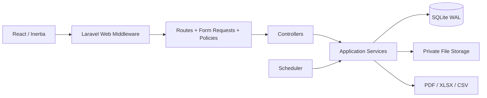
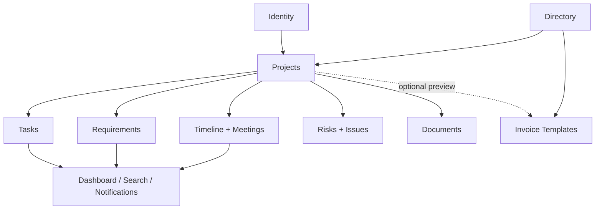

# معمارية Project Desk

> يصف هذا الملف البنية المنفذة، مع تمييز الحدود التشغيلية التي لم تُغلق بعد.

## 1. القرار المعماري

النظام **Modular Monolith** في مستودع ونشر واحد:

| طبقة | التقنية/المسؤولية |
| --- | --- |
| المتصفح | React 19 + TypeScript + Inertia 3 + Tailwind CSS 4 + Radix primitives، عربية RTL افتراضياً وإنجليزية LTR اختيارياً |
| النقل | مسارات Laravel web، جلسة وCSRF، Inertia responses وJSON داخلي وملفات تنزيل |
| HTTP | Form Requests، Controllers، Middleware، Policies/Gates |
| التطبيق | Services ومعاملات وتدقيق وقفل تفاؤلي وحسابات |
| المجال/البيانات | Eloquent Models، SQLite WAL، جداول علائقية وJSON محدود |
| المخرجات | تخزين محلي خاص، mPDF، PhpSpreadsheet، CSV streamed |
| التشغيل | Scheduler، database cache/session/queue، نسخ `.pdesk`، سجل Laravel |

المسار النصي للطلب هو: **المتصفح ← Web middleware ← Route binding ← Form Request/Policy ← Controller ← Service/transaction ← Eloquent/Storage ← Inertia أو JSON أو تنزيل**.

الرسم تلخيص فقط؛ الجدول السابق يحدد مسؤولية كل عقدة كاملة، ويظل التطبيق والخلفية في عملية نشر واحدة.

## 2. الحزم والإصدارات الأساسية

- PHP `^8.3` وLaravel `^13.17`؛
- `inertiajs/inertia-laravel ^3.0` و`@inertiajs/react ^3.0.0`؛
- React/React DOM `^19.2.0`، TypeScript `^5.7.2`، Vite `^8`؛
- Fortify، Laravel Passkeys، 2FA؛
- mPDF `^8.3` وPhpSpreadsheet `^5.9`؛
- PHPUnit 12، Larastan مستوى 7، Pint، ESLint وPrettier؛
- Node 22.12+ وpnpm 11.16.0.

## 3. Bootstrap والـmiddleware

`bootstrap/app.php` يسجل stack الويب بهذا الترتيب الإضافي:

1. `RequestContext`: يقبل معرفات منقحة أو يولد UUID، ويعيد `X-Request-Id` و`X-Correlation-Id`.
2. `HoldRestoreReadLock`: يأخذ قفل قراءة مشتركاً؛ أثناء restore يعيد 423.
3. `SetLocale`: يقرأ Cookie اللغة المشفرة، يقبل `ar|en` فقط، ويطبق العربية
   افتراضياً ثم يضبط `Content-Language`.
4. `HandleInertiaRequests`: يشارك المستخدم والقدرات والتنبيهات وحالة sidebar
   وعقد `localization` الذي يحوي اللغة والاتجاه واللغات المدعومة.
5. preload headers للأصول.
6. `SecurityHeaders`: nosniff، frame deny، referrer/permissions/COOP/CORP، وHSTS في production HTTPS.
7. `AuthenticateSession`: يربط الجلسة بتغير بيانات المصادقة.

مجموعة الأعمال محمية بـ`auth`, `verified`, `active`. `EnsureActiveUser` يسجل خروج الحساب المعطل/المؤرشف ويبطل الجلسة والـCSRF token.

## 4. حدود الوحدات المنفذة

| الوحدة | الجداول/النماذج الرئيسية | خدمات محورية |
| --- | --- | --- |
| Identity | users, passkeys, sessions | Fortify، `UserSessionSecurity` |
| Directory | clients, contacts | scopes `visibleTo/manageableBy`، Controllers |
| Projects/Work | projects, project_members, tasks, assignment_events | `TaskService`, `ProjectMetrics`, `WeeklyScheduleBuilder` |
| Requirements | requirements, requirement_task, books/versions | `RequirementService`, `RequirementBookService` |
| Planning | timeline_entries, meetings, attendees, minutes | `MeetingService` |
| Governance | risks, issues | Controllers + `OptimisticLock` |
| Documents | file_objects, attachment_links | `ProjectFileService`, scanner, retention |
| Invoice Templates | sales_documents, sales_line_items | `SalesDocumentService`, calculator, PDF |
| Data Operations | data_jobs, import_errors | CSV/XLSX services، backup services |
| Audit/Notifications | activity_logs, notifications | `ActivityLogger`, `NotificationCenterService` |
| Settings/Workflow | system_settings, workflow_statuses | corresponding services |

الاعتماد النصي: الهوية والدليل يغذيان المشاريع؛ المشاريع هي حد الصلاحية الذي تعتمد عليه المهام والمتطلبات والتخطيط والحوكمة والوثائق؛ لوحة المتابعة والبحث تقرآن من الجميع دون إنشاء مصدر حقيقة بديل؛ مركز البيانات يستدعي خدمات البيانات؛ التدقيق يكتب مع عملية المجال.

الأسهم المتقطعة تعني سياق معاينة اختياري فقط؛ ربط قالب الفاتورة بمشروع لا يمنح الوصول للقالب ولا يجعل القالب معاملة مشروع محاسبية.

## 5. معاملات واتساق وتزامن

- عمليات الإنشاء/التعديل المركبة تستخدم `DB::transaction` وتكتب `activity_logs` داخل المعاملة نفسها.
- `lockForUpdate` يحمي السجل أو التسلسل عند التعديل؛ SQLite مضبوط على `transaction_mode=IMMEDIATE` و`busy_timeout=5000`.
- `lock_version` يطبق على المشاريع، المهام، المتطلبات، إصدارات الكراسة، القوالب، المخاطر، المشكلات، البنود الزمنية، الاجتماعات والمحاضر.
- عدم تطابق الإصدار يعيد غالباً 422 بحقل `lock_version`، بينما المشروع والقالب يستخدمان 409 في مواضع محددة.
- استيراد المهام يقارن snapshot للإصدارات ثم يعيد قفل السجلات قبل commit؛ لا نجاح جزئياً.
- مولد رقم قالب الفاتورة يتطلب أن يكون داخل transaction ويقفل `document_sequences`.
- النسخ الكامل وتنظيف الملفات يتسلسلان بـ`FileInventoryLock`؛ الاستعادة تستخدم maintenance mode وقفل ملف حصرياً.

## 6. الزمن والتقويم

| القاعدة | التنفيذ |
| --- | --- |
| تخزين اللحظات | Form Requests تحول مدخلات business timezone إلى UTC؛ Eloquent يعيد datetime |
| التوقيت التجاري الافتراضي | `Africa/Tripoli` من `BUSINESS_TIMEZONE` |
| تواريخ بلا وقت | start/end للمشروع وissue/due للقالب من نوع `date` |
| أسبوع الجدول الحالي | الأحد (`week_starts_on=0`) حتى السبت |
| عطلة العرض الحالية | الجمعة والسبت (`[5,6]`) |
| إعدادات المدير | `calendar.week_start/weekend_days` مخزنة وتستخدم في جدولة النسخ الأسبوعية؛ builder الأسبوعي الحالي يعتمد config الثابت، لذا التكامل مع العرض **جزئي** |

`assigned_at` قرار الإسناد، ولا يغير `start_at/due_at`. `completed_at` مشتق من semantic حالة المهمة: يثبت عند `done` ويزال عند الخروج منه.

## 7. نمط الواجهة والحالة

- `resources/js/app.tsx` يحل الصفحات تلقائياً ويطبق layouts حسب الاسم.
- Inertia shared props: المستخدم، `canCreateTask`، قدرات مركز البيانات/الإعدادات، التنبيهات، حالة sidebar، و`localization` (`code`, `tag`, `dir`, `supported`).
- الصفحات تحفظ الحالة المحلية بـReact؛ إرسال النماذج عبر Inertia `useForm`، وJSON عبر `fetch` مع CSRF/session.
- Wayfinder يولد مسارات TypeScript؛ ملفات التوليد مستثناة من ESLint.
- `use-unsaved-changes` يحرس Inertia navigation وhistory وreload وإغلاق الحوارات.
- شاشات المشروع الكبيرة تحمل تبويباً واحداً فقط وتجزئه (عادة 50 صفاً) لتقليل payload.
- `LocaleRuntime` يزامن `html[lang][dir]` وحالة التنسيق، و`LanguageSwitcher`
  يرسل `PUT /locale` للزائر أو المستخدم؛ يحفظ الخادم الاختيار سنة في Cookie مشفرة.
- رسائل الواجهة الإنجليزية تحمل في كتالوجات TypeScript؛ تحمل الكتالوجات الإضافية
  كسولاً عند اختيار الإنجليزية، وتغطي طبقة توافق النصوص العربية الموروثة والخصائص
  الوصولية. تحمي الطبقة حقول محتوى المستخدم من الترجمة الآلية.
- `createLocaleNumberFormatter` و`createLocaleDateTimeFormatter` يستخدمان `ar-LY`
  للعربية و`en-GB` للإنجليزية في الأسطح المربوطة بهما.

## 8. البحث والقراءات

البحث يستخدم SQLite `LIKE` بعد escape لـ`%` و`_`، ويطلب حرفين على الأقل، ويحد كل نوع بخمس نتائج. الأنواع: project/task/client/requirement/invoice template/document/team. كل query يطبق visibility scope قبل البحث.

`ProjectMetrics` هو المصدر المشترك لتقدم المشروع وصحته والمرحلة التالية. `WeeklyScheduleBuilder` يبني أشرطة المهام والاجتماعات ويقصها عند حدود الأسبوع. لا تدخل إجماليات قوالب الفواتير في مؤشرات dashboard.

## 9. Adapter boundaries

- `MalwareScanner`: `none | command | callback`. في production يجب أن يكون configured وإلا يفشل الرفع مغلقاً.
- Laravel `Storage`: الملفات الخاصة تحت `storage/app/private` افتراضياً.
- PDF: mPDF متزامن إلى memory ثم response private/no-store؛ القوالب الحالية
  عربية/RTL ولا تتبدل تلقائياً مع لغة واجهة المستخدم.
- XLSX: PhpSpreadsheet مع حدود ZIP/حجم/ورقة/قالب؛ CSV stream وparser ثابت.
- Mail افتراضياً `log` محلياً؛ يجب تهيئة mailer إنتاجي للتحقق وإعادة كلمة المرور.

## 10. قرارات وحدود معلنة

- لا microservices ولا multi-tenancy ولا public API في v1.
- لا WebSocket/Echo realtime؛ الصفحات تعيد تحميل البيانات بعد الطفرات، والتنبيهات يزامنها scheduler.
- queue مهيأة database لكن الكود الحالي لا يعرّف `app/Jobs`; العمليات الثقيلة ما زالت متزامنة.
- PostgreSQL/MySQL connections عامة من Laravel وليست ملف نشر معتمداً؛ backup adapter الحالي SQLite-only.
- legacy commercial models والجداول موجودة للحفاظ على البيانات التاريخية فقط، ويمنع route binding الوصول لها.
- التدويل الحالي ثنائي اللغة للواجهة (`ar` و`en`)؛ لا ينشئ نسخاً مترجمة من
  بيانات المستخدم ولا يَعِد بترجمة PDF أو بإضافة لغة ثالثة دون كتالوج وعقد جديدين.
