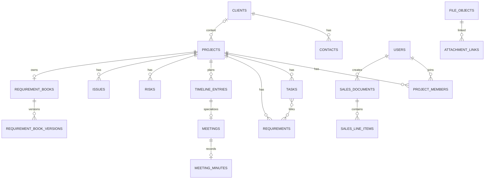

# نموذج بيانات Project Desk

> المصدر: migrations ونماذج Eloquent وعلاقاتها كما هي في 12 أغسطس 2026.

## 1. اصطلاحات

- المفتاح الأساسي الافتراضي `id` integer، مع timestamps ما لم يذكر خلاف ذلك.
- `*` في الجداول التالية يعني قيداً مهماً، وليس nullable/fillable notation.
- معظم كيانات الأعمال لا تستخدم `SoftDeletes`; الأرشفة حقل `archived_at` صريح.
- `lock_version` يبدأ 1 ويزيد عند كل طفرة محمية.

## 2. مخطط العلاقات العالي

العلاقات النصية الكاملة:

- العميل يملك جهات اتصال ومشاريع، ويمكن اختياره اختيارياً في قوالب الفواتير.
- المشروع يملك أعضاء ومهام ومتطلبات وخطاً زمنياً ومخاطر ومشكلات وكراسة متطلبات.
- المهمة والمتطلب علاقة many-to-many؛ المهمة لها سجل إسناد.
- الاجتماع يملك timeline entry واحداً، حضوراً ومحضراً واحداً اختيارياً.
- الملف له روابط attachment متعددة، وقد يكون ملف كراسة أو محضر أو مهمة بيانات.
- قالب الفاتورة له بنود، ومنشئ، وسياق عميل/مشروع اختياري.

الرسم لا يعرض كل FK؛ الجداول التالية هي المرجع التفصيلي.

## 3. الهوية والبنية الأساسية

### `users`

| الحقل | النوع/القيد | المعنى |
| --- | --- | --- |
| name, email | string؛ email unique | هوية المستخدم |
| email_verified_at | datetime nullable | بوابة `verified` |
| password | hash مخفي | كلمة مرور Fortify |
| phone, job_title | nullable | ملف وظيفي |
| global_role | string default member | admin/project_manager/member/viewer |
| status | string default active | active/inactive عملياً |
| archived_at | timestamp nullable | إبطال تاريخي للحساب |
| notification_preferences | JSON nullable | خيارات المستخدم |
| two_factor_* | text/datetime nullable | أسرار وحالة 2FA، مخفية عن serialization |

علاقات: projects عبر `project_members`، assignedTasks، notifications، passkeys.

الجداول القياسية المصاحبة: `password_reset_tokens`, `sessions`, `passkeys`, `cache`, `cache_locks`, `jobs`, `job_batches`, `failed_jobs`, `migrations`.

### `workflow_statuses`

`entity_type + code` فريد. الحقول `label`, `semantic(open/in_progress/done/cancelled)`, `color`, `position`, `is_active`. ترتبط بها projects/tasks/requirements. لا يوجد delete endpoint.

### `system_settings`

`group + key` فريد؛ `value` JSON حتى للقيم null؛ `is_secret` موجود في النموذج لكن مجموعات الإعداد الحالية تكتب قيماً غير سرية فقط. المجموعات المعروضة: general/company/notifications/automatic_backup/calendar.

## 4. الدليل والمشاريع

### `clients`

`code` فريد؛ الاسم مطلوب؛ email/phone/address اختيارية؛ `status`; `archived_at`; `created_by` nullable. العلاقات: contacts, projects, historical salesDocuments. نطاق الرؤية يسمح للمدير بمن أنشأه أو بمن يرتبط بمشروع مرئي.

### `contacts`

FK `client_id` cascade؛ name مطلوب؛ role/email/phone اختيارية؛ `is_primary`, `is_active`. تحقق التطبيق يمنع جهة أساسية غير نشطة، ويتأكد أن primary contact المختار للمشروع تابع للعميل.

### `projects`

| المجموعة | الحقول/القيود |
| --- | --- |
| الهوية | `code` unique، `name`, description nullable |
| الدليل | client nullable nullOnDelete، primary_contact nullable، manager nullable |
| التخطيط | status restrict، priority، start/end date nullable مع end ≥ start في validation |
| التزامن/التاريخ | `lock_version`, `archived_at` |

### `project_members`

`project_id + user_id` فريد؛ `project_role` default member؛ `status` default active. حذف المشروع cascade؛ حذف المستخدم restrict. مدير المشروع والمستخدم المنشئ يضافان كمديرين نشطين عند الإنشاء.

## 5. المتطلبات والعمل

### `requirements`

FK مشروع؛ `code` فريد داخل المشروع؛ title/description/acceptance_criteria؛ priority؛ status restrict؛ owner nullable؛ lock_version؛ archived_at. الكود الفارغ يولد `REQ-00001` بعد الإدراج.

### `tasks`

FK مشروع؛ code فريد داخله؛ title/description؛ status؛ priority؛ assignee nullable؛ `assigned_at` مستقل؛ `start_at` و`due_at` مطلوبان؛ completed_at؛ estimated_minutes؛ notes؛ lock_version؛ archived_at. الخدمة تولد `TSK-00001`، وتضمن due ≥ start وتزيل assigned_at عند إزالة المسؤول.

### `requirement_task`

مفتاح مركب requirement_id/task_id؛ كلاهما cascade. التطبيق لا يقبل الربط خارج المشروع نفسه أو إلى متطلب مؤرشف.

### `task_assignment_events`

task cascade؛ from/to user nullable؛ recorded_by restrict؛ assigned_at؛ recorded_at؛ note. يسجل حدثاً فقط عند تغير المسؤول، وليس كل حفظ.

## 6. التخطيط والاجتماعات

### `timeline_entries`

project؛ `kind`; title؛ starts_at؛ ends_at nullable؛ status؛ owner؛ note؛ metadata JSON؛ archived_at؛ lock_version. أنواع الإدخال العام: milestone/delivery/review/deadline/phase/event؛ `meeting` محجوز لخدمة الاجتماعات.

### `meetings` و`meeting_attendees`

meeting يملك `timeline_entry_id` unique cascade، organizer nullable، location، URL، agenda، archived_at وlock_version. attendees يربط meeting/user بصورة فريدة مع status: invited/accepted/declined/tentative/attended/absent.

### `meeting_minutes`

`meeting_id` unique؛ summary مطلوب؛ decisions/action_items؛ file_object_id nullable؛ recorded_by؛ recorded_at؛ lock_version. لا يوجد سجل محضر ثان للاجتماع؛ المسار upsert.

## 7. الحوكمة

### `risks`

project؛ title/description؛ probability وimpact (1–5 في validation)؛ status open/monitoring/mitigated/accepted/closed؛ owner؛ mitigation؛ due_at؛ archived_at؛ lock_version. درجة العرض = probability × impact.

### `issues`

project؛ title/description؛ severity low/medium/high/critical؛ status open/in_progress/resolved/closed؛ owner؛ due_at؛ resolution؛ archived_at؛ lock_version. يتطلب resolved/closed وجود resolution.

## 8. الملفات وكراسة المتطلبات

### `file_objects`

| الحقل | المعنى |
| --- | --- |
| disk, storage_key unique | مكان خاص يولده الخادم |
| original_name, mime_type, extension | metadata منقحة |
| size_bytes, checksum_sha256 | سلامة وحصص |
| scan_status | pending/safe/structurally_safe/quarantined حسب المسار |
| uploaded_by, uploaded_at | أصل الملف |

### `attachment_links`

يربط file_object بمشروع، ويمكن أن يحدد **واحداً** من task/requirement/requirement_book_version/meeting_minutes وفق مسار الخدمة. `archived_at` يؤرشف الرابط فقط. بعض حصرية الأهداف تفرضها الخدمة وليست CHECK constraint في migration.

### `requirement_books` و`requirement_book_versions`

Book واحد unique لكل مشروع. Version فريد بـ(book, version_number)، وله title/status/file/uploader/uploaded_at/is_current/lock_version/archived_at. الحالات: draft/under_review/approved/superseded. الخدمة تضمن إصداراً حالياً نشطاً واحداً منطقياً، لكن قاعدة البيانات لا تملك partial unique index لـ`is_current`.

## 9. قوالب الفواتير والبيانات التاريخية

### `sales_documents`

الجدول اسمه تاريخياً تجاري، لكن سطح المنتج الحالي يقبل فقط:

- `type=invoice`؛
- `status=draft|archived`؛
- number unique مولد من `document_sequences`؛
- title؛ client/project/issue_date/due_date اختيارية؛
- reference؛ currency LYD/USD/EUR؛ discount/tax؛ notes؛ snapshots؛ lock_version؛ created_by.

`SalesDocument::resolveRouteBindingQuery` وscopes يحجبان proposal/receipt/letterhead والحالات المحاسبية القديمة. لا تحذف بيانات legacy.

### `sales_line_items`

document cascade؛ name/description؛ quantity decimal(12,3) >0؛ unit؛ unit_price decimal(14,2) ≥0؛ position. الإجماليات لا تخزن؛ يعيد `SalesCalculator` subtotal/discount/tax_base/tax/total باستخدام BCMath.

### جداول legacy

`proposal_details`, `receipt_details`, `letter_details` و`source_document_id` ما زالت موجودة للتوافق التاريخي، لكنها غير مستخدمة في مسارات المنتج الحالية. `document_sequences` يحتفظ بـdocument_type/year/next_number unique.

## 10. العمليات والتدقيق

### `data_jobs` و`import_errors`

Job: type، resource_type، format، status، file_object، created_by، summary JSON، error_message، started/completed. Error: job، sheet/row/field/code/message. حالات الاستيراد تتدرج من processing إلى validated/succeeded/failed حسب المسار.

### `activity_logs`

actor nullable، project nullable، action، subject_type/id، before/after JSON، request_id، correlation_id، IP، user_agent، created_at فقط. لا يعرض التطبيق endpoint حذف أو تعديل؛ هو append-only على مستوى التطبيق.

### `notifications`

Laravel database notifications: UUID، type، notifiable morph، data، read_at. Project Desk يستخدم type ثابت `project-desk.deadline` ومعرفات مستقرة مشتقة من user/source.

## 11. سياسات الحذف وFK

- حذف project يسبب cascade لموارد المشروع، لكنه ليس endpoint عادياً؛ المنتج يؤرشف.
- المستخدم المشار إليه في عضوية/أحداث/ملفات غالباً restrict، بينما manager/owner nullable يستخدم nullOnDelete.
- client المرتبط بمشروع nullOnDelete، لكن sales historical FK restrict في migration.
- حذف file_object cascade لattachment_links؛ مراجع الكراسة/المحضر/data jobs تستخدم nullOnDelete أو restrict حسب الجدول.
- تنظيف اليتيم لا يعتبر رابطاً مؤرشفاً يتيماً؛ كل durable reference يحمي الملف.

## 12. فهارس مهمة

توجد فهارس على نطاقات الحالة/الأرشفة، تواريخ المهام، المسؤول والحالة، المشروع/التاريخ للخط الزمني، المخاطر والمشكلات، scan status، job type/status، activity subject/actor/project/correlation، ومخزون المرفقات. اختبار الحجم يغطي 10,000 مهمة واستقرار عدد queries لمقاييس الحافظة.
